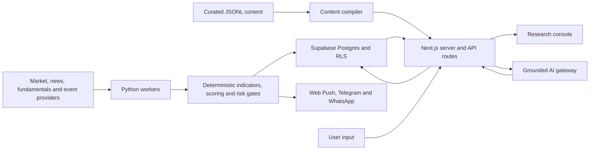

# Architecture Dossier - Lyra Stock Momentum Radar

> Generated 16 July 2026 from local disk inspection. Refresh after major structural changes.

## Overview

Lyra is a research-first stock intelligence console built around a deterministic
oversold-recovery score. It combines a Next.js interface, Python market-data workers,
Supabase persistence and authentication, optional grounded AI explanations, and
multi-channel notifications. The current local working tree contains 43 page routes,
28 application API routes, four worker packages, 28 Supabase migrations, and both
TypeScript and Python test suites.

The central architecture rule is that deterministic code owns prices, indicators,
scores, risk gates, alert triggers, and paper-trade state. AI can explain and organise
grounded facts, but it does not own those values or place broker orders.

## Tech Stack

| Layer | Technology |
|---|---|
| Web framework | Next.js 15 App Router, React 19 |
| Language | TypeScript with strict mode; Python for workers |
| UI | Tailwind CSS, custom dense console components, Lucide icons |
| Data access | Supabase SSR and JavaScript clients with Row Level Security |
| Database | Supabase Postgres, 28 ordered migrations |
| Auth | Supabase Auth with cookie-aware server clients and middleware |
| Market processing | pandas, NumPy, yfinance, `ta`, Pydantic |
| AI | Server-side provider gateway for OpenAI, Anthropic, OpenRouter, Google and xAI |
| Notifications | Web Push, Telegram and WhatsApp dispatch paths |
| Testing | Vitest for TypeScript; pytest for Python |
| Scheduling | Hourly GitHub Actions scanner workflow |
| Deployment | Vercel configuration; Docker/Coolify path in the local working tree |

## Directory Map

```text
vai-lyra-stock-tracker/
├── src/app/                 Next.js pages, auth routes and API routes
├── src/components/          Console, research, trading and onboarding UI
├── src/lib/                 Data access, deterministic logic, AI and notifications
├── workers/
│   ├── stock_scanner/       OHLCV, indicators, scoring, overlays and alerts
│   ├── intelligence_worker/ News relevance, sentiment and hype processing
│   ├── fundamentals_worker/ Fundamentals collection and valuation
│   └── events_worker/       Events, IPOs and event-risk processing
├── supabase/migrations/     Canonical ordered database schema
├── sql/                     Older scanner-only SQL path
├── content/                 Editable JSONL research content
├── contracts/notifications/ Notification schemas, templates and test register
├── tests/                   Cross-cutting TypeScript and Python tests
├── docs/                    Architecture, product, security, testing and runbooks
├── public/                  PWA manifest, service worker, icons and brand assets
├── scripts/                 Content build, release and setup diagnostics
└── .github/workflows/       Hourly scanner schedule
```

## Route Map

### Product Pages

| Group | Routes | Purpose |
|---|---|---|
| Start and account | `/welcome`, `/onboarding`, `/onboarding/activation`, `/account`, `/settings`, `/privacy`, `/whats-new` | First run, preferences, safety, release visibility |
| Daily command | `/`, `/portfolio`, `/trades`, `/watchlist`, `/saved`, `/wire` | Daily brief, personal holdings, trade history and attention queue |
| Investigation | `/findings`, `/graph`, `/charts`, `/intelligence`, `/calendar` | Evidence-backed findings, relationships, charts, news and events |
| Market discovery | `/radar`, `/smart-money`, `/themes`, `/supply-chain`, `/small-caps`, `/investors`, `/awards`, `/flows`, `/filings`, `/ipos`, `/commodities`, `/fundamentals` | Deterministic and editorial research surfaces |
| Analysis tools | `/comparison`, `/simulation`, `/strategy-lab`, `/calculators`, `/education` | Comparison, rehearsal, strategy testing and learning |
| Paper trading | `/paper`, `/paper-bot`, `/trading` | Paper-account state and guarded trading-system design |
| Detail routes | `/tickers/[symbol]`, `/themes/[slug]`, `/ipos/[symbol]` | Entity-level research and evidence |
| Auth | `/auth/login`, `/auth/signup` | Supabase sign-in and sign-up |

### API Routes

| Group | Routes |
|---|---|
| Account and user data | `/api/account`, `/api/onboarding`, `/api/portfolio`, `/api/watchlist`, `/api/trades`, `/api/ticker-lookup` |
| AI | `/api/ai/status`, `/api/ai/brief`, `/api/ai/chat`, `/api/ai/insights`, `/api/ai/agent`, `/api/findings/genui` |
| Findings | `/api/findings/lifecycle` |
| Notifications | `/api/notifications`, `/api/notifications/dispatch`, `/api/push/subscribe`, `/api/push/test`, `/api/push/unsubscribe` |
| Webhooks | `/api/webhooks/telegram`, `/api/webhooks/whatsapp` |
| Paper trading | `/api/trading/paper-account`, `/api/trading/paper-bot`, `/api/trading/paper-bot/command`, `/api/trading/benchmarks`, `/api/trading/notifications` |
| Research | `/api/small-caps/research` |
| Operations | `/api/feedback`, `/api/health` |
| Auth callbacks | `/auth/callback`, `/auth/signout` |

## Data Flow



The dashboard falls back to built-in demonstration data when Supabase is not
configured. In a configured deployment, shared market data and private user data flow
through Supabase, with user-scoped access enforced by authentication and Row Level
Security. The scanner computes shared signals once, then applies portfolio, watchlist
and notification context for users.

## Key Dependencies

| Dependency | Role |
|---|---|
| `next`, `react`, `react-dom` | Web application and server routes |
| `@supabase/ssr`, `@supabase/supabase-js` | Authenticated data access and browser/server clients |
| `zod` | Runtime validation |
| `web-push` | Browser push subscriptions and dispatch |
| `date-fns` | Date and relative-time formatting |
| `lucide-react` | Interface icons |
| `pandas`, `numpy`, `ta` | Market-series and technical-indicator processing |
| `yfinance` | Prototype market-data provider |
| `supabase` Python client | Worker persistence |
| `pydantic` | Worker configuration and model validation |

## Integration Points

- Supabase provides Postgres, authentication, Row Level Security and server-side
  persistence.
- yfinance is the default scanner provider; the worker boundary is designed to admit
  another market-data provider.
- Finnhub can supply optional news, fundamentals and event data.
- GitHub Actions schedules the scanner hourly at minute five, subject to the worker's
  market-hours guard.
- Vercel hosts the current public web surface. The local working tree also contains a
  Docker/Coolify deployment path.
- OpenAI, Anthropic, OpenRouter, Google and xAI are available through one server-side
  gateway, with deterministic fallbacks at the feature boundary.
- Web Push, Telegram and WhatsApp are represented in the notification system.
- TradingView receives exported Pine strategy text; broker order placement remains
  intentionally unavailable.

## Architecture Decisions

1. The oversold-recovery score is deterministic and mirrored into Pine with parity
   tests. AI does not recalculate it.
2. Demonstration mode requires no credentials and remains the default for a fresh
   clone.
3. Browser-visible Supabase credentials are publishable credentials governed by RLS;
   service-role and provider secrets remain server-side.
4. Curated research facts are authored as JSONL and compiled before development,
   type-check and build commands.
5. Shared market evidence is separated from user-owned portfolios, watchlists,
   preferences, trades and alert destinations.
6. Paper trading and risk rehearsal are implemented separately from broker transport.
7. `supabase/migrations/` is the canonical schema path; `sql/` is retained as an older
   scanner-focused path.

## Known Technical Debt

- The root README has a local, uncommitted improvement pass that is ahead of the public
  GitHub README.
- The local README links to `COSTS.md`, but that file is not present.
- The new `/api/health` route exists locally but the currently hosted Vercel deployment
  returns 404 for that path until the deployment is refreshed.
- The repository has an hourly scanner workflow but no push/pull CI workflow that runs
  TypeScript, Vitest and pytest together.
- The TypeScript suite passes, while the Python suite currently has one stale-looking
  quiet-hours expectation that assumes UTC despite the current default of
  `Australia/Sydney`.
- The coexistence of `sql/` and `supabase/migrations/` creates an onboarding hazard and
  should remain explicitly documented until the older path is removed or archived.

## Before / After

```text
BEFORE                                   AFTER
─────────                                ─────────
Detailed architecture under docs/       Detailed docs remain canonical
README carries a partial map             ARCHITECTURE.md [NEW]
No root architecture entrypoint          ├── Stack and route map
                                         ├── Data flow
                                         ├── Integration boundaries
                                         └── Known debt
```

**What moved:** No source code or existing documentation moved. A root entrypoint now
summarises the app's current technical shape and points future README work toward a
stable, disk-grounded architecture map.

## Handoff Payload

`handoff-payload`

```json
{
  "commitHash": null,
  "filesCreated": ["ARCHITECTURE.md"],
  "filesModified": null,
  "crossesToTicks": null,
  "remainingPartialsOrBlockers": [
    "README improvement recommendations are documented separately and have not been applied.",
    "One Python quiet-hours test currently fails because its timezone assumption conflicts with the current default."
  ],
  "commandsRun": [
    "find src/app for page and route inventory",
    "inspect package.json, tsconfig.json, .env.example and requirements.txt",
    "inspect workers, Supabase migrations, GitHub workflow and deployment configuration",
    "compare local working copy with public GitHub main"
  ],
  "testResults": null,
  "validationResults": {
    "referencedPathsExist": true,
    "routeMapMatchesDisk": true,
    "dependenciesMatchPackageFiles": true,
    "mermaidStructureReviewed": true
  },
  "safetyScanResult": "pass",
  "realProviderCallsMade": false,
  "externalWritesSendsMutationsAdded": false,
  "customerDataSecretsCredentialsIntroduced": false,
  "generatedOutputPaths": ["ARCHITECTURE.md"],
  "remainingBlockers": [
    "README changes remain a separate implementation decision.",
    "The hosted health endpoint does not yet reflect the local route."
  ],
  "recommendedNextAgentHandoff": "Apply the README audit, then run test-coverage-auditor before publishing verification badges."
}
```
