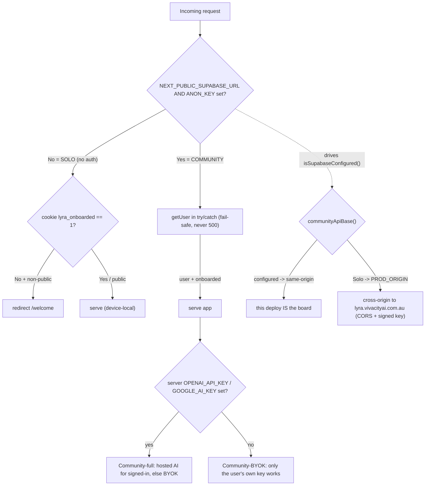
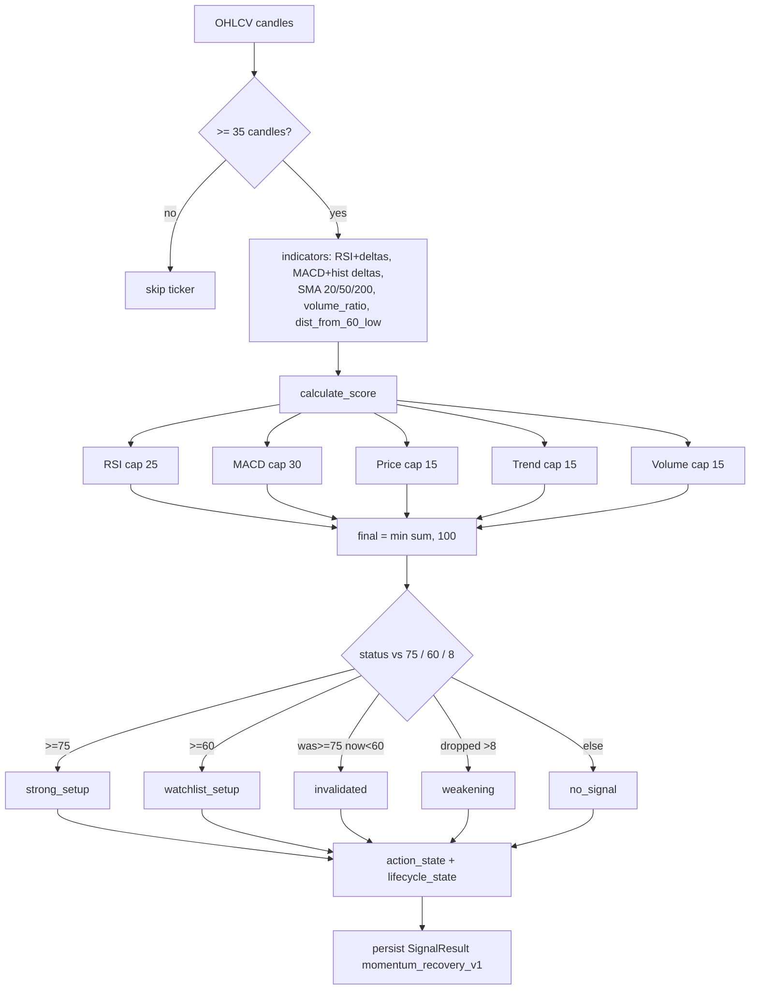
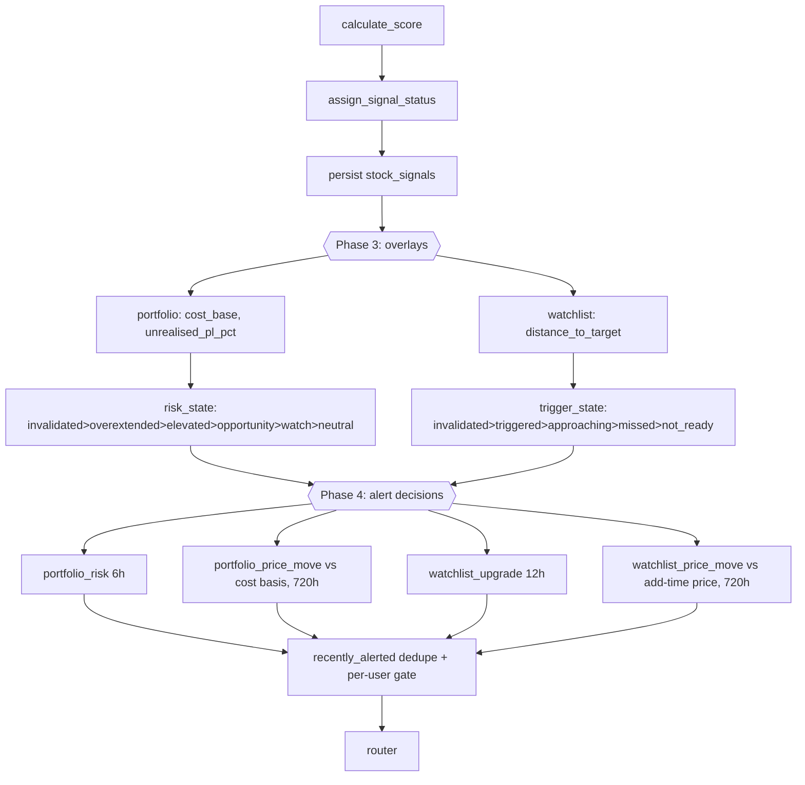
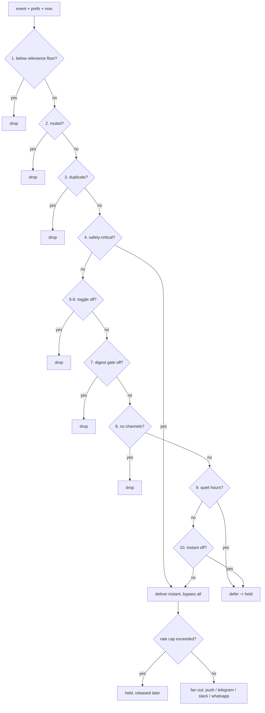
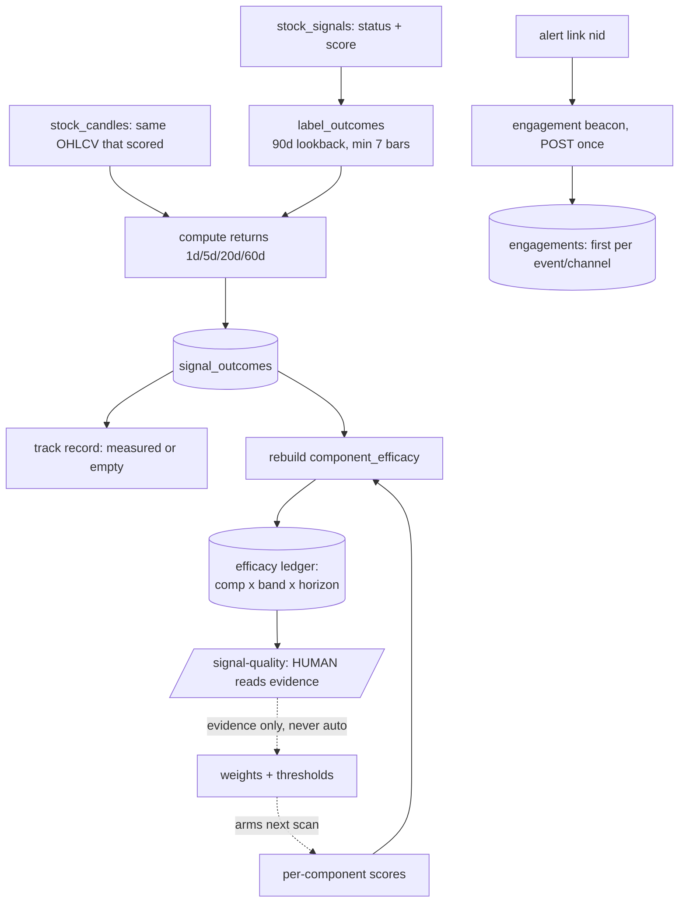
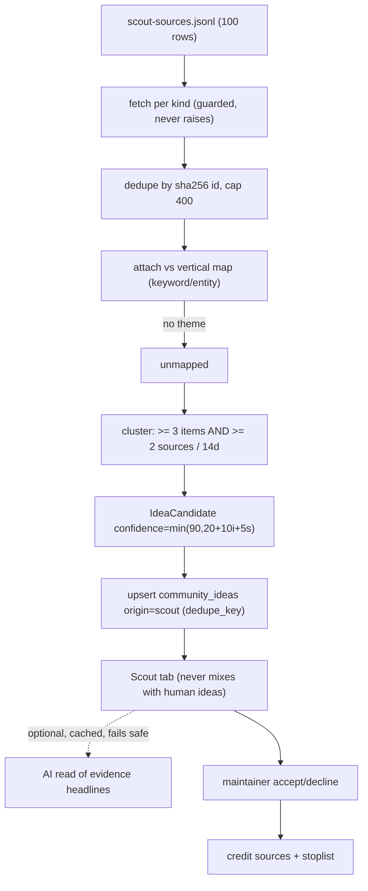
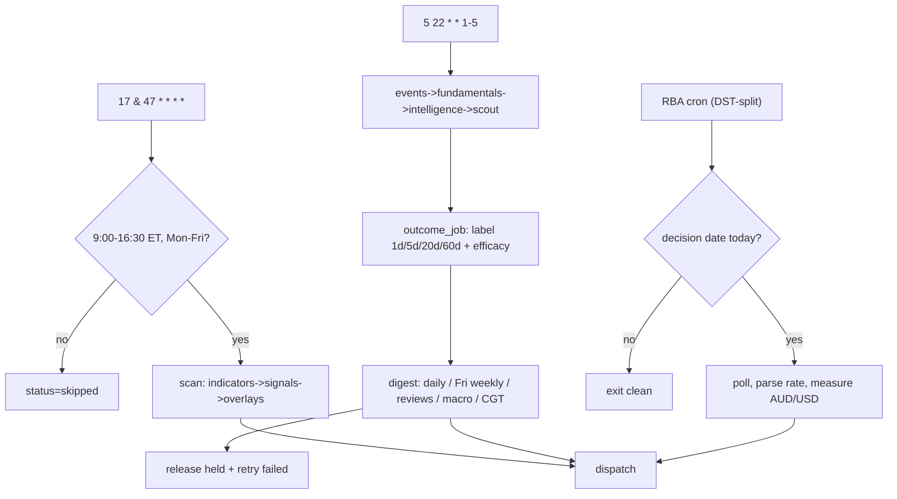
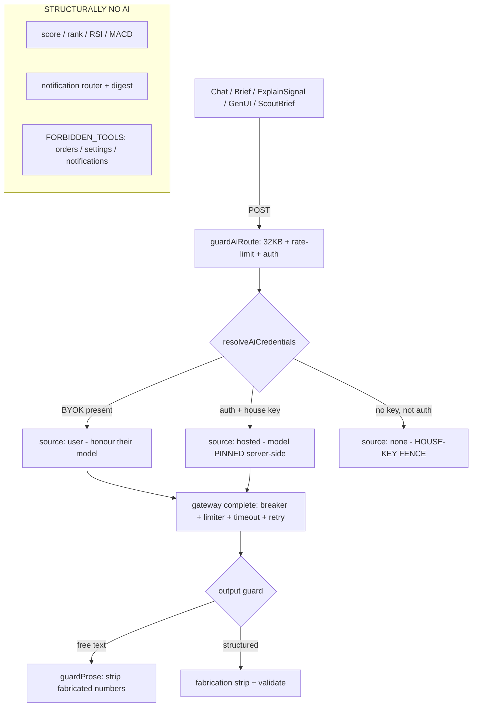

# How Lyra Works - the decision process, end to end

> This document is **grounded in the actual code**, not a pitch. Every claim carries a
> `file:line` citation so you can open the file and check it yourself. It was assembled by
> deep-reading nine subsystems in parallel and reconciling each against source.
>
> **The one law that explains everything below:** *the deterministic engine decides, the AI
> only explains, and the AI never invents a number.* Scoring, ranking, signal/risk state, and
> every notification payload are computed by non-AI code; the model is a bounded narrator that
> is structurally forbidden from the decision path (`CLAUDE.md` conventions;
> `src/lib/ai/__tests__/policy-invariants.test.ts:40-55` fails the build if a new raw-AI route
> is added).

Companion docs: `ARCHITECTURE.md` (structure) - `HARNESS.md` (enforcement) - `LOOPS.md`
(motion). This file is the **decision/reasoning** explainer.

---

## 0. The 30-second map

```
   DATA (deterministic pull)              THE ENGINE (deterministic, $0 AI)             YOU
   ┌───────────────────────┐    ┌────────────────────────────────────────────┐   ┌─────────┐
   │ OHLCV candles (yfin)   │    │  indicators → SCORE 0-100 → signal_status   │   │  push   │
   │ news / gov / partners  │──▶ │  → action_state → lifecycle_state           │──▶│ telegram│
   │ RBA / FOMC calendar    │    │  → portfolio & watchlist OVERLAYS           │   │ whatsapp│
   │ your portfolio+watchl. │    │  → RELEVANCE rank → notification ROUTER     │   │ slack   │
   └───────────────────────┘    └───────────────────┬────────────────────────┘   └─────────┘
                                                     │  every value is computed, then measured
                                                     ▼
                                 ┌────────────────────────────────────────────┐
                                 │  OUTCOME LOOP: label forward returns from    │  ← what makes it
                                 │  the SAME candles → track record + efficacy  │    auditable, not
                                 │  ledger → arms HUMAN retuning                 │    a vibe
                                 └────────────────────────────────────────────┘
                                                     ▲
                                 ┌───────────────────┴────────────────────────┐
                                 │  AI LAYER (BYOK, on-demand, forbidden from    │  ← explains only.
                                 │  the numbers): "explain this", grounded chat  │    never decides.
                                 └────────────────────────────────────────────┘
```

Read that top to bottom: data is pulled by plain API calls, turned into a **score** by a fixed
formula, ranked by a **relevance** number, routed to your channels by a **pure function**, and
then every published number is **measured against reality** so the ranking can be audited and
corrected. AI sits to the side and explains - it is never in the loop that decides what you see.

---

## 1. Deployment modes - one codebase, three shapes (env decides)

There is no "mode" flag. The presence of two env vars decides everything
(`.env.example:17-18`, `src/lib/supabase/client.ts:17-18`).

| Mode | `NEXT_PUBLIC_SUPABASE_*` | Server AI key | What you get |
|---|---|---|---|
| **Solo** | unset | n/a | No account, device-local data, BYOK AI, **no notifications**. A free demo front door. |
| **Community - BYOK** | set | **unset** | Full accounts, DB, cloud sync, **notifications** - AI is the user's own key only. *(This is the "strip my API key" shape.)* |
| **Community - full** | set | set | Everything above **+** hosted AI (users need no key of their own). |

**The house-key fence:** a server (hosted/shared) AI key is handed out **only to authenticated
callers**; a user's own BYOK key always works, even signed-out. An anonymous visitor can never
burn Lyra's key - a financial-DoS fence (`src/lib/ai/credentials.ts:56-91`).

**Per-user AI entitlement (the trial).** Within a Community deployment that has a hosted key, the
house key is not handed to *everyone* signed in - only to users who are **AI-included**: inside
their **14-day free trial** (from account `created_at`) or holding a standing grant
(`profiles.ai_included`, for the founder / a future paid tier). A signed-in user past their trial
is **BYOK-only**, exactly like Solo - they keep the entire product (scan, portfolio, notifications)
and just add their own key for chat. So "who Lyra pays for" is a per-user decision, not a
deployment-wide one (`src/lib/ai/entitlement.ts`, gated in `resolveAiCredentials` via
`guardAiRoute`). The scanner and notifications never need an AI key, so a lapsed trial costs the
user nothing but the chat.



Middleware never crashes the app: any auth/edge failure fails **safe** (public/API through, app
pages to `/welcome`), never a 500 (`src/middleware.ts:75-100`). The read-only demo tour can
never mutate data - every write API still requires a session (`src/middleware.ts:104-108`).

---

## 2. The score - how "analysed" actually works (no AI)

A stock's oversold-recovery **score** is an additive **0-100** number from five hard-capped
indicator blocks, computed in `workers/stock_scanner/signal_engine.py::calculate_score`. Every
rule reads a raw numeric indicator and is **skipped (contributes 0), never guessed**, when its
input is missing (`signal_engine.py:36-91`).

### The exact formula (every point cited)

| Block | Cap | Points |
|---|---|---|
| **RSI** | 25 | +10 if `35 <= rsi_14 <= 50` (the reset band); +10 if `rsi_delta_1 > 0`; +5 if `rsi_delta_2 > 0` (`signal_engine.py:36-44`) |
| **MACD** | 30 | +8 if `hist < 0`; **+12** if `hist_delta_1 > 0`; +5 if `hist_delta_2 > 0`; +5 if below-signal **and** improving (`signal_engine.py:46-63`) |
| **Price location** | 15 | +10 if within 10% of the 60-period low; +5 if `close <= sma_50 * 1.03` (`signal_engine.py:65-70`) |
| **Trend** | 15 | +10 if `close >= sma_200` **else** +5 if `>= sma_200 * 0.95`; +5 if `sma_20 >= sma_50 * 0.95` (`signal_engine.py:72-81`) |
| **Volume** | 15 | +5 if `ratio >= 0.8`; +5 if `ratio >= 1.0`; +5 if volume rose vs the prior candle (`signal_engine.py:83-91`) |

`final_score = min(RSI + MACD + price + trend + volume, 100)` (`signal_engine.py:93`). The caps
sum to exactly 100, so the clamp is defensive only.

**Indicators** (from `workers/stock_scanner/indicators.py`): RSI(14) + 1/2-period deltas; MACD
(12/26/9) + histogram deltas; SMA 20/50/200; EMA 12/26; `volume_ratio`; and
`distance_from_60_period_low`. A ticker needs **>= 35 candles** to score at all
(`indicators.py:22`) and the last **3** snapshots to compute deltas (`main.py:239`).

### Score → status → action → lifecycle

`assign_signal_status` maps the score in strict priority (`signal_engine.py:123-132`):

```
   score >= 75  ────────────────▶ strong_setup      (action: buy_review)
   score >= 60  ────────────────▶ watchlist_setup   (action: watch)
   prev>=75 AND now<60 ─────────▶ invalidated       (action: invalidated)
   dropped > 8 vs prev ─────────▶ weakening         (action: do_not_add)
   else ────────────────────────▶ no_signal         (action: hold)
```

Then `lifecycle_state_for` compares to the previous stored row to emit
`new_signal / upgraded / downgraded / recovered / invalidated / continuing / unchanged`
(`signal_engine.py:147-162`). Thresholds `75 / 60 / 8` are env-tunable
(`config.py:78-80`). Strategy id is `momentum_recovery_v1` - note it is a **dip/early-turn**
strategy: a high score means "beaten-down name turning up", **not** a breakout to new highs.



**Why you can trust it more than a model here:** the score is reproducible (same candles →
same number), auditable (you can see which block contributed what), and pinned across languages
by golden vectors (`tests/test_score_parity.py:82-88`). An LLM's "this looks strong" is none of
those.

---

## 3. Signal lifecycle + your portfolio / watchlist overlays

After scoring every ticker, the engine derives **per-you** overlays
(`workers/stock_scanner/main.py:265-303`):

- **Portfolio:** `cost_base = quantity*avg_buy_price + brokerage_fee`;
  `unrealised_pl_pct = (market_value - cost_base)/cost_base*100`; and a **risk_state** in strict
  priority `invalidated > overextended > elevated_risk > opportunity > watch > neutral`, where
  *overextended* needs **both** `unrealised > 20%` **and** `rsi_14 > 70`
  (`portfolio_engine.py:6-21,44-48`).
- **Watchlist:** `distance_to_target_price_pct` and a **trigger_state**
  `invalidated > triggered > approaching > missed > not_ready`, where *triggered* requires the
  score, price, RSI band, MACD-rising, and volume conditions to all hold
  (`watchlist_engine.py:12-71`).

Every alert **"reason" string is an f-string** filled with those computed numbers - no AI, no
invented values. Real examples:

```python
reason = f"Portfolio holding {symbol} moved {unrealised_pl_pct:.1f}% from cost basis, crossing {threshold:+d}%."   # alert_engine.py:69
reason = f"Watchlist item {symbol} moved {move_pct:.1f}% from its add-time price, crossing {threshold:+d}%."         # alert_engine.py:114
```

**One subtlety to know:** portfolio price-move alerts measure from your **cost basis**;
watchlist price-move alerts measure from the **add-time reference price** - two different
baselines (`alert_engine.py:61 vs 105`). Watchlist alerts are **off by default**
(`enable_watchlist_alerts=False`, `config.py:82`).



---

## 4. Relevance ranking - "which is most valuable to send?"

This is the answer to *how the deterministic stuff is ranked*. Every event carries a
**`relevanceScore`**, and a **pure 10-rule router** (`routeNotification`, no I/O, fully
unit-testable) decides deliver / drop / defer purely from `(event, prefs, now, dedupeKeys)`
(`src/lib/notifications/router.ts:2-7,245`). An event with no explicit score **defaults to 100**
(`dispatch.ts:750`), so unspecified always clears the floor.

The overlay relevance is itself computed: **100** for portfolio risk, else the signal score,
else `min(95, 60 + 4*|move_pct|)`, else 70 (`main.py:71-84`). Personalisation is the dominant
lever - a move in something **you hold** is scored 100.

### The router pipeline, in exact order

```
   1. relevanceScore < your minRelevanceScore (default 40) ─────▶ DROP (below floor)
   2. muted all / muted symbol / muted theme ──────────────────▶ DROP (muted)
   3. dedupeKey seen recently ─────────────────────────────────▶ DROP (duplicate)
   4. SAFETY-CRITICAL type? (kill-switch, approvals, risk) ────▶ DELIVER instantly, bypass everything
   5-6. category / chatter toggle off ─────────────────────────▶ DROP (disabled)
   7. digest/periodic gate off ────────────────────────────────▶ DROP
   8. no enabled channels ─────────────────────────────────────▶ DROP
   9. inside your quiet hours (your timezone) ─────────────────▶ DEFER (held, released later)
  10. instant alerts off ─────────────────────────────────────▶ DEFER
   else ─────────────────────────────────────────────────────▶ DELIVER
        │
        ▼  then a DB-backed rate cap: > maxAlertsPerHour (default 6)?  ─▶ HELD (never dropped)
        ▼  fan out → push / telegram / slack / whatsapp
```

Two guarantees worth internalising: **safety-critical alerts** (kill-switch, order/paper
approvals, risk-blocked) always deliver instantly and ignore mutes, quiet mode, quiet hours, and
the rate cap - the only thing that stops them is having zero channels
(`router.ts:59-75,281-286`). And **deferred / rate-capped events are HELD, never dropped** -
parked as `held` rows and released by a later tick or the nightly sweep. **Late beats lost**
(`dispatch.ts:816-862`). The rate cap counts **distinct event ids**, so one alert fanned to
push+slack is one ping-burst, not two (`dispatch.ts:527-538`).



---

## 5. What makes the ranking *authoritative* - the outcome loop

A formula you cannot check is just a guess with better manners. What makes Lyra's ranking
trustworthy is that **every published number is measured against reality** and the measurement
is auditable (`workers/stock_scanner/outcome_job.py`, `efficacy_job.py`).

- **Label** each `strong_setup` / `watchlist_setup` with forward returns at **1d/5d/20d/60d**
  (7/35/140/420 bars) computed from the **same stored candles** that scored it - no re-fetch, no
  backtest data, so it is reproducible (`outcome_job.py:32-39`, `outcome_engine.py:178`).
- **Track record** aggregates real win rate + average return; it is **measured-only or empty** -
  it never falls back to a decorative number (`src/lib/track-record.ts:6-13`).
- **Engagement** is recorded via an **unguessable** beacon - only a real `notification_events`
  row can be engaged, first per (event, channel) stands (`.../engaged/route.ts:39-56`).
- **Efficacy ledger** rebuilds win rate + avg return **per score-component, per band (tercile),
  per horizon** every night - a full idempotent rebuild, never incremental
  (`efficacy_job.py:26-42,101-126`).

**Crucial invariant:** scoring **never reads outcomes** - the engine stays static and
explainable; the ledger is the *only* join between score and reality, and **retuning is HUMAN,
not automatic** (a person reads the evidence via the `/signal-quality` chain and moves a weight
behind a pinning test) (`efficacy_job.py:5-13`).



This is the honest reply to "I would not trust a random deterministic approach": you are not
asked to trust the weights - you are shown whether they **predicted reality**, and a human
corrects them when they did not. That audit trail is exactly what a model's judgement cannot
give you.

---

## 6. The AI scout - noticing the wider world (news, gov, partnerships)

A nightly Python worker turns the outside world into evidence-linked ideas - **deterministically**
(`workers/scout/main.py`). It pulls a registry of **100 sources**
(`content/scout-sources.jsonl`: 36 open RSS, 1 API, 22 crawl, 41 gated X), **attaches** each item
to the vertical map by pure keyword/entity matching, **clusters** the unmapped remainder, and
files idea cards.

**The promotion bar (why it is trustworthy, not noisy):** an entity is promoted only when it
recurs in **>= 3 items from >= 2 distinct sources** within a **14-day** window - one outlet
drumbeating a term is marketing; several independently is signal
(`cluster.py:37-38,71-93`). Confidence is pure breadth math:
`min(90, 20 + 10*items + 5*sources)` (`cluster.py:96`) - never a model's opinion. Below-bar
clusters show as "drumbeats" with exactly how far they must go, computed by the same Python so
the UI can never drift from the real bar (`cluster.py:125-171`).

**Where AI touches it - and how little:** the only AI is an **optional, cached (24h),
guard-railed "read"** that rephrases a card's own evidence headlines in 2-4 sentences
(`.../ideas/brief/route.ts:37-134`). It is injection-screened, stripped of any invented figure,
and **every failure returns the deterministic template** - the card never depends on the model.
The scout only ever **writes cards**; accepting one is founder/maintainer-gated, and your verdicts
feed back (declined entities join a stop-list; sources earn/lose credit) (`outcomes.py:28-116`).



---

## 7. The macro fleet - RBA, FOMC, calendar, CGT

A Sydney-calendar-gated layer seeds central-bank dates and fires deterministic notices
(`workers/stock_scanner/macro_calendar.py`, `event_radar.py`, `cgt_radar.py`,
`rba_decision_job.py`):

- **RBA rate decisions:** on each of the seeded dates (8x2026 + 8x2027), a job fires at **2:31pm
  Sydney** (a DST-split cron), polls the RBA site, and **regex-extracts** held/cut/raised + the
  rate from the official statement. If it cannot read the statement it still fires *"RBA decision
  is out"* **without quoting a number** rather than guessing (`rba_decision_job.py:14-17,160-165`).
- **Companions:** pre-briefs, minutes (+14d), Chart Pack (+1d), FOMC morning-after.
- **CGT radar:** positions in gain get a 12-month-anniversary heads-up in a **30-day** band
  (8-30d out) then a **7-day** band, framed *"General information, not tax advice"*
  (`cgt_radar.py:36-125`).
- **Event radar:** earnings (<= 2d) and IPO listings (<= 2d) for names you hold or watch.

Every macro job is idempotent (dedupe-keyed), timezone-correct on the Sydney calendar, and a
clean no-op with no dispatch secret. *(Diagram: see the macro flowchart in the appendix mermaid
bundle; it fans RBA / companions / CGT / events into the same dispatch path as everything else.)*

---

## 8. The scheduler - the always-on engine

Lyra's cadence is four time-based crons plus three git-triggered workflows. **All cron strings
are UTC**; timezone correctness lives inside the jobs (`hourly-stock-scanner.yml:14`).

| Schedule | Job | What it does |
|---|---|---|
| `17,47 * * * *` | **hourly-stock-scanner** | The scan - but only inside **9:00-16:30 ET, Mon-Fri** (`scheduler_guard.py:13-15`); outside that it records `skipped` |
| `5 22 * * 1-5` | **nightly-maintenance** | events → fundamentals → intelligence → **scout** → **outcomes** (label + coaching + efficacy) → **digest** (daily, Fri weekly, reviews, macro, CGT) → held-event sweep |
| `31 4 (AEST) / 31 3 (AEDT) * * 1-5` | **rba-decision-alert** | ~250 clean no-ops/yr; fires only on real decision dates |
| `0 13 * * *` | **Vercel gov-awards** | warms the 6h gov-spending cache |

Push/PR triggers: **CI** (version-guard, type/lint/test/build, pytest, migrations-from-zero),
**deploy-smoke** (waits for the live commit then probes health), **sync-solo-branch**
(fast-forwards `solo` to `main`). Each cron **re-enables itself** (`if: always()`) so GitHub's
60-day auto-disable can never silently kill the schedule.



---

## 9. Where AI is - and is structurally not

Every AI surface passes through **one guard** (`guardAiRoute`: auth + 32KB cap + rate-limit) into
**one resolver** (`resolveAiCredentials`: BYOK wins → else authenticated-only house key → else
none) into **one gateway** `complete()` (breaker 5/60s, limiter 6, 30s timeout, retry x3)
(`src/lib/ai/gateway.ts`). Output is guarded: free text runs through `guardProse` (strips
fabricated numerals), structured output through a fabrication strip + validator.

**AI is allowed to:** explain a signal in plain English, answer grounded chat, compose GenUI,
write the optional scout "read", and emit a `trade_readiness` **verdict** (one of three, never an
order/side/quantity/price). **AI is structurally forbidden from:** scoring, ranking, RSI/MACD,
signal/risk state, order construction, and the entire notification path - and
`FORBIDDEN_TOOLS` blocks `create_order/submit_order/modify_position/send_notification/change_settings`
(`run-agent.ts:220-256`). The `policy-invariant` tests go **red** if a new route reaches the
gateway without a guard (`policy-invariants.test.ts:40-55`).



---

## 10. Where AI *should* lead - turning your goal into what you see (design)

> **Status: design / roadmap, not current code.** Today Lyra feeds your onboarding profile
> (risk, horizon, goal) into the AI prompt (`v0.31.0`), and the ranking weights are human-tuned.
> The loop below is the intended next step, not a claim about what runs now.

The one thing a fixed formula can **never** do is turn *"make as much money as possible, fast,
high risk"* into a reshaped view of the market. That translation - fuzzy human intent → a ranking
policy - is exactly where AI is irreplaceable. The design that keeps it honest **and** free:

```
   YOU SPEAK (free text, when present)        AI INTERPRETS INTENT → POLICY        ENGINE EXECUTES IT
   "max money, fast, high risk"        ──▶    weight momentum + magnitude UP,  ──▶  every hourly brief
   (onboarding, or "get aggressive")          stability DOWN, widen to               ranks the aggressive
        │                                     high-beta small caps, short            names to the top,
        │  happens when you're PRESENT        horizon → a durable per-user           framed for speed
        │  → BYOK works, no server key        POLICY object                          → $0 AI per send
        └───────────────────────────────────────────────────────────────────────────────┘
                                                             │
                                                    OUTCOMES still measure it
                                                    (did the aggressive picks pan out?)
```

The key property: **AI reasons about the *policy*, not about every *send*.** The interpretation
happens when you are present and talking (so BYOK covers it - no hosted key, no scheduled-AI
cost), and it emits a policy the deterministic engine executes for free on every hourly push
thereafter. AI's judgement is baked into every send without being invoked on every send - and it
is still held to the outcome scoreboard, so it earns its place or gets cut.

**Guardrail to design in:** intent reshapes the *lens* (what research surfaces and how it is
framed), never the research-only line into "buy this / size this much" - the hard rule the
codebase already enforces (`run-agent.ts` `trade_readiness`, `v0.49.0`).

---

## Appendix A - the numbers that govern everything

| Constant | Value | Source |
|---|---|---|
| Min candles to score | 35 | `indicators.py:22` |
| Strong-setup threshold | score >= 75 | `config.py:78` |
| Watchlist threshold | score >= 60 | `config.py:79` |
| Weakening / jump delta | > 8 | `config.py:80` |
| Score component caps | RSI 25 / MACD 30 / price 15 / trend 15 / volume 15 | `signal_engine.py:93`, `score-breakdown.ts:16-24` |
| Overextended | unrealised > 20% AND rsi > 70 | `portfolio_engine.py:13` |
| Default relevance floor | 40 | `notifications/types.ts:197` |
| Default alerts/hour cap | 6 | `notifications/types.ts:196` |
| Unspecified relevance defaults to | 100 | `dispatch.ts:750` |
| Scout promotion bar | >= 3 items from >= 2 sources / 14d | `cluster.py:37-38` |
| Scout confidence | min(90, 20+10*items+5*sources) | `cluster.py:96` |
| Outcome horizons | 1d/5d/20d/60d = 7/35/140/420 bars | `outcome_job.py:35` |
| AI default max tokens | 300 | `gateway.ts:90` |
| House-key budget | 2000/run, 250000/day | `credentials.ts` budget |
| Market-hours guard | 09:00-16:30 ET, Mon-Fri | `scheduler_guard.py:13-15` |

## Appendix B - the invariants that must always hold

1. The AI never invents a number - free text bounded to grounding numerals, structured output
   fabrication-stripped (`ai/guardrails/prose.ts:77-98`).
2. The engine decides; the AI explains - scoring/ranking/state/orders carry no AI import
   (`policy-invariants.test.ts`).
3. Safety-critical alerts always deliver, bypassing every filter except "no channels"
   (`router.ts:59-75`).
4. Deferred / rate-capped events are held, never dropped - late beats lost (`dispatch.ts:816-862`).
5. Scoring never reads outcomes; the efficacy ledger is the only join, and retuning is human
   (`efficacy_job.py:5-13`).
6. Track record is measured-only or empty - never a decorative win rate (`track-record.ts:6-13`).
7. The house AI key is handed out only to authenticated callers; BYOK always works
   (`credentials.ts:56-91`).
8. Every scheduled job is demo-safe - no Supabase / no secret = clean no-op, never a crash.

---

*Generated from a code-verified extraction of nine subsystems. If a citation ever stops
matching the code, the code is the truth - fix this doc.*
