# 📈 Lyra - Stock Momentum Radar

> An hourly tech-stock momentum scanner that spots recovery setups before they're obvious - and explains them in plain English. **Research, not advice.**

Lyra watches the market on an hourly cadence and scores each stock on momentum recovery: RSI lift, MACD histogram turning up, price location, trend context, and volume participation. A deterministic engine owns every number; an optional AI layer just phrases it for you. Runs on **built-in demo data with zero setup**, and scales up to a live, alerting, AI-explained console when you want it.

```bash
git clone https://github.com/BrysonW24/vai-lyra-stock-tracker.git
cd vai-lyra-stock-tracker
npm install && npm run dev      # ✨ runs on demo data, no keys needed
```

Open http://localhost:3042 and you're in. 🎉

## 0 - How to Access Lyra

<p align="center">
  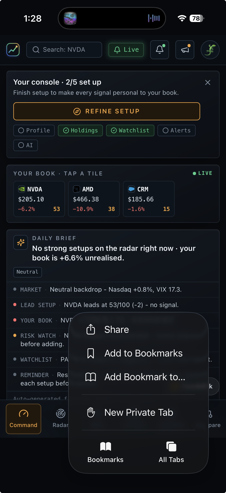
  
  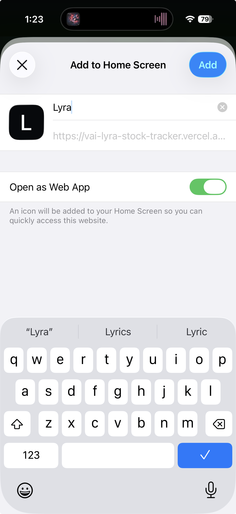
</p>

## 1 - Lyra Notifcations

<!-- <p align="center">
  
  
  
</p> -->

## 1 - Landing Page

<p align="center">
  
  
  
</p>

## 2 - Onboarding

<p align="center">
  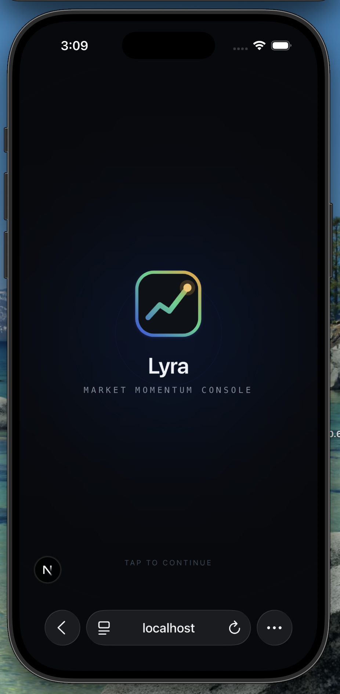
  
  
</p>
<p align="center">
  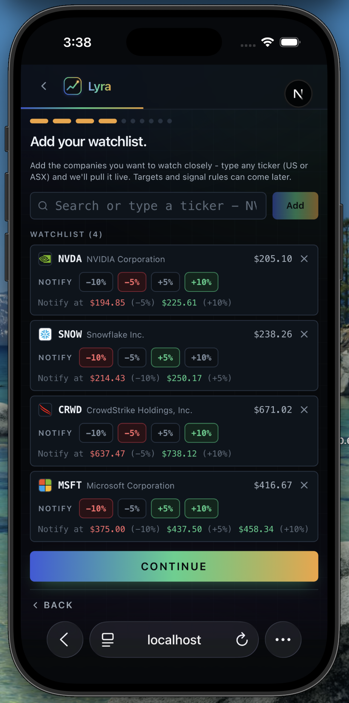
  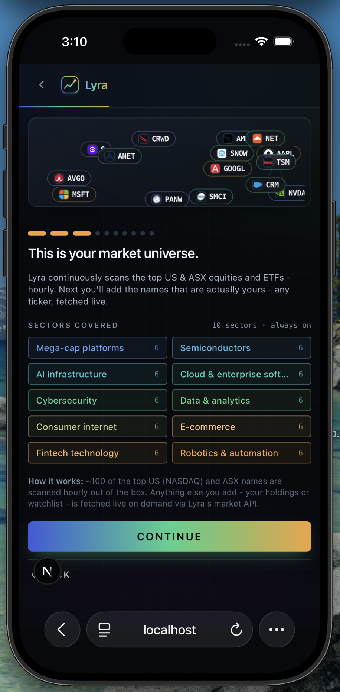
  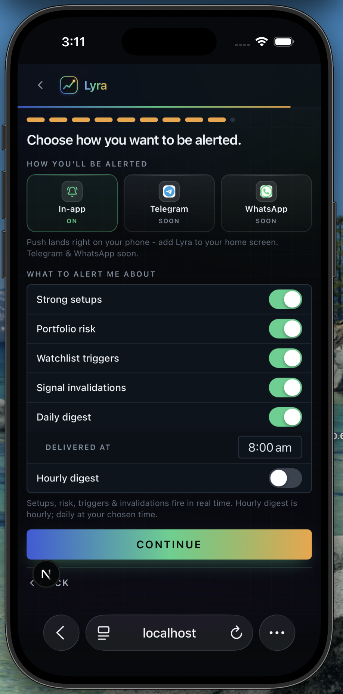
</p>
<p align="center">
  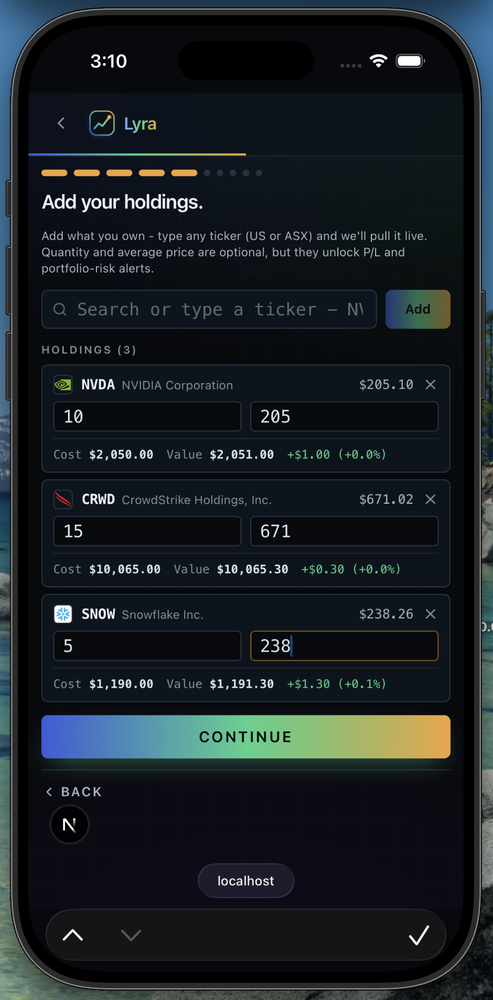
</p>

## 3 - Command Centre

<p align="center">
  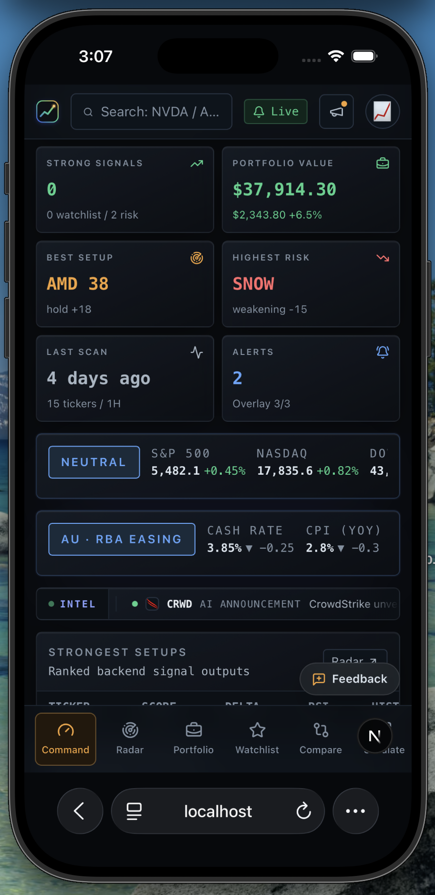
  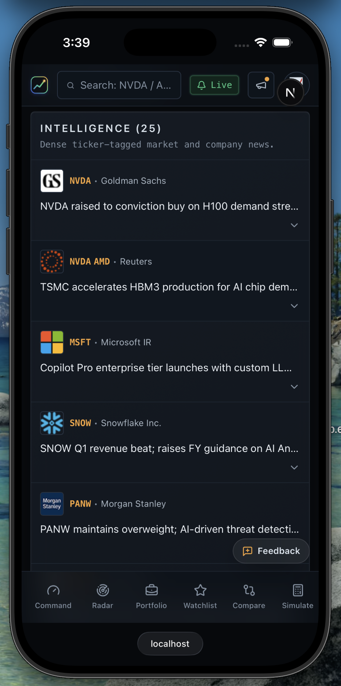
  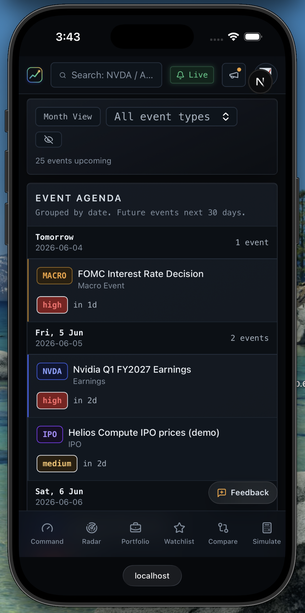
</p>
<p align="center">
  
  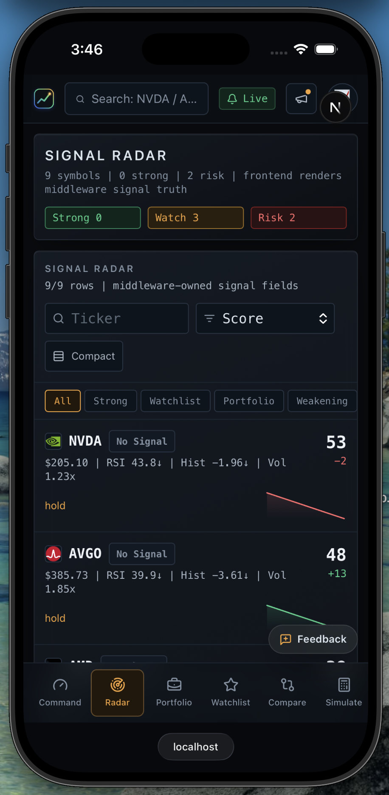
  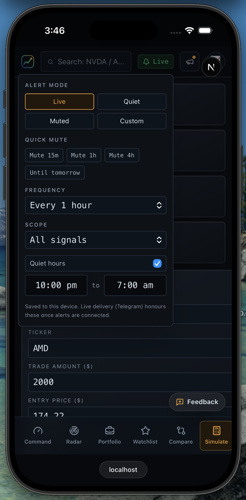
</p>
<p align="center">
  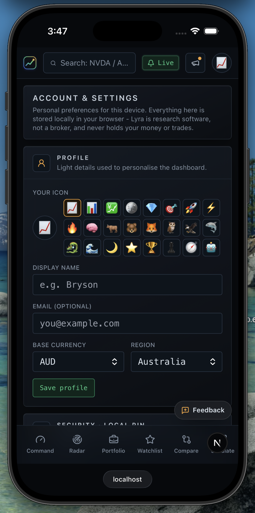
</p>


---

## ✨ What you get

- 🛰️ **Momentum radar** - every tracked stock scored 0-100 with a clear signal state (strong setup / building / near trigger / invalidated)
- 🧮 **Deterministic engine** - RSI, MACD, trend, volume and score are computed in code, never guessed by an AI
- 📊 **Dense command center** - overview, signal radar, per-ticker detail, alerts, and settings
- 💼 **Portfolio + watchlist overlays** - on-the-spot valuation and price-alert thresholds (-10 / -5 / +5 / +10%)
- 🔔 **Telegram alerts** - strong setups and invalidations pushed to your phone (opt-in)
- 🤖 **Optional AI co-pilot** - plain-English briefs and explanations, grounded strictly in the engine's numbers
- 🧪 **Demo-safe everywhere** - no backend? It runs on realistic sample data so you can explore instantly

---

## 🔑 Bring your own key. 🧠 Bring your own model.

The AI layer is **100% opt-in and fully BYO**. Lyra never ships an API key and never proxies your key through a server you don't control.

- **🔑 Bring your own key (BYOK)** - paste your own API key in **Settings → AI**. It's stored **only in your browser** and sent **directly** to your chosen provider when an AI feature runs. It is never committed, never logged, never sent to a Lyra server.
- **🧠 Bring your own model (BYOM)** - pick the exact model you want. Leave it blank for a sensible cheap default, or name any model your key can access (e.g. `claude-3-5-sonnet-latest`, `gpt-4o`, `claude-3-5-haiku-latest`, `gpt-4o-mini`).
- **🔁 Works with OpenAI and Anthropic** out of the box - choose your provider in Settings. (Under the hood the gateway is provider-agnostic and also speaks OpenRouter and Gemini.)

> The AI **explains**; the deterministic engine **decides**. The model is only ever given facts the engine already computed - it never invents a number and never gives buy/sell advice.

Prefer no AI at all? Leave it **Off** (the default). Every brief and explanation has a deterministic fallback, so the whole app works with the AI layer completely disabled.

---

## 🛠️ Three modes - use as much as you want

| Mode | What you need | What you get |
|------|---------------|--------------|
| 🎮 **Demo** | nothing | The full console on built-in sample data. Just `npm run dev`. |
| 📡 **Live** | Supabase + a market-data source | Real hourly scanning, your own tickers, portfolio + watchlist overlays. |
| 🤖 **AI** | your own OpenAI **or** Anthropic key | Plain-English briefs and explanations, with your model of choice. |

Run **`npm run doctor`** anytime to see exactly what's configured, what's missing, and which mode you're in. 🩺

Copy [`.env.example`](./.env.example) to `.env.local` and fill in only what you need. See [`QUICKSTART.md`](./QUICKSTART.md) for the friendly walkthrough and [`SECURITY.md`](./SECURITY.md) for key-handling rules (never put a secret in a `NEXT_PUBLIC_*` variable).

---

## 📡 Going live (optional)

1. **Supabase** - run the SQL in [`sql/`](./sql/) to create the tables, then set `NEXT_PUBLIC_SUPABASE_URL` + `NEXT_PUBLIC_SUPABASE_ANON_KEY` (read-only, frontend) and `SUPABASE_URL` + `SUPABASE_SERVICE_ROLE_KEY` (worker only).
2. **Scan** - `npm run worker:scan` runs the Python scanner once. The included GitHub Actions workflow at [`.github/workflows/hourly-stock-scanner.yml`](./.github/workflows/hourly-stock-scanner.yml) runs it hourly (add your secrets in the repo settings).
3. **Alerts** - add `TELEGRAM_BOT_TOKEN` + `TELEGRAM_CHAT_ID` to receive pushes.

---

## 🧱 Tech stack

- **Frontend:** Next.js 15, React 19, TypeScript, Tailwind CSS
- **Worker:** Python (pandas, yfinance, `ta`, Supabase client) + pytest
- **Data:** Supabase (Postgres) with row-level security; read-only on the frontend
- **AI:** provider/model-agnostic gateway in [`src/lib/ai/gateway.ts`](./src/lib/ai/gateway.ts)
- **Scheduler:** GitHub Actions (hourly)
- **Alerts:** Telegram Bot API

## 📁 Project structure

```
src/app/                  Next.js pages (overview, radar, ticker, alerts, settings)
src/components/           Dashboard + analytics components
src/lib/                  Fetch helpers, demo data, env validation, AI gateway
contracts/notifications/  JSON contracts for the AI notification layer
workers/stock_scanner/    Python scanner (indicators, scoring, overlays, alerts)
sql/                      Supabase schema + seed
tests/                    Worker tests
docs/                     Architecture, AI engine plan, production hardening
```

---

## More from Lyra

<p align="center">
  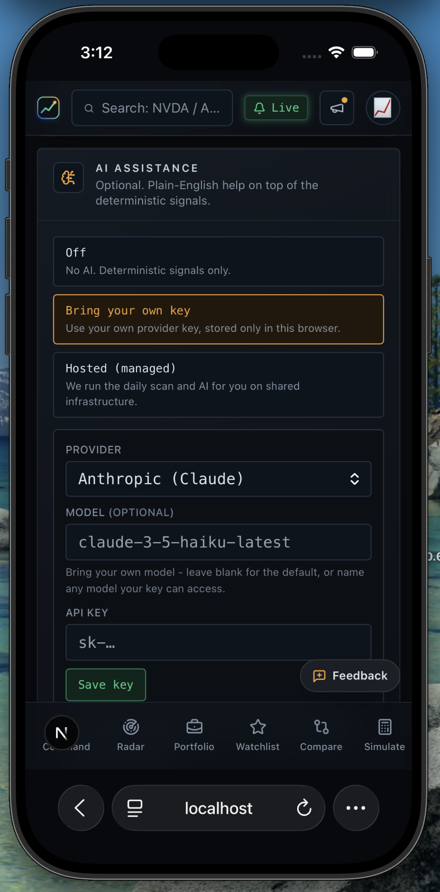
</p>

<p align="center"><sub><b>Notification management</b> &nbsp;·&nbsp; <b>AI support</b></sub></p>

---

## ⚠️ Disclaimer

Lyra is **research software, not financial advice**. It surfaces and explains technical signals; it does not tell you what to buy or sell. Markets are risky - do your own research and never invest more than you can afford to lose.

## 📄 License

[MIT](./LICENSE) - free to use, fork, and learn from. Built with ❤️ by [Vivacity.ai](https://vivacity.ai).
