# 📈 Lyra - Stock Momentum Radar

> An hourly tech-stock momentum scanner that spots recovery setups before they're obvious - and explains them in plain English. **Research, not advice.**

Lyra watches the market on an hourly cadence and scores each stock on momentum recovery: RSI lift, MACD histogram turning up, price location, trend context, and volume participation. A deterministic engine owns every number; an optional AI layer just phrases it for you. Runs on **built-in demo data with zero setup**, and scales up to a live, alerting, AI-explained console when you want it.

```bash
git clone https://github.com/BrysonW24/vai-lyra-stock-tracker.git
cd vai-lyra-stock-tracker
npm install && npm run dev -- -p 3042      # ✨ runs on demo data, no keys needed
```

Open http://localhost:3042 and you're in. 🎉

## 🧭 Make it yours - clone, set up, deploy, all guided

This repo is built to be **shared as a link and replicated end to end**. Four things get you from clone to your own live console:

1. **Setup instructions** - agent-paced or human-paced, your pick:
   - **Have [Claude Code](https://claude.com/claude-code)?** Open it in the clone and run **`/setup`** - the repo ships an agent playbook ([`.claude/commands/setup.md`](./.claude/commands/setup.md)) that sets everything up for you, stage by stage, with a verification gate at every step.
   - **Prefer to drive?** Follow the [walkthroughs](./docs/walkthroughs/README.md): [what Lyra is](./docs/walkthroughs/01-what-is-lyra.md) -> [run it in 5 minutes](./docs/walkthroughs/02-run-it-yourself.md) -> [go live with your own Supabase](./docs/walkthroughs/03-go-live-supabase.md) -> [put it online](./docs/walkthroughs/04-deploy-your-own.md) -> [understand the score](./docs/walkthroughs/05-understand-the-score.md).
2. **An AI key (optional)** - set `OPENAI_API_KEY` server-side for hosted explanations, or paste any provider's key in **Settings -> AI** (BYOK, stays in your browser). The console is fully usable with no AI key at all.
3. **Hosting (optional)** - free on Vercel, or your own server with **Coolify** using the included [`Dockerfile`](./Dockerfile): [deploy walkthrough](./docs/walkthroughs/04-deploy-your-own.md) + [Coolify runbook](./docs/runbooks/coolify-deploy.md).
4. **Alerts where you live** - urgent setups and hourly summaries pushed to you: web push with zero accounts, Telegram in ~10 minutes, Slack via your own incoming webhook (paste it in Settings -> Notifications), WhatsApp honestly scoped: [alerts walkthrough](./docs/walkthroughs/06-alerts-on-your-phone.md).
5. **Costs, fully itemised** - every service in the stack priced in [`COSTS.md`](./COSTS.md). Demo mode is $0; a fully live, always-on setup can run on free tiers.

## 0 - How to Access Lyra

**The best way to share Lyra depends on who you are sharing with - and it is almost never "clone it".**

- **Anyone you want to _show_** (friends, prospects, "look what I built") - send the live link: **[vai-lyra-stock-tracker.vercel.app](https://vai-lyra-stock-tracker.vercel.app)**. Demo mode runs on built-in data with **zero setup, no account, no keys**, so they land straight in the real console. On mobile they can Add to Home Screen (below) for an app-like icon.
- **Developers who want their _own_ copy** - point them at this repo to **fork** (not clone-to-browse) and run the guided setup: Claude Code users run **`/setup`**, everyone else follows the [walkthroughs](./docs/walkthroughs/README.md). The path from demo to deployed is fully gated.
- **AI coding agents** (in case they do clone) - the front door is **[AGENT-ONBOARDING.md](./AGENT-ONBOARDING.md)**: it hands them the `/setup` contract and the verification gates, and if they change code, the enforcement map ([HARNESS.md](./HARNESS.md)) and the skill-chain coverage map ([SKILL-CHAIN.md](./SKILL-CHAIN.md)) that keep the repo honest.

_Rule of thumb: **link** for humans, **fork** for builders, **AGENT-ONBOARDING.md** for agents. The clone is for people who want to run their own Lyra, not for people who just want to see it._

---

## 1 - Landing Page

<p align="center">
  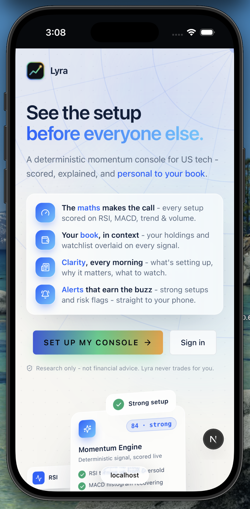
  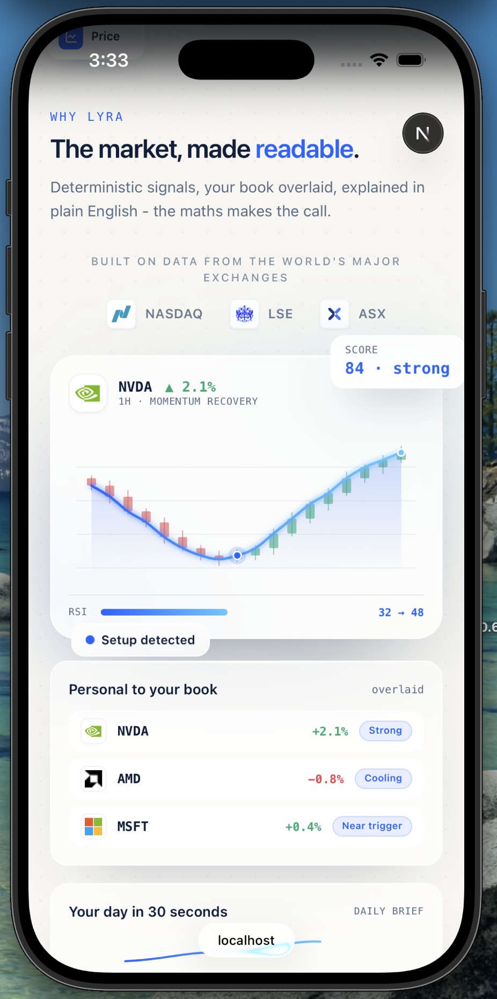
  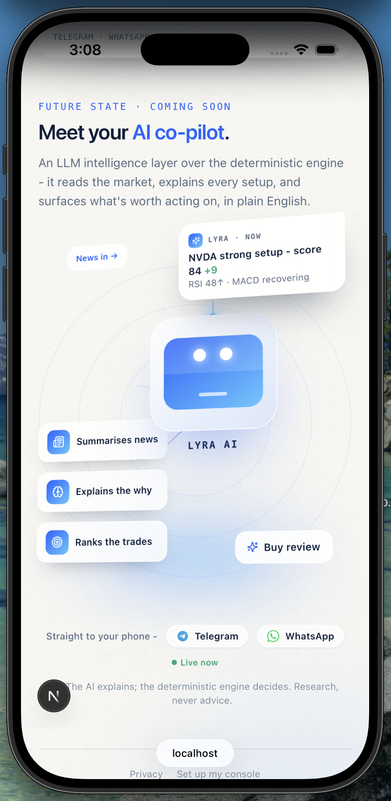
</p>

## 2 - Onboarding

<p align="center">
  
  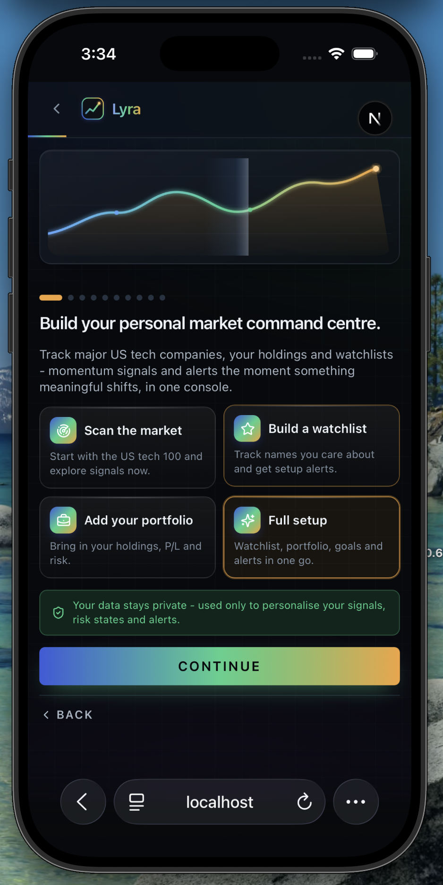
  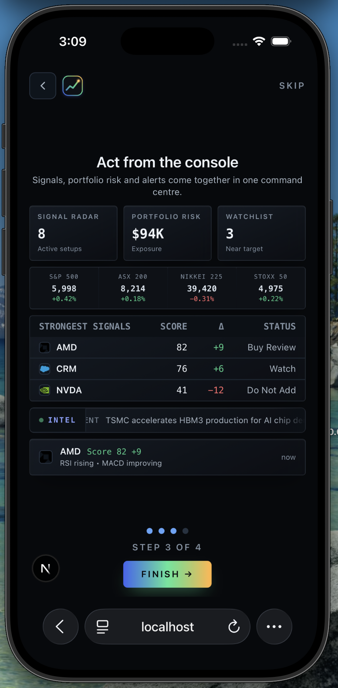
</p>
<p align="center">
  
  
  
</p>

## 3 - Command Centre

<p align="center">
  
  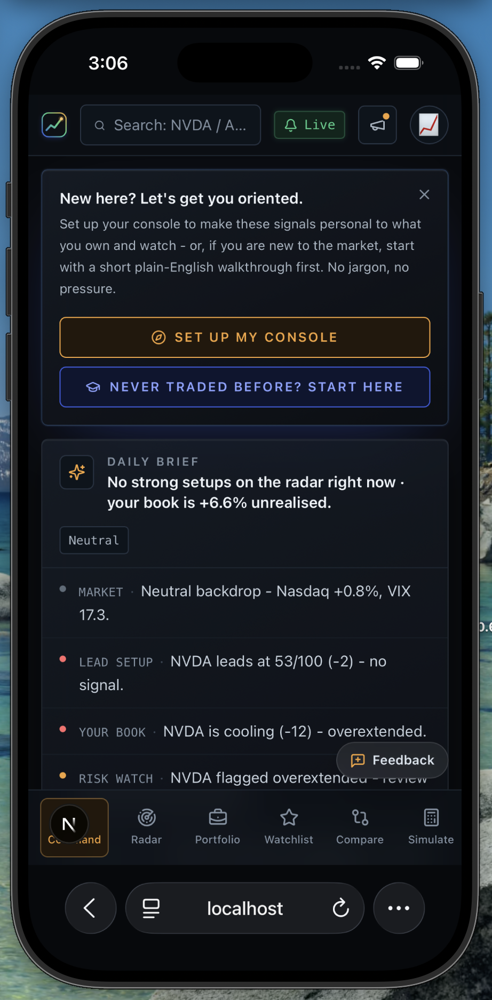
  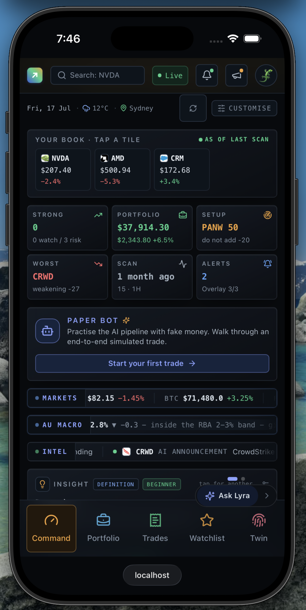
</p>
<p align="center">
  
  
  
</p>
<p align="center">
  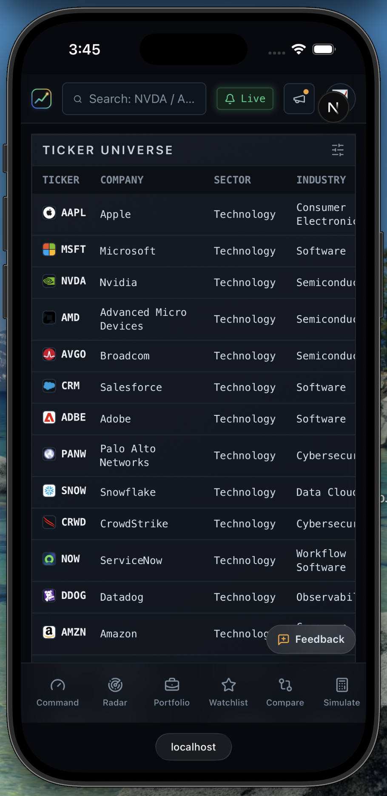
  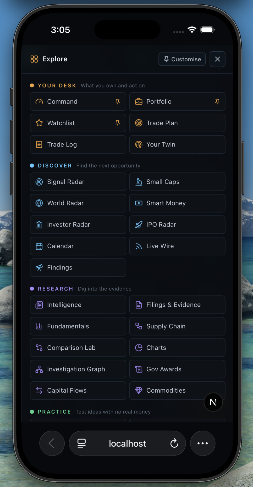
  
</p>

## 4 - Lyra AI

The AI explains; the deterministic engine decides. Bring your own key or use the hosted
beta - the model only ever answers from what is already on your dashboard.

<p align="center">
  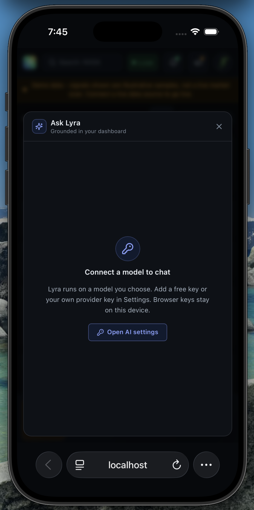
  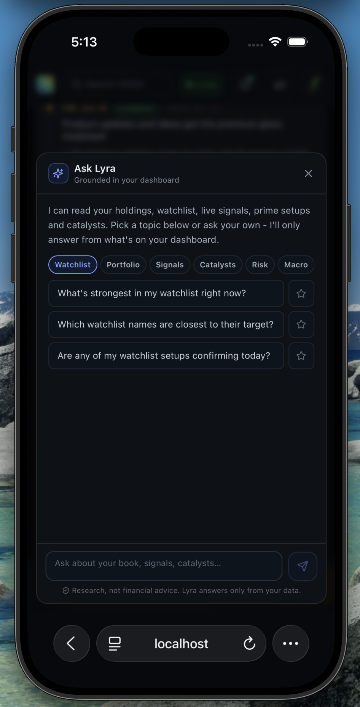
  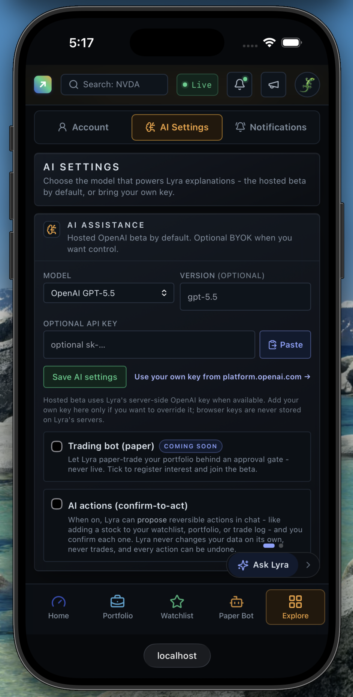
</p>

## 5 - Lyra Notifications

Strong setups and risk flags, delivered on the channels you pick - with quiet hours and
per-scope control so alerts stay worth the buzz. Every alert carries the engine's own
grain: the trigger reason, the symbol, a relevance score, and a link back into Lyra.

<p align="center">
  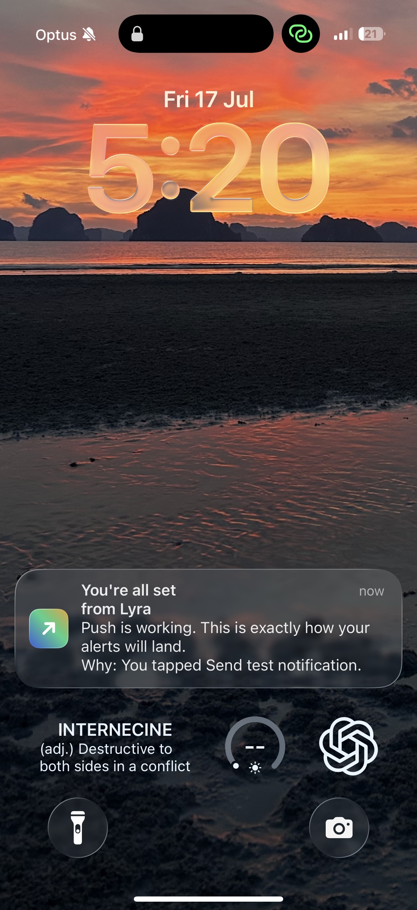
  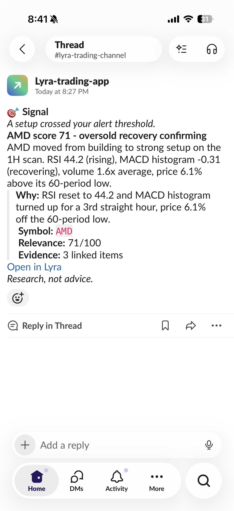
  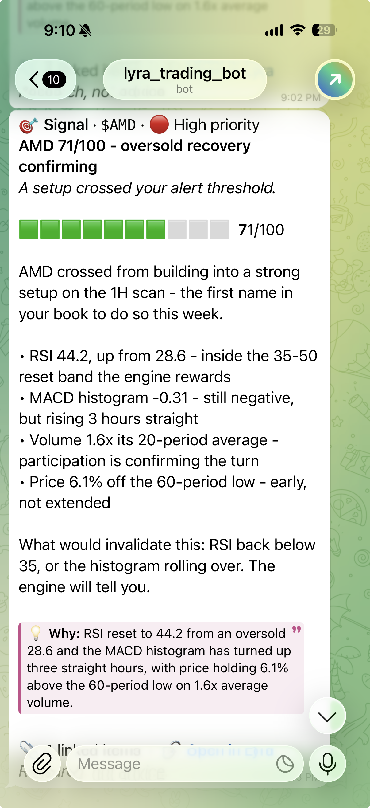
</p>

---

## ✨ What you get

- 🛰️ **Momentum radar** - every tracked stock scored 0-100 with a clear signal state (strong setup / building / near trigger / invalidated)
- 🧮 **Deterministic engine** - RSI, MACD, trend, volume and score are computed in code, never guessed by an AI
- 📊 **Dense command center** - overview, signal radar, per-ticker detail, alerts, and settings
- 💼 **Portfolio + watchlist overlays** - on-the-spot valuation and price-alert thresholds (-10 / -5 / +5 / +10%)
- 🔔 **Alerts on your channels** - strong setups and invalidations pushed to Telegram, Slack (your own webhook), WhatsApp, or web push (all opt-in)
- 🤖 **Optional AI co-pilot** - plain-English briefs and explanations, grounded strictly in the engine's numbers
- 🧪 **Demo-safe everywhere** - no backend? It runs on realistic sample data so you can explore instantly

<p align="center">
  <em>Alerts, where you live:</em><br /><br />
  <a href="./docs/walkthroughs/06-alerts-on-your-phone.md#step-3---telegram-works-today-the-recommended-phone-channel"></a>
  <a href="./docs/walkthroughs/06-alerts-on-your-phone.md#step-4---slack-your-own-webhook-2-minutes"></a>
  <a href="./docs/walkthroughs/06-alerts-on-your-phone.md#step-5---whatsapp-architecture-only---read-before-spending-time-here"></a>
  <a href="./docs/walkthroughs/06-alerts-on-your-phone.md#step-2---web-push-zero-phone-number-needed"></a>
</p>

---

## 🔑 Hosted OpenAI beta. Optional BYOK.

The beta AI layer is wired for a server-side hosted OpenAI key so friends can test Lyra without pasting provider credentials. User keys are still supported and override the hosted key.

- **Hosted default** - set server-side `OPENAI_API_KEY` and new users default to OpenAI (`gpt-5.5`, configurable with `LYRA_HOSTED_OPENAI_MODEL`).
- **Bring your own key (BYOK)** - paste your own API key in **Settings -> AI**. It stays in this browser and is never stored by Lyra.
- **Bring your own model (BYOM)** - pick the exact model you want. Leave it blank for the provider default, or name any model your key can access.
- **Provider-agnostic gateway** - OpenAI, Anthropic, OpenRouter, Gemini, and xAI all route through one server-side gateway.

> The AI **explains**; the deterministic engine **decides**. The model is only ever given facts the engine already computed - it never invents a number and never gives buy/sell advice.

Every brief and explanation has a deterministic fallback, so the app still works if a model call fails.

---

## 🛠️ Three modes - use as much as you want

| Mode | What you need | What you get |
|------|---------------|--------------|
| 🎮 **Demo** | nothing | The full console on built-in sample data. Just `npm run dev`. |
| 📡 **Live** | Supabase + a market-data source | Real hourly scanning, your own tickers, portfolio + watchlist overlays. |
| 🤖 **AI** | `OPENAI_API_KEY` server-side, or a user's BYOK | Hosted beta chat/briefs plus optional user-selected models. |

Run **`npm run doctor`** anytime to see exactly what's configured, what's missing, and which mode you're in. 🩺

Copy [`.env.example`](./.env.example) to `.env.local` and fill in only what you need. See [`QUICKSTART.md`](./QUICKSTART.md) for the friendly walkthrough and [`SECURITY.md`](./SECURITY.md) for key-handling rules (never put a secret in a `NEXT_PUBLIC_*` variable).

---

## ⏱️ How long setup takes

Lyra installs in tiers - stop wherever you want. Times assume you already have Node 20+, npm 10+, and git on the machine.

| Tier | You end up with | Fresh time |
|------|-----------------|------------|
| 🎮 **Demo** | The full console on built-in sample data, zero keys | **5-10 min** |
| 📡 **Live (local)** | Your own Supabase + real hourly scanning, still $0 | **+45-90 min** |
| ☁️ **Deployed** | Cloud always-on: Vercel/Coolify host + hourly GitHub Actions scanner | **+30-90 min** |

**In short:** seeing it run is about **5-10 minutes**; a real personal live instance is about **1 to 1.5 hours**; fully deployed and always-on is about **1.5 to 3 hours** (Vercel path - longer for a self-hosted Coolify box).

What tends to eat the time, and how the repo softens it:

- **Supabase schema is the biggest manual step** - apply the migrations in [`supabase/migrations/`](./supabase/migrations/) in numeric order in the SQL editor. This is most of the "live" time.
- **Silent auth trap:** a new Supabase project defaults its Site URL to `:3000`; Lyra runs on `:3042`, so the email-confirmation link fails until you set it to match.
- **The Python worker does not read `.env.local`** - run `set -a; source .env.local; set +a` before `npm run worker:scan`, or the scan runs green but writes nothing.
- **The first scan is slow** - yfinance pulls 180 days of hourly candles per symbol and occasionally rate-limits. A few minutes is normal.
- **`NEXT_PUBLIC_*` are build-time on Vercel/Coolify** - set them as build variables, not runtime, or the deploy silently runs in demo mode.

The [walkthroughs](./docs/walkthroughs/README.md) give a "you know it worked when" checkpoint plus a symptom-to-fix table after every step, and Claude Code users can run **`/setup`** to have an agent drive the whole thing. Full itemised costs: [`COSTS.md`](./COSTS.md).

---

## 🧰 Commands - the full set

Everything is an npm script; you never need to remember a raw command.

### Day to day

| Command | What it does |
|---|---|
| `npm install` | Install dependencies (also wires the git hooks) |
| `npm run dev -- -p 3042` | Run the dashboard locally at http://localhost:3042 (demo data if no keys) |
| `npm run doctor` | Diagnose your setup: which mode you're in, what's configured, what's missing |
| `npm run build` | Production build of the frontend |
| `npm run type-check` | TypeScript strict check (run before committing) |
| `npm run test` | Frontend unit tests (Vitest) |

### Scanner (live mode)

| Command | What it does |
|---|---|
| `npm run worker:scan` | Run the Python scanner once, right now (needs worker deps: `pip install -r requirements.txt`) |
| `npm run worker:test` | Run the Python worker test suite (pytest) |

### Content + releases (contributors)

| Command | What it does |
|---|---|
| `npm run content:build` | Compile `content/*.jsonl` into importable JSON (runs automatically before dev/build) |
| `npm run release` | Cut a release: syncs `package.json` + `CHANGELOG.md` from `src/lib/version.ts` |
| `npm run check:version` | The pre-push version guard, runnable by hand |

Step-by-step instructions for every stage - from first clone to your own deployed, alerting Lyra - live in the [walkthroughs](./docs/walkthroughs/README.md), and Claude Code users can just run **`/setup`**.

---

## 📡 Going live (optional)

1. **Supabase** - apply the migrations in [`supabase/migrations/`](./supabase/migrations/) in numeric order (the canonical schema - auth, RLS, scanner, trades), then run [`sql/_apply_all_scanner_schema.sql`](./sql/_apply_all_scanner_schema.sql) once (idempotent worker-schema reconciliation). Set `NEXT_PUBLIC_SUPABASE_URL` + `NEXT_PUBLIC_SUPABASE_ANON_KEY` (read-only, frontend) and `SUPABASE_URL` + `SUPABASE_SERVICE_ROLE_KEY` (worker only). Full guide: [go live with your own Supabase](./docs/walkthroughs/03-go-live-supabase.md).
2. **Scan** - `npm run worker:scan` runs the Python scanner once. The included GitHub Actions workflow at [`.github/workflows/hourly-stock-scanner.yml`](./.github/workflows/hourly-stock-scanner.yml) runs it hourly (add your secrets in the repo settings).
3. **Alerts** - add `TELEGRAM_BOT_TOKEN` + `TELEGRAM_CHAT_ID` to receive pushes, and/or paste your own Slack incoming-webhook URL in **Settings -> Notifications** (no server env needed - it persists per user).
4. **Host it** - free on Vercel, or self-host with Docker/Coolify: [deploy walkthrough](./docs/walkthroughs/04-deploy-your-own.md) + [Coolify runbook](./docs/runbooks/coolify-deploy.md). Verify any deploy with `/api/health` (returns the running version + mode). Costs: [`COSTS.md`](./COSTS.md).

---

## 🧱 Tech stack

- **Frontend:** Next.js 15, React 19, TypeScript, Tailwind CSS
- **Worker:** Python (pandas, yfinance, `ta`, Supabase client) + pytest
- **Data:** Supabase (Postgres) with row-level security; read-only on the frontend
- **Cache:** Upstash Redis over REST (optional) - a shared read-through cache across serverless instances; falls back to an in-process map when unset, so it is never required
- **AI:** provider/model-agnostic gateway in [`src/lib/ai/gateway.ts`](./src/lib/ai/gateway.ts)
- **Scheduler:** GitHub Actions (hourly)
- **Alerts:** Telegram Bot API, Slack incoming webhooks, WhatsApp Cloud API, Web Push

## 🏗️ Architecture - what runs where

Lyra runs across three hosts, each doing what it is best at. **Vercel is not just the frontend** - it also runs the entire per-request API layer as serverless functions. The heavy, scheduled compute lives on GitHub Actions, and all shared state lives in Supabase.

```
┌──────────────────────────────────────────────────────────────────┐
│ You   ·   browser / installable PWA                              │
└────────────────────────────────┬─────────────────────────────────┘
                                 │ HTTPS
                                 ▼
┌──────────────────────────────────────────────────────────────────┐
│ VERCEL   ·   region iad1                 the per-request backend │
│                                                                  │
│   Next.js 15 frontend  ─►  37 serverless API routes              │
│       src/app/api/**/route.ts : auth, Supabase reads,            │
│       AI gateway, notifications, twin capture,                   │
│       per-symbol signal refresh                                  │
│                                                                  │
│   calls out  ─►  AI: OpenAI / Anthropic / OpenRouter / Gemini    │
│       notify: Telegram / Slack / WhatsApp / Web Push             │
│                                                                  │
│   Vercel cron  ─►  /api/ingestion/gov-awards  (daily 13:00)      │
└────────────────────────────────┬─────────────────────────────────┘
                                 │ reads state (anon)  ·  writes via API (service)
                                 ▼
┌──────────────────────────────────────────────────────────────────┐
│ SUPABASE   ·   Postgres + row-level security    the shared state │
│                                                                  │
│   Every table RLS-owned. The frontend reads with the anon        │
│   key; the scanner writes with the service key. Demo: none.      │
└────────────────────────────────┴─────────────────────────────────┘
                                 │ writes scan results
                                 │
┌────────────────────────────────┴─────────────────────────────────┐
│ GITHUB ACTIONS   ·   scheduled Python workers      the always-on │
│                                                                  │
│   hourly-stock-scanner.yml  ─►  Python scanner                   │
│       workers/stock_scanner/ : indicators, scoring,              │
│       overlays, alerts                                           │
│                                                                  │
│   nightly-maintenance.yml  ─►  horizon-2 workers,                │
│       outcomes, digests, notification sweep                      │
└────────────────────────────────┬─────────────────────────────────┘
                                 │ pulls OHLCV
                                 ▼
┌──────────────────────────────────────────────────────────────────┐
│ Market data   ·   yfinance / Finnhub                             │
└──────────────────────────────────────────────────────────────────┘
```

**In short:** Vercel serves the console and runs the 37 serverless API routes plus one light daily cron; GitHub Actions runs the always-on Python scanner and the nightly jobs; Supabase (Postgres + row-level security) is the shared state both tiers read and write. Demo mode needs none of it - it runs entirely on built-in sample data.

---

## 🧮 Deterministic engine vs AI - a hard boundary

Lyra is deterministic-first by design. **Every number, score, and decision is computed in code** - the same inputs always produce the same output, with no model in the loop. The AI layer is **optional and additive**: it phrases what the engine already decided in plain English. It is never allowed to compute, override, or invent.

| The deterministic engine (always on) | The AI layer (optional) |
|---|---|
| RSI, MACD, moving averages, volume ratios | Plain-English explanation of a signal |
| The 0-100 score and every component | Daily briefs and chat answers |
| Signal lifecycle and action state | Layout choice for GenUI views |
| Portfolio, watchlist, and alert thresholds | Framing tuned to your risk posture |
| Runs with zero keys (demo and live) | Needs a hosted key or your BYOK |
| The source of every fact | Given those facts, never the market |

**How they work together:** the engine runs first and owns the truth. When you ask for an explanation, the AI is handed *only the facts the engine already computed* - never raw market data, never a blank prompt - and its output passes a fabrication-and-advice guard (`guardProse`) before you see it. If the model is unconfigured, fails, or returns something the guard rejects, the console falls back to a deterministic view built from the same numbers. **The app is fully usable with no AI at all.**


> **AI explains; the engine decides.** The model never invents a number and never tells you what to buy or sell - that is what keeps Lyra research, not advice.

---

## 📁 Project structure

```
src/app/                  Next.js pages (overview, radar, ticker, alerts, settings)
src/components/           Dashboard + analytics components
src/lib/                  Fetch helpers, demo data, env validation, AI gateway, Pine export
contracts/notifications/  JSON contracts for the AI notification layer
workers/stock_scanner/    Python scanner (indicators, scoring, overlays, alerts)
sql/                      Supabase schema + seed
tests/                    Worker tests
docs/walkthroughs/        Clone-to-live walkthroughs (start here to replicate)
docs/runbooks/            Deploy + operations runbooks (Coolify, kill switch, ...)
docs/                     Architecture, AI engine plan, production hardening
.claude/commands/         /setup - agent playbook for Claude Code users
Dockerfile                Self-hosting image (Coolify/Docker); Vercel ignores it
COSTS.md                  Every service in the stack, priced
```

---

## 🧬 On the roadmap - your Digital Trading Twin

A **digital trading twin** is a private, per-user model of *what you pay attention to, how you weigh risk, and which setups you actually act on* - learned quietly from how you use Lyra. It does two things: it **reflects your own habits back to you** (are you catching names early or chasing them late? do you size up right after a loss?), and it lets Lyra **compose the screen for you** instead of for everyone. Down the line, a twin becomes portable - a new user could be *onboarded into* an existing twin (your own across devices, or a mentor's) as a starting posture rather than a blank slate.

It stays strictly inside Lyra's contract: the twin is a **preference and attention model, never a decision model.** It learns *where you look*, never "what to buy"; it never places an order and never gives advice. The deterministic engine still owns every number and every decision - the twin only decides what to show you first and how to frame it for your risk posture, and it ships with an **anti-bubble guarantee** (personalisation may raise attention but may never lower the visibility of risk or disconfirming evidence).

📄 **Full pitch:** [`docs/strategy/2026-07-16-digital-trading-twin.md`](docs/strategy/2026-07-16-digital-trading-twin.md) - concept, what it learns, the onboarding-into-a-twin future, the architecture that keeps the contract, a phased roadmap, and an honest "what would make us not build this."

---

## ⚠️ Disclaimer

Lyra is **research software, not financial advice**. It surfaces and explains technical signals; it does not tell you what to buy or sell. Markets are risky - do your own research and never invest more than you can afford to lose.

## 📄 License

[MIT](./LICENSE) - free to use, fork, and learn from. Built with ❤️ by [Vivacity.ai](https://vivacity.ai).
