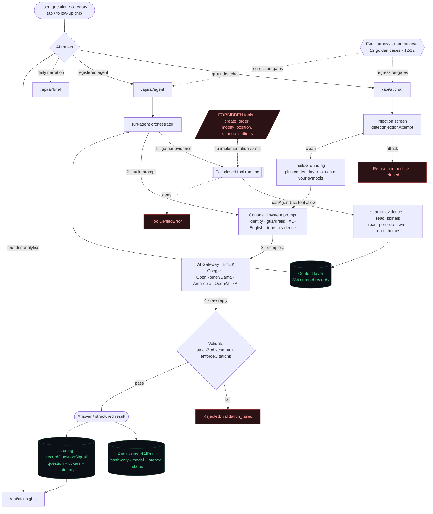
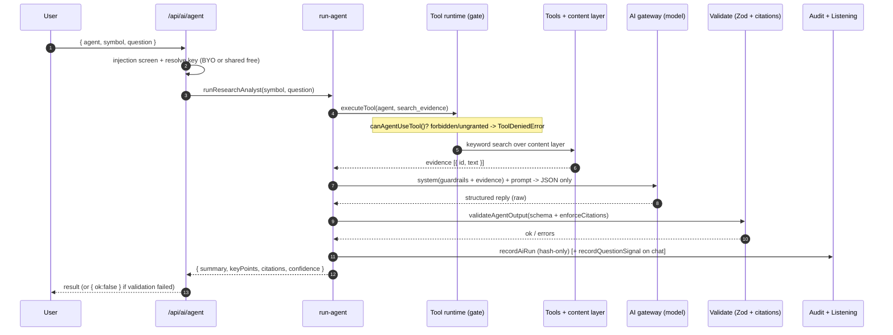

# Ask Lyra - AI tool + agent architecture

How every AI call in Lyra flows from a user question to a grounded, cited, audited answer - and
why the model **phrases and cites but can never decide a number or place an order**. Documented
three ways: a Mermaid flowchart, a Mermaid sequence diagram, and an ASCII schematic.

> Doctrine: deterministic-first. The rules engine owns every number; the AI narrates. Safety is
> enforced in code (a fail-closed tool gate + schema validation), not in a disclaimer.

---

## 1. Pipeline (Mermaid flowchart)



---

## 2. One request, end to end (Mermaid sequence)



---

## 3. ASCII schematic

```text
                          ASK LYRA  -  AI TOOL + AGENT ARCHITECTURE (vdapp42)
 ================================================================================================

   USER  (mobile / sim)
     |  "Why is NVDA strong?"  .  tap a category  .  tap a follow-up chip
     v
 +------------------------------------------------------------------------------------------+
 |  ROUTES   /api/ai/chat (copilot)   /api/ai/agent (agents)   /api/ai/brief   /api/ai/insights |
 +--------------+----------------------------------------------------+--------------------------+
                |                                                    |
        +-------v--------+                               +-----------v-----------------+
        | INJECTION SCREEN|  detectInjectionAttempt()    |  run-agent.ts (orchestrator)|
        |  attack -> refuse + audit                       |  research_analyst, trade_.. |
        +-------+--------+                               +-----------+-----------------+
                |                                                    | 1. gather evidence
                |                                                    v
                |                              +-------------------------------------------+
                |                              |  TOOL RUNTIME  (fail-closed)              |
                |                              |  executeTool(agent, tool):                |
                |                              |    canAgentUseTool() --allow--> [ tools ] |--+
                |   ###########################|                                           |  |
                |   #  FORBIDDEN TOOLS WALL    #|    --deny--> ToolDeniedError              |  |
                |   #  create_order        X   #|   tools: search_evidence, read_signals,  |  |
                |   #  modify_position     X   #|          read_portfolio_own, read_themes |  |
                |   #  change_settings     X   #|   (forbidden tools have NO case = unrunnable) |
                |   ###########################+-------------------------------------------+  |
                |                                                    ^ evidence {id,text}      |
                |                        +---------------------------+-----------+            |
                |   buildGrounding() ----+  CONTENT LAYER (284 curated records)  |<-----------+
                |   joins content onto   |  themes . companies . supply-chain .              
                v   YOUR holdings/watch  |  IPOs . finance-facts                             
        +-----------------------------------------------------------v----------------------+
        |  CANONICAL SYSTEM PROMPT (system-prompt.ts)  - one source, every model            |
        |  identity . guardrails (grounding/no-advice/safety/honesty) . AU-English .        |
        |  format . tone(profile) . CONTEXT (+thematic join) . agent refusal rules          |
        +-----------------------------------+----------------------------------------------+
                                            v  complete()
        +----------------------------------------------------------------------------------+
        |  AI GATEWAY (gateway.ts)  BYOK . 5 providers                                      |
        |  Google (free default) . OpenRouter/Llama . Anthropic . OpenAI . xAI/Grok         |
        |  key: user's own  --or--  shared GOOGLE_AI_KEY (zero-setup free tier)             |
        +-----------------------------------+----------------------------------------------+
                                            v  raw reply
        +----------------------------------------------------------------------------------+
        |  VALIDATE  validateAgentOutput() -> strict-Zod schema + enforceCitations()        |
        |            fail -> status:validation_failed (rejected, not shown)                 |
        +-----------------------------------+----------------------------------------------+
                                            v  record (always)
        +--------------------------+   +-----------------------------------------------------+
        |  AUDIT recordAiRun()     |   |  LISTENING recordQuestionSignal()                  |
        |  hash-only . model .     |   |  question + tickers + category (separate, on purpose)|
        |  latency . status .      |   |  -> /api/ai/insights -> "what users want" -> roadmap |
        |  injectionFlags          |   +-----------------------------------------------------+
        +--------------------------+
                                            |
   ANSWER -> clean text + follow-up chips   |   agent -> {summary,keyPoints,citations,confidence}

   -- GATING / MEASUREMENT --------------------------------------------------------------------
   EVAL HARNESS  `npm run eval`  -> 12 golden cases (grounding . never-advice . injection) 12/12 OK
```

---

## 4. Layer by layer

| Layer | File | What it does |
|---|---|---|
| Routes | `src/app/api/ai/{chat,agent,brief,insights}/route.ts` | Entry points. Chat = grounded copilot; agent = registered agents; brief = daily narration; insights = founder analytics |
| Injection screen | `lib/ai/guardrails/injection.ts` | `detectInjectionAttempt()` - hidden-instruction / jailbreak attempts are refused and audited as `refused` |
| Orchestrator | `lib/ai/run-agent.ts` | Gathers evidence → prompts for JSON → validates → audits. The model never chooses to execute |
| Tool runtime (gate) | `lib/ai/tools/runtime.ts` | `executeTool()` calls `canAgentUseTool()` first (fail-closed). Forbidden tools have **no case** - structurally unrunnable |
| Tools | `lib/ai/tools/index.ts` | `search_evidence` (keyword retrieval over content), `read_signals`, `read_portfolio_own`, `read_themes` - all read-only |
| Content layer | `content/*.jsonl` → `lib/generated/*.json` | 284 curated records (themes, companies, supply-chain, IPOs, finance-facts). Joined into grounding + searchable as evidence |
| Canonical prompt | `lib/ai/system-prompt.ts` | One source of identity + guardrails + AU-English + format; composed per route. One edit raises the floor everywhere |
| Grounding | `lib/ai/chat-context.ts` | `buildGrounding()` - your holdings/watchlist/signals/setups/catalysts + the thematic content join |
| Gateway | `lib/ai/gateway.ts` | BYOK dispatch to 5 providers; free Google default via shared `GOOGLE_AI_KEY` |
| Validation | `lib/ai/guardrails/schema.ts` | `validateAgentOutput()` - strict-Zod + `enforceCitations()`. Invalid output is rejected, not shown |
| Audit | `lib/ai/audit.ts` | `recordAiRun()` - hash-only (never raw prompts): model, latency, status, injection flags. For trust/forensics |
| Listening | `lib/ai/question-signals.ts` | `recordQuestionSignal()` - captures question + tickers + category **on purpose**, to learn what users want |
| Policy | `lib/ai/policy.ts` | `AI_NEVER`, `FORBIDDEN_TOOLS`, `AGENT_TOOL_MATRIX`, fail-closed `canAgentUseTool()` |
| Registry | `lib/ai/agents/registry.ts` | 8 agents, each with strict-Zod input/output schemas + refusal rules |
| Eval | `evals/corpus.json` + `scripts/eval.mjs` | `npm run eval` - 12 golden cases (grounding, never-advice, injection); regression-gates `lib/ai` |

---

## 5. Why it is safe (the four walls)

1. **Injection screen** - user/data content is treated as untrusted; hidden instructions are refused.
2. **Fail-closed tool gate** - an agent can only call tools in its grant; forbidden tools (`create_order`,
   `modify_position`, `change_settings`) have no implementation at all - they cannot be expressed.
3. **Schema + citation validation** - structured output that does not match the agent's strict-Zod
   schema (or lacks citations) is rejected before it ever reaches the user.
4. **Hash-only audit** - every run is recorded for forensics without ever storing the raw prompt.

The model's job is to **phrase grounded facts and cite them**. It cannot invent a number, give
advice, or take an action. That is the trust wedge, enforced in code.

---

## 6. Verified

- `npm run eval` → **12/12** (grounding, never-advice, injection refusal).
- `/api/ai/agent` (research_analyst, NVDA) → retrieved 6 evidence ids, returned schema-valid
  `{summary, keyPoints, citations:[company:NVDA, theme:agi-infrastructure], confidence}`.
- `/api/ai/insights` → live demand snapshot (top symbols, categories, run health).
- AU-English enforced (US-worded prompt returns AU spelling).

## 7. Next

`trade_readiness` (the paper-bot's verdict agent) plugs into the **same** `run-agent` runtime:
gather evidence → emit one of three verdicts (never an order) → deterministic OrderIntent builder →
risk engine → approval gate → paper fill. The tool gate above is the hard prerequisite that makes it safe.
