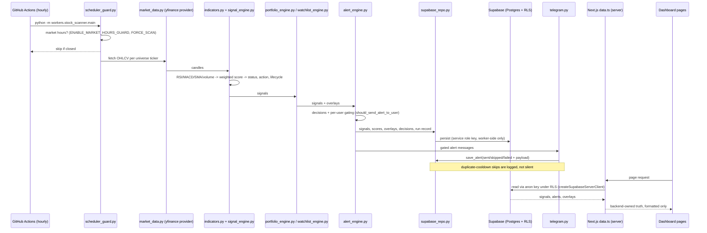
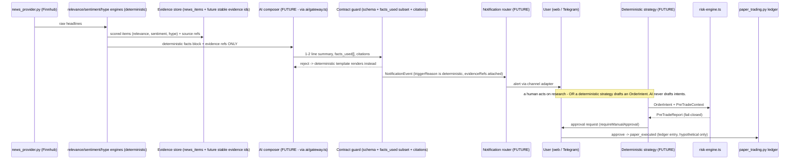
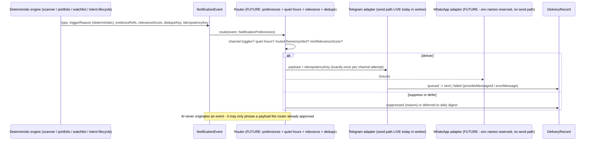

# Data flow - end-to-end sequences

> **Purpose:** Show how data actually moves through Lyra today, and how the planned evidence-to-alert and notification-router flows will work, with explicit current-vs-future labelling. | **Audience:** Engineers and agents tracing behaviour or wiring new flows. | **Status:** Active | **Owner:** Bryson Walter | **Last updated:** 2026-06-11

All four flows obey the same rule: deterministic engines produce truth; the frontend formats but never recalculates (`CLAUDE.md` convention); AI, where present, only phrases facts handed to it.

## Flow 1 - Scanner to signals to dashboard (LIVE today)

The hourly heartbeat. Trigger is the repo-root GitHub Actions workflow (per `CLAUDE.md`: `.github/workflows/vdapp42-hourly-stock-scanner.yml`) or a local `npm run worker:scan`.



**Demo fallback (always available):** when `NEXT_PUBLIC_SUPABASE_URL`/`ANON_KEY` are absent, `src/lib/data.ts` serves `src/lib/demo-data.ts` and `src/lib/live-signals.ts` recomputes the same deterministic signal server-side from live Yahoo daily OHLCV - a faithful TS port of `indicators.py` + `signal_engine.py`, so panels agree with the chart without any backend.

**Failure modes:** market closed -> guard skips; provider error per symbol -> symbol skipped or keeps demo signal; Supabase write failure -> run errors are logged by the worker (`logger.py`); Telegram failure -> recorded in the alert row's `error_message`, never retried into duplicates (cooldown check first).

## Flow 2 - Content JSONL to generated JSON to surfaces (LIVE today)

The AI-native editorial layer: facts live in data files, not code. See `content/README.md`.

```mermaid
sequenceDiagram
    participant Editor as Human or agent
    participant JSONL as content/<domain>.jsonl
    participant Build as scripts/build-content.mjs
    participant Gen as src/lib/generated/<domain>.json
    participant Lib as src/lib/world-radar.ts (and ipos.ts, commodities.ts, smart-money.ts)
    participant Pages as themes / small-caps / investors / ipos / commodities / smart-money pages

    Editor->>JSONL: edit ONE line (one JSON record per line)
    Editor->>Build: npm run content:build (also auto via predev/prebuild/pretype-check)
    Build->>Build: parse each line; invalid JSON exits 1 with file:line
    Build->>Gen: write <domain>.json + manifest.json (domain discovery)
    Lib->>Gen: import + cast to the domain TypeScript type
    Pages->>Lib: typed accessors (getThemes, scoreThemeCompanies, getCapitalEvents, ...)
    Note over Lib,Pages: deterministic scoring in world-radar.ts - AI never writes these records into the app
```

**Failure modes:** malformed JSONL line -> build fails loudly with `file:line` before dev/build/type-check proceeds; field-name drift vs the TS interface -> caught by `npm run type-check` because the generated JSON is cast against the domain type.

## Flow 3 - News to evidence store to AI summary to alert to paper trade (FUTURE - partially grounded)

**Status: target state.** The grounded pieces today: `workers/intelligence_worker/` (news fetch + relevance/sentiment/hype engines) writing toward `news_items` / `ticker_news_map` (`supabase/migrations/014_future_intelligence.sql`), and the notification contracts (`src/lib/notifications/types.ts`, `contracts/notifications/`). The AI composer, evidence ids, notification router, and intent wiring do NOT exist yet.



The end of this chain is always the paper ledger. Live execution is intentionally unreachable - see [`future-trading-bot.md`](./future-trading-bot.md).

## Flow 4 - Deterministic event to notification router to channel adapters

**Current state:** there is no router. The worker's `alert_engine.py` gates per user (quiet hours, mutes, thresholds, cooldowns) and `main.py` sends directly through `telegram.py`, logging every attempt via `save_alert`. Channel destinations are registered through `src/app/api/notifications/route.ts` into `notification_channels` under RLS.

**Target state:** the contracts in `src/lib/notifications/types.ts` define the router that replaces the direct send:



**Inbound commands (FUTURE):** `InboundCommand` in `src/lib/notifications/types.ts` enumerates the allowed Telegram commands (`status`, `portfolio`, `approve`, `reject`, `killswitch`, ...). High-risk commands require an exact pending-approval match - never free-form parsing. `TELEGRAM_WEBHOOK_SECRET` is reserved in `.env.example` for webhook authentication; no webhook route exists in `src/app/api/` today.

## Cross-flow invariants

1. Numbers flow one way: deterministic engine -> (optional AI phrasing) -> user. AI output that introduces a number not present in its input facts must be rejected (contract rule: `facts_used` is a subset of the event's `facts` - `contracts/notifications/notification-contracts.schema.json`).
2. Every suppression is auditable: cooldown skips, quiet-hours deferrals, and rejected AI output all leave records (alert rows today; `DeliveryRecord.suppressed` in the target router).
3. Idempotency everywhere: alerts dedupe on cooldown keys today; the router contract carries `dedupeKey` + `idempotencyKey`; order intents carry `idempotencyKey` built by `buildIdempotencyKey()` (`src/lib/trading/risk-engine.ts`).
4. The frontend never recomputes core logic - it renders backend-owned truth or the server-side TS port (`src/lib/live-signals.ts`), never its own math in components.
