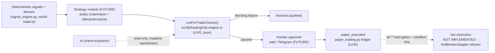

# Future trading bot - how a bot will eventually sit on top

> **Purpose:** Specify how an automated trading layer will eventually compose with Lyra's deterministic engines: the OrderIntent lifecycle, the real pre-trade checks, kill switches, approval flow, what is deliberately NOT implemented, and the hard gates before live execution could ever be considered. | **Audience:** Engineers and agents touching `src/lib/trading/` or proposing execution features. | **Status:** Active | **Owner:** Bryson Walter | **Last updated:** 2026-06-11

## Read this first

**No live broker execution exists in this codebase, and nothing in this doc implies otherwise.** What exists today is exactly three files plus a paper ledger:

- `src/lib/trading/types.ts` - types only (`OrderIntent`, `TradingSettings`, kill switches, pre-trade contracts).
- `src/lib/trading/risk-engine.ts` - a pure, deterministic, fail-closed pre-trade engine with no I/O.
- `src/lib/trading/broker-adapter.interface.ts` - an interface whose only implementation is `NullBrokerAdapter`, which refuses every call with "Refused: live execution is disabled in this build."
- `workers/stock_scanner/paper_trading.py` - a deterministic hypothetical-position ledger. No broker, no real money (tested in `tests/test_paper_trading.py`).

**LLMs never generate orders.** An intent is produced by deterministic strategy logic, passes the deterministic risk engine, requires human approval where configured, and can at most be paper-executed. AI may write `OrderIntent.aiExplanation` after the fact - that is its entire role here (`src/lib/trading/types.ts`).

## OrderIntent lifecycle

Statuses from `OrderIntentStatus` in `src/lib/trading/types.ts`:

```mermaid
stateDiagram-v2
    [*] --> drafted: deterministic strategy emits intent\n(frozen signal/risk/evidence snapshots + idempotencyKey)
    drafted --> blocked: pre-trade engine fails\n(any blocking check)
    drafted --> pending_approval: passes + requireManualApproval
    drafted --> approved: passes + approval not required\n(paper modes only)
    pending_approval --> approved: explicit human approval\n(web today; Telegram approve later)
    pending_approval --> rejected: human rejects
    pending_approval --> expired: approval window lapses
    approved --> paper_executed: paper ledger entry\n(workers/stock_scanner/paper_trading.py)
    blocked --> [*]
    rejected --> [*]
    expired --> [*]
    paper_executed --> [*]
    note right of paper_executed
        live_executed exists in the type
        and is INTENTIONALLY UNREACHABLE:
        - risk engine blocks all live modes
        - NullBrokerAdapter refuses everything
        - no live adapter exists
    end note
```

Supporting mechanics:

- **Idempotency:** `buildIdempotencyKey(strategyId, symbol, side, isoDay)` (`risk-engine.ts`) collapses same strategy+symbol+side+day; the `duplicate` check blocks any intent whose key is already open.
- **Auditability:** every intent freezes `signalSnapshot`, `riskSnapshot`, and `evidenceSnapshot` at draft time "so the decision is auditable forever" (`types.ts`).
- **Defaults are off:** `DEFAULT_TRADING_SETTINGS` ships `tradingMode: 'disabled'`, `maxOrderNotional: 0`, `maxDailyLoss: 0`, `requireManualApproval: true`, empty `allowedStrategies` - a fresh account cannot pass the engine even in paper mode until limits are deliberately configured.

## The pre-trade engine - real check ids

`runPreTradeChecks(intent, ctx)` in `src/lib/trading/risk-engine.ts` evaluates every gate, side-effect free, fail-closed (unknown or missing context fails). These are the actual check ids in the code:

| # | Check id | Severity | What it enforces |
|---|---|---|---|
| 1 | `trading_mode` | blocking | Trading is enabled at all (`disabled` is the default) |
| 2 | `no_live_execution` | blocking | Only `disabled` / `paper_only` / `approval_required` accepted - live modes are refused in this build even if configured |
| 3 | `kill_switches` | blocking | No active kill switch (all of them, not just hard-kill ones) |
| 4 | `strategy_allowed` | blocking | Strategy id is on the user's `allowedStrategies` allowlist |
| 5 | `symbol_not_blocked` | blocking | Symbol not on the user's blocklist |
| 6 | `theme_not_blocked` | blocking | Symbol's theme not on the user's blocked themes |
| 7 | `market_open` | blocking | Market session is open |
| 8 | `symbol_tradable` | blocking | Symbol not halted / untradable |
| 9 | `broker_connected` | blocking | Broker (paper) connection healthy |
| 10 | `quote_fresh` | blocking | Quote age within `maxQuoteAgeSeconds`; stale data fails closed |
| 11 | `max_order_notional` | blocking | `0 < notional <= maxOrderNotional` |
| 12 | `max_position_pct` | blocking | Post-trade position within `maxPositionPct` of portfolio (zero portfolio value fails) |
| 13 | `max_daily_loss` | blocking | Daily loss limit configured (> 0) AND realised daily PnL above `-maxDailyLoss`; an unconfigured limit FAILS |
| 14 | `max_drawdown` | blocking | Portfolio drawdown below `maxTotalDrawdownPct` |
| 15 | `liquidity` | blocking | Average daily dollar volume meets `minDollarVolume` floor |
| 16 | `spread` | blocking | Spread within `maxSpreadPct` |
| 17 | `earnings_blackout` | warning | Outside the earnings blackout window (warning for paper; would be blocking for live) |
| 18 | `news_blackout` | warning | No high-impact news-risk blackout (same escalation note) |
| 19 | `duplicate` | blocking | Idempotency key not already open |
| 20 | `intent_sane` | blocking | Quantity and notional are positive finite numbers |

The `PreTradeReport` carries `passed` (no blocking failures), `requiresApproval` (mirrors `requireManualApproval`), and the full check list including warnings - so the report itself is an audit artifact, and the future `intent-explainer` agent can phrase it without touching it.

## Kill switches

Eleven switch ids defined in `ALL_KILL_SWITCHES` (`risk-engine.ts`), state shape in `types.ts` (`reason` is mandatory when active):

| Id | Scope |
|---|---|
| `global` | All trading activity platform-wide |
| `user` | All trading for one account |
| `strategy` | One strategy across all users |
| `broker` | A broker connection (outage, errors) |
| `symbol` | New orders in one symbol |
| `theme` | New orders in a whole theme |
| `daily_loss` | Trips when the daily loss limit is hit |
| `error_rate` | Trips on elevated system error rates |
| `slippage` | Trips when realised slippage exceeds tolerance |
| `data_staleness` | Trips when market data is stale |
| `ai_system` | Disables the AI layer (which can never trade anyway - defence in depth) |

`isHardKilled()` treats `global` / `user` / `broker` as stop-everything regardless of context, and the `kill_switches` check blocks on ANY active switch. **Not built yet:** persistence of switch state, automatic trip wiring (daily_loss/error_rate/slippage/data_staleness monitors), and an admin surface to flip them. The `kill_switch_enabled` notification type is already contracted (`src/lib/notifications/types.ts`).

## Approval flow - web and Telegram

- **Contracted today:** `requireManualApproval` in `TradingSettings` (default true) and `PreTradeReport.requiresApproval`; notification types `order_intent_created`, `order_approval_required`, `order_rejected`; inbound commands `approve` / `reject` with the rule that "high-risk inbound commands require an exact pending-approval match - never free-form" (`src/lib/notifications/types.ts`).
- **Built today:** none of the approval UI or Telegram inbound path exists. There is no webhook route in `src/app/api/` (`TELEGRAM_WEBHOOK_SECRET` is reserved in `.env.example` for when it lands).
- **Target:** approval surfaces in the web app (review the intent + full `PreTradeReport`) and via Telegram reply, both resolving to the same single approval record, idempotent on the intent's `idempotencyKey`. An approval can only move `pending_approval -> approved`; it can never resurrect `blocked`, `rejected`, or `expired` intents.

## What is deliberately NOT implemented

State these plainly; do not let any doc, UI copy, or commit message imply otherwise:

- No live broker adapter. Only `NullBrokerAdapter` exists.
- No order submission, modification, or cancellation against any real or sandbox broker.
- No strategy module that drafts `OrderIntent`s (the lifecycle's producer does not exist yet - even paper intents are not auto-generated today).
- No `order_intents` / `execution_audit_logs` tables (the latter is named as a future requirement in `broker-adapter.interface.ts` comments).
- No kill-switch persistence, monitors, or admin UI.
- No approval UI, no Telegram inbound command handling.
- No broker credentials anywhere - and when they come, the rule is already written: "API keys server-side only, in managed secret storage - never Supabase rows, never the frontend bundle, never logs" (`broker-adapter.interface.ts`).
- `live_limited` / `live_full` trading modes exist as type values only and are refused by the `no_live_execution` check.

## Hard gates before live execution

Live execution may not be proposed, let alone built, until EVERY gate below passes. These are sequential - a later gate cannot compensate for an earlier one.

- [ ] **Gate 1 - Backtest evidence.** Strategy validated on historical data via an extended `workers/stock_scanner/backtest_engine.py` suite with documented assumptions (slippage, fees, liquidity) and out-of-sample results recorded in the repo.
- [ ] **Gate 2 - Paper validation period.** The full lifecycle (`drafted -> ... -> paper_executed`) running end-to-end for a sustained period with real market data, with paper results vs backtest expectations reviewed and divergences explained.
- [ ] **Gate 3 - Risk configuration proven.** Non-zero `maxOrderNotional`, `maxDailyLoss`, position and drawdown limits deliberately set and exercised - including demonstrating that the engine blocks when limits are hit (the engine already fails an unconfigured daily-loss limit by design).
- [ ] **Gate 4 - Sandbox broker first.** A sandbox/paper-environment `BrokerAdapter` implementation, with every call and error written to `execution_audit_logs`, idempotency keys on every submission, and verified no-duplicate behaviour under retries.
- [ ] **Gate 5 - Kill-switch drills.** Every one of the 11 switches tripped in test and shown to halt the relevant scope immediately; automatic monitors (`daily_loss`, `error_rate`, `slippage`, `data_staleness`) wired and demonstrated.
- [ ] **Gate 6 - Manual approval mandatory.** `requireManualApproval` stays true for any initial live phase; approval surfaces audited; no unattended operation.
- [ ] **Gate 7 - Legal and regulatory review.** Jurisdiction-specific review of licensing, market-access obligations, and disclosure language before any real order. Research-tool positioning must be re-examined the moment execution exists.

## Regulatory posture (principles level)

These are design anchors, not legal advice, and apply at the point any execution capability is contemplated:

- **SEC Rule 15c3-5 (Market Access).** Broker-dealers providing market access must maintain pre-trade risk controls that prevent orders exceeding capital/credit thresholds, prevent erroneous orders, and enforce regulatory checks BEFORE orders reach the market, with controls under the broker-dealer's direct and exclusive control. Lyra's architecture deliberately mirrors the spirit: deterministic pre-trade checks (notional, position, loss, liquidity, staleness, duplicates) that fail closed and cannot be bypassed by any upstream layer, plus kill switches. Even as a non-broker retail tool, building to this standard is the bar.
- **FINRA algorithmic trading guidance (e.g. Regulatory Notice 15-09).** Effective supervision and control practices for algorithmic strategies: development/testing discipline before deployment, software change management, real-time monitoring, kill-switch procedures, and clear accountability. The hard gates above (backtests, paper validation, drills, audit logs, manual approval) are the implementation of those principles in this codebase.

If Lyra ever routes orders through a broker API, the broker's own 15c3-5 controls apply on their side - and Lyra's pre-trade engine remains a second, independent layer in front of them, not a replacement for them.

## Composition summary

