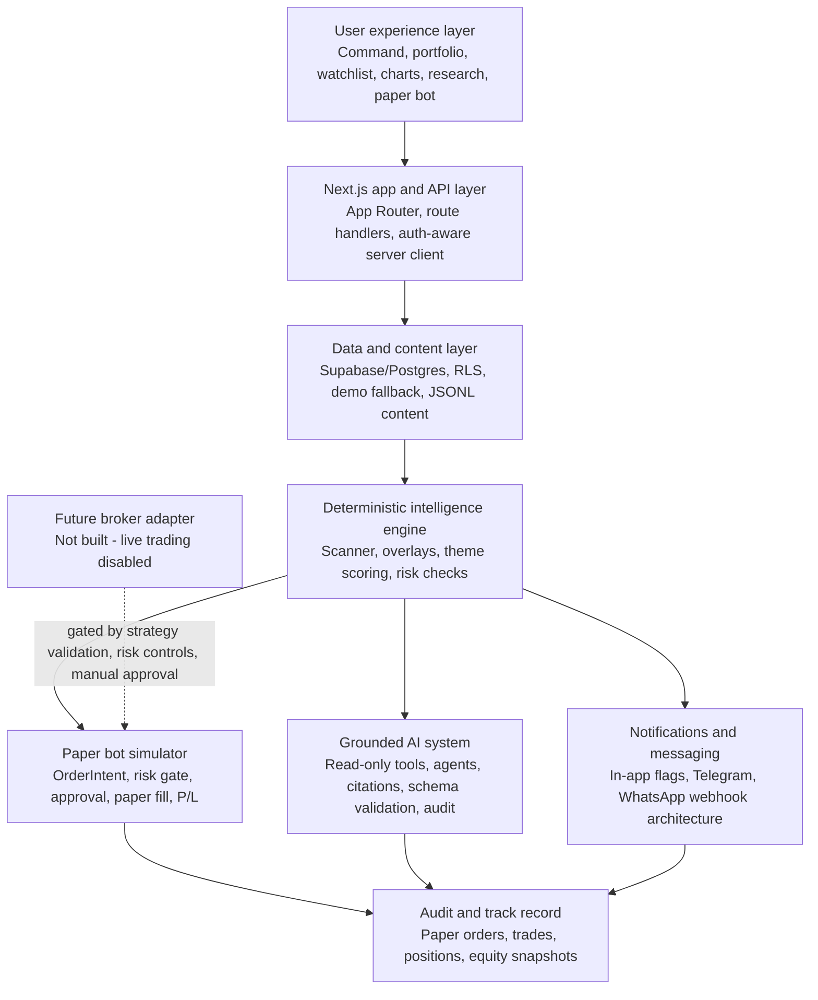
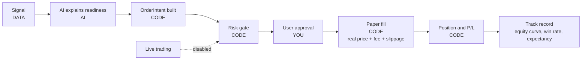

# Product technical story - Lyra by Vivacity.ai

> **Purpose:** Give a potential new user, engineer, or investor a complete plain-English technical story of what Lyra is, what it does, how it is built, what the AI can and cannot do, and how the paper-bot path works. | **Audience:** New users, product reviewers, engineers, agents, and founder/investor updates. | **Status:** Active | **Owner:** Bryson Walter | **Last updated:** 2026-06-14

Lyra by Vivacity.ai is a **research-first, AI-native investing intelligence platform**. It combines a deterministic stock momentum scanner, portfolio and watchlist monitoring, macro/chart-pack views, thematic supply-chain research, small-cap discovery, grounded AI agents, secure notification architecture, and a paper-only bot simulator.

The key principle is simple:

> **Deterministic systems compute, score, gate, simulate, and audit. AI retrieves, explains, summarises, and cites. Live trading remains disabled.**

Lyra is research context, not financial advice. It surfaces evidence and structured views so a user can make better research decisions. It does not tell users what to buy or sell.

---

## 1. The one-sentence product story

Lyra helps a user understand **what is moving, why it might matter, how it affects their portfolio, where the world may be going, and whether a signal is strong enough to test in a paper-trading simulator before real money is ever involved.**

---

## 2. What a user can do

Lyra is now organised as a mobile-first investing OS. The navigation lives in `src/components/AppShell.tsx` and exposes these main surfaces:

### Command and daily monitoring

- **Command Centre** - the main daily operating view.
- **Live Wire** - live signal and alert-style feed.
- **Intelligence** - broader market and research feed.
- **Calendar** - market events and dated context.
- **Saved** - saved research and user-curated items.

### Personal workspace

- **Portfolio** - holdings, exposure, P/L, and overlays.
- **Watchlist** - tracked names and trigger context.
- **Charts** - portfolio, economy, markets, and commodities chart pack.
- **Alerts** - in-app and channel-delivered notifications.

### Research surfaces

- **World Radar / Themes** - first-principles thematic research.
- **Supply Chain** - bottlenecks and physical dependency maps.
- **Small Caps** - under-discovered research candidates.
- **Investor Radar / Smart Money** - tracked investors and filing caveats.
- **Filings & Evidence** - evidence surfaces.
- **IPO Radar** - private/public opportunity tracking.
- **Commodities** - metals, energy, resources, and macro inputs.
- **Fundamentals** - financial quality and company context.

### Analysis tools

- **Comparison Lab** - compare companies and themes.
- **Simulation Lab** - test scenarios.
- **Strategy Lab** - strategy research and validation path.
- **Calculators** - practical finance calculations.
- **Education** - user learning and onboarding.

### Trading-readiness surfaces

- **Paper Trading** - manual simulation layer.
- **Paper Bot** - human-in-the-loop future-bot simulator.
- **Live Bot** - readiness explainer. Live trading is intentionally disabled.

---

## 3. Architecture overview

The system is layered so that a future trading bot can be added only after the research, scoring, risk, simulation, audit, and validation layers have proven themselves.

---

## 4. Layer 1 - User experience layer

The user experience is built around a broad investing workflow, not a single chart. The app shell gives users permanent access to personal workspace pages, research surfaces, analysis tools, paper trading, and live-bot readiness.

Primary code paths:

- `src/components/AppShell.tsx` - global navigation and shell.
- `src/app/page.tsx` - Command Centre.
- `src/app/portfolio/page.tsx` - portfolio.
- `src/app/watchlist/page.tsx` - watchlist.
- `src/app/charts/page.tsx` - chart pack.
- `src/app/themes/page.tsx` and `src/app/themes/[slug]/page.tsx` - World Radar and theme dossiers.
- `src/app/small-caps/page.tsx` - small-cap discovery.
- `src/app/paper-bot/page.tsx` - paper bot.
- `src/app/trading/page.tsx` - Live Bot readiness, not live trading.

The design intent is to make Lyra feel like a mobile-first investing command centre: fast to open, dense enough for serious research, but clear about what is live, what is demo, and what is only research context.

---

## 5. Layer 2 - Deterministic market engine

Lyra starts with deterministic market signals. The scanner watches a stock universe and turns OHLCV data into signal rows. The core scanner computes:

- RSI recovery
- MACD histogram recovery
- price location versus recent lows and moving averages
- trend context
- volume participation
- score breakdown
- signal status
- action state
- lifecycle state
- portfolio overlays
- watchlist overlays
- alert decisions

Primary code paths:

- `workers/stock_scanner/main.py` - scanner orchestration.
- `workers/stock_scanner/market_data.py` - market data provider abstraction.
- `workers/stock_scanner/indicators.py` - RSI, MACD, SMA, volume features.
- `workers/stock_scanner/signal_engine.py` - weighted signal scoring and lifecycle.
- `workers/stock_scanner/portfolio_engine.py` - portfolio overlays.
- `workers/stock_scanner/watchlist_engine.py` - watchlist overlays.
- `workers/stock_scanner/alert_engine.py` - alert decisions and user gating.
- `src/lib/data.ts` - maps live Supabase records into UI shapes.
- `src/lib/live-signals.ts` - live-signal fallback path for no-Supabase mode.

The scanner is the source of truth for technical signals. AI never decides the score.

---

## 6. Layer 3 - Data, demo mode, and persistence

Lyra supports two operating modes:

1. **Demo/session mode** - the app works without keys or Supabase, using demo data and in-memory state.
2. **Authenticated live mode** - Supabase/Postgres stores user-scoped data under RLS.

Primary code paths:

- `src/lib/supabase/server.ts` - cookie-aware Supabase server client.
- `src/lib/data.ts` - dashboard data loader with Supabase or demo fallback.
- `supabase/migrations/` - canonical schema migrations.
- `sql/` - legacy single-operator schema.
- `.env.example` - safe environment model.

Important data principles:

- Frontend uses only public Supabase URL and anon key.
- Service-role key is worker/server-only.
- User-owned records are scoped by RLS.
- Demo fallback keeps the product explorable without backend setup.
- Paper-bot persistence is auth-aware and falls back to in-memory state when no user/session exists.

---

## 7. Layer 4 - AI-native content layer

Lyra has an editable research content layer in `content/`. It is designed so a human or agent can update research data without editing React components.

Content files include:

- `content/themes.jsonl`
- `content/supply-chain-nodes.jsonl`
- `content/theme-companies.jsonl`
- `content/capital-events.jsonl`
- `content/investors.jsonl`
- `content/commodities.jsonl`
- `content/ipos.jsonl`
- `content/smart-money.jsonl`
- `content/finance-facts.jsonl`

The build script compiles these JSONL files into generated JSON:

- `scripts/build-content.mjs`
- `src/lib/generated/*.json`

The content build runs automatically through `predev`, `prebuild`, and `pretype-check`. This lets the app ship curated research surfaces while keeping the data editable and reviewable.

---

## 8. Layer 5 - Thematic intelligence and World Radar

The World Radar layer expands Lyra from stock scanning into thematic and supply-chain research.

Its core thesis:

> Do not just scan stocks. Scan the real-world causal chain behind future returns: themes -> bottlenecks -> supply-chain nodes -> companies -> capital events -> investor moves -> research candidates.

Primary code path:

- `src/lib/world-radar.ts`

It models:

- themes
- supply-chain nodes
- theme companies
- capital events
- investor moves
- small-cap research candidates
- opportunity scoring
- filing caveats

The deterministic opportunity score blends:

- theme fit
- bottleneck exposure
- evidence score
- momentum score
- financial quality
- capital flow
- liquidity
- theme confidence
- crowding, hype, and dilution penalties

Outputs are research labels only:

- Deep research candidate
- Watchlist candidate
- Momentum confirmed
- High quality but crowded
- Early but unproven
- Interesting but risky
- Avoid - hype/dilution risk
- Monitor

No output is a buy/sell instruction.

---

## 9. Layer 6 - Charts and macro context

The Charts section is designed as an RBA/FRED-style chart pack embedded inside the investing app.

Primary code paths:

- `src/app/charts/page.tsx`
- `src/components/charts/ChartsView.tsx`
- `src/components/charts/ChartsTabs.tsx`
- `src/lib/chart-pack.ts`
- `src/lib/market-board.ts`

Tabs today:

- **Portfolio** - portfolio composition, sector exposure, holdings momentum, watchlist momentum.
- **Economy** - GDP, CPI, core CPI, unemployment, PMI, housing, AU inflation/labour examples.
- **Markets** - yield curve, 10Y/2Y yields, credit spreads, VIX, MOVE, financial stress, global exchanges, policy rates.
- **Commodities** - energy, metals, resources, and theme-relevant physical inputs.

Current status:

- Portfolio tab uses app data.
- Economy, Markets, and extra commodity series are curated sample series until live RBA/FRED/market feeds are wired.
- The UI labels the series as illustrative sample data where relevant.

---

## 10. Layer 7 - Grounded AI system

Lyra's AI system is not a loose chatbot. It is a controlled, evidence-first agent runtime.

Primary code paths:

- `src/lib/ai/policy.ts` - central AI policy.
- `src/lib/ai/agents/registry.ts` - agent definitions.
- `src/lib/ai/tools/runtime.ts` - fail-closed tool runtime.
- `src/lib/ai/tools/index.ts` - read-only tools.
- `src/lib/ai/run-agent.ts` - agent orchestration.
- `src/lib/ai/guardrails/schema.ts` - strict output validation and citation enforcement.
- `src/lib/ai/guardrails/injection.ts` - injection detection.
- `src/lib/ai/audit.ts` - AI audit logging.
- `src/lib/ai/question-signals.ts` - listening layer.
- `src/lib/ai/gateway.ts` - provider/model-agnostic gateway.
- `src/app/api/ai/chat/route.ts` - grounded chat.
- `src/app/api/ai/agent/route.ts` - registered agents.
- `src/app/api/ai/brief/route.ts` - daily narration.
- `src/app/api/ai/insights/route.ts` - user-question/product insight loop.

### AI may do

- Summarise evidence users can already see.
- Explain deterministic scores and risk reports.
- Search evidence through read-only tools.
- Classify news and documents.
- Compare entities and themes using provided evidence.
- Draft research notes and checklists.
- Flag missing, stale, or contradictory evidence.
- Propose paper-trade candidates for deterministic validation.

### AI may not do

- Create orders.
- Submit, modify, or cancel orders.
- Access a broker.
- Change portfolio state.
- Bypass RLS.
- Reveal secrets.
- Treat Telegram or WhatsApp messages as system instructions.
- Treat external documents as instructions.
- Give personalised financial advice.

### Tool runtime

The AI tool runtime fails closed. An agent can only use tools granted in `AGENT_TOOL_MATRIX`. Forbidden tools such as `create_order`, `submit_order`, `modify_position`, `send_notification`, and `change_settings` are named in policy but have no executable runtime case.

This makes dangerous tools structurally unrunnable, not merely discouraged.

---

## 11. Layer 8 - Paper Bot and trading simulator

The Paper Bot is the bridge between AI research and any future automated trading system. It is intentionally paper-only.

Primary code paths:

- `src/app/paper-bot/page.tsx`
- `src/components/paper-bot/PaperBotView.tsx`
- `src/lib/trading/paper-bot.ts`
- `src/lib/trading/order-intent-builder.ts`
- `src/lib/trading/risk-engine.ts`
- `src/lib/trading/paper-account-store.ts`
- `src/lib/trading/paper-account-repo.ts`
- `src/lib/trading/paper-bot-commands.ts`
- `src/app/api/trading/paper-bot/route.ts`
- `src/app/api/trading/paper-bot/command/route.ts`
- `src/app/api/trading/paper-account/route.ts`
- `src/app/api/trading/notifications/route.ts`

### Paper Bot flow

### What is simulated

- Proposal from a signal.
- AI readiness verdict.
- Deterministic OrderIntent creation.
- Risk check.
- Manual approval.
- Paper fill using reference price, fee, and slippage.
- Position creation.
- P/L and equity tracking.
- Full-position close.
- Realised P/L for closed trades.

### What is not built

- No live broker adapter.
- No live order submission.
- No autonomous trading.
- No path where AI can create, approve, or execute a trade.

The Paper Bot is a flight simulator for the future bot workflow. It lets the product build a track record and earn trust before any real-money path exists.

---

## 12. Layer 9 - Risk engine and controls

The risk engine is deterministic, side-effect free, and fail-closed.

Primary code path:

- `src/lib/trading/risk-engine.ts`

It checks:

- trading mode
- no live execution
- kill switches
- strategy allowlist
- blocked symbols
- blocked themes
- market open
- symbol tradable
- paper venue connection
- quote freshness
- max order notional
- max position percentage
- max daily loss
- max drawdown
- liquidity
- spread
- earnings blackout
- news-risk blackout
- duplicate idempotency key
- intent sanity

This is the safety spine that any future broker integration must reuse. Live execution is blocked both by absence of a broker implementation and by the `no_live_execution` risk check.

---

## 13. Layer 10 - Notifications and messaging

Lyra supports in-app flags and secure messaging architecture.

Primary code paths:

- `src/lib/trading/notifications-store.ts`
- `src/lib/trading/notify-delivery.ts`
- `src/lib/notifications/router.ts`
- `src/lib/notifications/telegram.ts`
- `src/lib/notifications/whatsapp.ts`
- `src/lib/notifications/whatsapp-signature.ts`
- `src/app/api/webhooks/telegram/route.ts`
- `src/app/api/webhooks/whatsapp/route.ts`

### In-app flags

The Paper Bot raises flags when:

- a candidate is waiting for approval
- a paper fill occurs
- a position crosses a P/L band
- the risk gate blocks a proposal
- general info events occur

### Telegram

Telegram inbound webhook security includes:

- `X-Telegram-Bot-Api-Secret-Token` verification
- constant-time secret comparison
- Zod payload validation
- closed command enum
- rate limiting
- no free-form LLM instruction path
- no live approval path

Outbound delivery is config-gated and uses server-only tokens.

### WhatsApp

WhatsApp inbound webhook architecture includes:

- Meta subscription verification
- raw-body HMAC signature verification
- Zod payload validation
- closed command grammar
- no inbound account creation
- no free-form LLM instruction path

WhatsApp send/inbound business actions are still a staged integration path. The security boundary is already represented in code.

---

## 14. App stack

### Frontend

- Next.js 15
- React 19
- TypeScript
- Tailwind CSS
- Lucide icons
- App Router route handlers

### Backend/data

- Supabase/Postgres
- Supabase SSR server client
- Row-level security for user-owned data
- Demo fallback when Supabase is absent

### Workers

- Python scanner worker
- pandas
- yfinance
- `ta`
- Supabase client
- pytest

### AI

- Provider-agnostic gateway
- BYOK/provider model path
- Read-only tool runtime
- Agents and strict schemas
- Citation enforcement
- Hash-only audit posture

### Content

- JSONL editorial/reference content
- build-time compiled generated JSON
- agent/human editable content records

### Testing

- Vitest for TypeScript modules
- pytest for worker logic
- AI eval harness for guardrails and refusal behaviour
- Paper-bot spine tests
- Paper analytics and repository tests

---

## 15. What the application solves

### For a new user

Lyra helps answer:

- What changed today?
- Which stocks are showing momentum recovery?
- What does my portfolio look like?
- What is on my watchlist?
- What macro conditions matter?
- Which themes are gaining momentum?
- What physical bottlenecks support a theme?
- Which small caps are worth researching?
- What are elite/institutional investors doing?
- What evidence supports this idea?
- What risks or missing evidence should I know?
- Can this signal be tested safely on paper?

### For a serious investor

Lyra helps combine:

- technical signals
- macro backdrop
- portfolio context
- thematic supply-chain research
- capital-flow research
- investor/fund movement
- commodities and physical inputs
- AI explanations grounded in evidence
- paper-trading performance

### For a future automation path

Lyra already has the core safety pattern:

- AI explains readiness.
- Deterministic code drafts the intent.
- Deterministic risk engine gates the intent.
- User approval is required.
- Paper simulator fills fake money only.
- Performance is tracked.
- Live execution is blocked.

---

## 16. Current state vs working toward

### Current state

Lyra is a robust research platform with:

- deterministic stock scanner
- portfolio and watchlist overlays
- demo/live mode
- thematic intelligence layer
- editable content layer
- small-cap discovery buckets
- chart-pack surfaces
- grounded AI agents
- fail-closed AI tool runtime
- AI citation and schema validation
- paper-bot simulator
- paper account analytics
- auth-aware paper persistence
- in-app flags
- Telegram secure webhook
- WhatsApp signed webhook architecture
- risk engine and no-live-execution guard

### Working toward

Next hardening priorities:

- live RBA/FRED/market chart feeds
- deeper backtesting and walk-forward validation
- per-strategy performance analytics
- stronger idempotency for paper fills and future retries
- durable notification preferences and pairing
- fully wired WhatsApp delivery
- Telegram account pairing and account-scoped commands
- sandbox broker adapter only after validation
- approval-gated live readiness after paper performance proves the strategy

---

## 17. Live trading status

Live trading is **not built** and should not be implied to exist.

A future live bot would require:

- validated strategies
- robust backtesting
- walk-forward tests
- durable paper performance
- strict risk limits
- kill switches
- idempotency guarantees
- broker sandbox testing
- manual approval mode
- production monitoring
- incident runbooks
- legal/compliance review where applicable

Until then, the correct product positioning is:

> **Lyra is a research-first, AI-native investing intelligence system with a paper-only bot simulator. The model explains and cites. Deterministic systems score, gate, simulate, and audit.**

---

## 18. New-user mental model

A potential new user should understand Lyra like this:

1. **The scanner finds setups.**
2. **The research layer explains why a company might matter in the real world.**
3. **The chart pack shows the macro and portfolio backdrop.**
4. **The AI answers questions using approved evidence only.**
5. **The Paper Bot lets users test the future bot workflow safely.**
6. **The risk engine blocks unsafe or unsupported paths.**
7. **Live trading is disabled until the system earns the right to go live.**

That is the technical story of the application today.