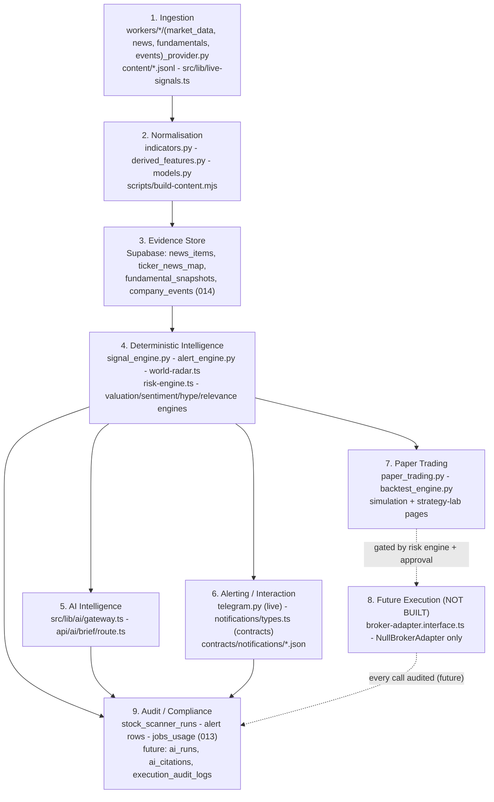

# System overview - the 9-layer architecture

> **Purpose:** Map Lyra's 9-layer architecture to the actual code paths that exist today, and state plainly what is current vs target per layer. | **Audience:** Engineers and agents onboarding to or extending Lyra. | **Status:** Active | **Owner:** Bryson Walter | **Last updated:** 2026-06-11

## Operating principles (load-bearing)

- **Deterministic code decides; AI only explains.** Every score, signal state, alert decision, and (future) order intent comes from deterministic engines. AI phrases facts it is handed verbatim.
- **No live execution.** The trading layer is types + a pure risk engine + a `NullBrokerAdapter` that refuses everything. `live_executed` is intentionally unreachable. See [`future-trading-bot.md`](./future-trading-bot.md).
- **Fail closed.** Missing context, stale data, unconfigured limits - all fail the check, never pass it (`src/lib/trading/risk-engine.ts`).
- **Secrets server-side only.** `SUPABASE_SERVICE_ROLE_KEY`, Telegram tokens, and provider keys never appear in `NEXT_PUBLIC_*` vars, logs, or the frontend bundle (`.env.example`, `SECURITY.md`).

## Layer diagram

## Layer-by-layer: current state vs target state

### 1. Ingestion

**Current:**

- Market OHLCV: `workers/stock_scanner/market_data.py` - provider-abstracted, yfinance today (`MARKET_DATA_PROVIDER=yfinance`), universe from `workers/stock_scanner/universe.py`.
- News: `workers/intelligence_worker/news_provider.py` (Finnhub free tier when `FINNHUB_API_KEY` is set).
- Fundamentals: `workers/fundamentals_worker/fundamentals_provider.py`.
- Corporate events / IPOs: `workers/events_worker/events_provider.py`.
- Server-side live signal fallback: `src/lib/live-signals.ts` fetches daily Yahoo OHLCV so signal panels work without Supabase.
- Editorial/reference content: `content/*.jsonl` (themes, supply-chain nodes, theme companies, capital events, investors, IPOs, commodities, smart money) - agent-editable, see `content/README.md`.

**Target:** additional market-data providers behind the same interface; broader news sources; filings ingestion. The provider abstraction exists precisely so yfinance can be swapped without touching downstream layers.

### 2. Normalisation

**Current:**

- `workers/stock_scanner/indicators.py` - Wilder RSI(14), MACD(12,26,9), SMA 20/50/200, volume ratios into `IndicatorSnapshot` (`workers/stock_scanner/models.py`).
- `workers/stock_scanner/derived_features.py` - derived feature computation.
- `scripts/build-content.mjs` - compiles JSONL content into importable JSON at `src/lib/generated/` (runs on `predev`, `prebuild`, `pretype-check`).
- Typed dataclasses in `models.py` and TypeScript types in `src/types/` are the normalised shapes everything downstream consumes.

**Target:** a shared cross-worker schema package so the four workers and the frontend never drift; today alignment is by convention plus tests.

### 3. Evidence Store

**Current (precursor):** Supabase tables reserved by `supabase/migrations/014_future_intelligence.sql` - `news_items`, `ticker_news_map`, `fundamental_snapshots`, `company_events` (idempotent over the legacy `sql/007-009` schema). Editorial evidence lives in content records with `sourceName` / `evidenceSummary` fields (`src/lib/world-radar.ts` types).

**Target:** a unified evidence store where every stored item has a stable evidence id, source URL, retrieval timestamp, and content hash, so AI summaries and notifications can carry `evidenceRefs` (already contracted in `src/lib/notifications/types.ts` - `NotificationEvent.evidenceRefs`) that resolve to durable records. This is the substrate for citation enforcement in the AI layer.

### 4. Deterministic Intelligence

This layer owns every decision. **Current:**

- Momentum signals: `workers/stock_scanner/signal_engine.py` (weighted score, status thresholds strong >= 75 / watchlist >= 60, action + lifecycle states, structured explanation). Faithful TS port for the no-Supabase path: `src/lib/live-signals.ts`.
- Market context: `workers/stock_scanner/market_context.py`; outcomes: `outcome_engine.py`; trade snapshots: `trade_snapshot_engine.py`.
- Portfolio and watchlist overlays: `portfolio_engine.py`, `watchlist_engine.py`.
- Alert decisions + per-user gating (cooldowns, quiet hours, mutes, thresholds): `workers/stock_scanner/alert_engine.py`.
- Thematic scoring: `src/lib/world-radar.ts` - `scoreCompany` / `bucketSmallCaps`, research-only action labels (`Research`/`Watch`/`Monitor`/`Review risk` - never buy/sell).
- News intelligence: `workers/intelligence_worker/{relevance_engine,sentiment_engine,hype_engine}.py`.
- Valuation: `workers/fundamentals_worker/valuation_engine.py`; event risk: `workers/events_worker/event_risk_engine.py`.
- Pre-trade risk: `src/lib/trading/risk-engine.ts` - pure, side-effect free, fail-closed, fully enumerated in [`future-trading-bot.md`](./future-trading-bot.md).

**Target:** the deterministic strategy module that drafts `OrderIntent`s (paper only) - the strategy registry referenced by `TradingSettings.allowedStrategies` does not exist yet.

### 5. AI Intelligence

**Current:**

- `src/lib/ai/gateway.ts` - provider-and-model-agnostic `complete()`: Anthropic, OpenAI, OpenRouter, Google, xAI. Browser BYOK or server-side hosted key, never logged or persisted.
- `src/app/api/ai/brief/route.ts` and `src/app/api/ai/chat/route.ts` - grounded brief/chat: model receives ONLY deterministic facts and phrases them; failure returns `ok:false` and deterministic UI remains.
- AI settings (`hosted` / `free` / `byo`) in `src/lib/account.ts`; hosted OpenAI is the beta default.
- Worker-side flag remains available for legacy explanation paths: `ENABLE_AI_EXPLANATIONS` + `ANTHROPIC_API_KEY`.

**Target:** agents registry, tool layer with a permission gate, notification composer consuming `contracts/notifications/`, `ai_runs`/`ai_citations` audit tables, eval harness. Full design in [`ai-native-architecture.md`](./ai-native-architecture.md) - most of it is explicitly not built yet.

### 6. Alerting / Interaction

**Current:**

- Live outbound: `workers/stock_scanner/telegram.py` sends Telegram alerts from the worker only, with duplicate-cooldown suppression and every attempt (sent/skipped/failed) persisted via `supabase_repo.save_alert` (`workers/stock_scanner/main.py`).
- Channel registration: `src/app/api/notifications/route.ts` saves a user's Telegram chat id / WhatsApp number into `notification_channels` under RLS. Bot tokens never touch this route.
- Contracts: `src/lib/notifications/types.ts` (`NotificationEvent`, `NotificationPreferences`, `RouteDecision`, `DeliveryRecord`, `InboundCommand`) and `contracts/notifications/{notification-contracts.schema.json,message-templates.json,test-register.json}`.

**Target (not built):** the unified notification router that consumes `NotificationEvent`s and emits `DeliveryRecord`s per channel adapter; WhatsApp sends (env var names reserved in `.env.example`, no send path exists); inbound Telegram command handling (`TELEGRAM_WEBHOOK_SECRET` is reserved; no webhook route exists in `src/app/api/` today).

### 7. Paper Trading

**Current:**

- `workers/stock_scanner/paper_trading.py` - deterministic, pure paper-trade ledger: hypothetical positions, equity, P/L. No broker, no real money, explicitly research software (tested in `tests/test_paper_trading.py`).
- `workers/stock_scanner/backtest_engine.py` - research backtesting (tested in `tests/test_backtest_engine.py`).
- Frontend surfaces: `src/app/simulation/page.tsx`, `src/app/strategy-lab/page.tsx`, backed by `src/lib/{simulation,strategy,backtest}.ts`; schema in `supabase/migrations/011_simulations_strategies.sql`.

**Target:** wire `OrderIntent` (paper-only) through the pre-trade engine into this ledger so the full intent lifecycle is exercised long before any broker exists.

### 8. Future Execution - NOT BUILT, by design

**Current:** interface only. `src/lib/trading/broker-adapter.interface.ts` defines `BrokerAdapter`; the sole implementation is `NullBrokerAdapter`, which reports `environment: 'none'` and refuses `submitOrder`/`cancelOrder` with "Refused: live execution is disabled in this build." The risk engine independently blocks any mode beyond `approval_required` (`no_live_execution` check).

**Target:** a sandbox/paper broker adapter first, then - only after every hard gate in [`future-trading-bot.md`](./future-trading-bot.md) passes - a live adapter. No timeline is implied by this doc.

### 9. Audit / Compliance

**Current:**

- Scanner run records: `stock_scanner_runs` (legacy `sql/001`, migration `005`/`006` family).
- Every alert attempt persisted with status + error + payload (`supabase_repo.save_alert`).
- Jobs/usage schema: `supabase/migrations/013_jobs_usage.sql`; RLS across user data: `015_rls_policies.sql`.
- Frozen decision snapshots are contracted into `OrderIntent` (`signalSnapshot`, `riskSnapshot`, `evidenceSnapshot` - `src/lib/trading/types.ts`) so any future intent is auditable forever.

**Target:** `ai_runs` + `ai_citations` tables (no migration exists yet - see [`ai-native-architecture.md`](./ai-native-architecture.md)), `execution_audit_logs` for every broker-adapter call (referenced in `broker-adapter.interface.ts` comments, not yet a table), and persisted kill-switch state history.

## Runtime topology

| Surface | Tech | Entry |
|---|---|---|
| Dashboard | Next.js 15 / React 19, App Router | `src/app/` (overview, radar, tickers, themes, small-caps, smart-money, investors, ipos, intelligence, fundamentals, portfolio, watchlist, alerts, simulation, strategy-lab, settings, account, onboarding) |
| API routes | Next.js route handlers | `src/app/api/{ai/brief,account,feedback,notifications,onboarding,portfolio,ticker-lookup,watchlist}/route.ts` |
| Workers | Python (pandas, yfinance, ta, supabase, pytest) | `python -m workers.stock_scanner.main` plus `intelligence_worker`, `fundamentals_worker`, `events_worker` |
| Database | Supabase Postgres + RLS | `supabase/migrations/001-018` (canonical), `sql/001-009` (legacy single-operator schema) |
| Scheduler | GitHub Actions (repo root, per `CLAUDE.md`: `vdapp42-hourly-stock-scanner.yml`) + `workers/stock_scanner/scheduler_guard.py` market-hours gate | hourly |

## Environment variables (from `.env.example`)

| Var | Side | Layer | Notes |
|---|---|---|---|
| `NEXT_PUBLIC_SUPABASE_URL`, `NEXT_PUBLIC_SUPABASE_ANON_KEY` | frontend | 3/4 read path | Zod-validated in `src/lib/env.ts`; optional - absence triggers demo mode |
| `NEXT_PUBLIC_APP_URL` | frontend | UI | demo fallback (automatic when Supabase env is absent) keeps the app rendering with no keys |
| `SUPABASE_URL`, `SUPABASE_SERVICE_ROLE_KEY` | worker only | 1-4 write path | never frontend, never `NEXT_PUBLIC_*` |
| `DEFAULT_USER_ID` | worker | 4 | stamps overlays for single-operator mode under RLS |
| `TELEGRAM_BOT_TOKEN`, `TELEGRAM_CHAT_ID` | worker only | 6 | outbound alerts |
| `TELEGRAM_WEBHOOK_SECRET` | server only | 6 (future inbound) | reserved; no webhook route exists yet |
| `WHATSAPP_*` (5 vars + version) | server only | 6 (future) | architecture only - no send path exists |
| `MARKET_DATA_PROVIDER`, `TICKER_SYMBOLS`, `DEFAULT_TIMEFRAME`, `LOOKBACK_PERIOD_DAYS` | worker | 1 | provider abstraction |
| `ALERT_SCORE_THRESHOLD`, `WATCHLIST_SCORE_THRESHOLD`, `SIGNAL_CHANGE_THRESHOLD` | worker | 4 | deterministic thresholds (75/60/8 defaults) |
| `ENABLE_TELEGRAM_ALERTS`, `ENABLE_WATCHLIST_ALERTS`, `ENABLE_HOURLY_DIGEST`, `ENABLE_MARKET_HOURS_GUARD`, `FORCE_SCAN`, `SCAN_INTERVAL` | worker | 4/6 | scanner toggles |
| `FINNHUB_API_KEY` | worker | 1 | optional live news/fundamentals/events |
| `OPENAI_API_KEY`, `LYRA_HOSTED_OPENAI_MODEL`, `LYRA_OPENAI_REASONING_EFFORT`, `GOOGLE_AI_KEY`, `ANTHROPIC_API_KEY`, `ENABLE_AI_EXPLANATIONS` | server/worker only | 5 | hosted OpenAI beta, optional Gemini fallback, legacy worker explanations |

## Failure modes

| Failure | Behaviour | Where |
|---|---|---|
| Supabase env missing | Dashboard renders demo data + live Yahoo signals; APIs return `demo: true` | `src/lib/data.ts`, `src/lib/live-signals.ts`, `api/notifications/route.ts` |
| AI provider error / no key / mode off | `ok:false`, client falls back to deterministic render - the brief always renders | `src/app/api/ai/brief/route.ts` |
| Stale quotes | `quote_fresh` check fails closed | `src/lib/trading/risk-engine.ts` |
| Duplicate alert inside cooldown | Suppressed AND logged (`sent_status="skipped"`) - auditable, not silent | `workers/stock_scanner/main.py` |
| Market closed | Scheduler guard skips the run (unless `FORCE_SCAN=true`) | `workers/stock_scanner/scheduler_guard.py` |
| Per-symbol fetch error | That symbol keeps its demo signal; the rest proceed | `src/lib/live-signals.ts` |
