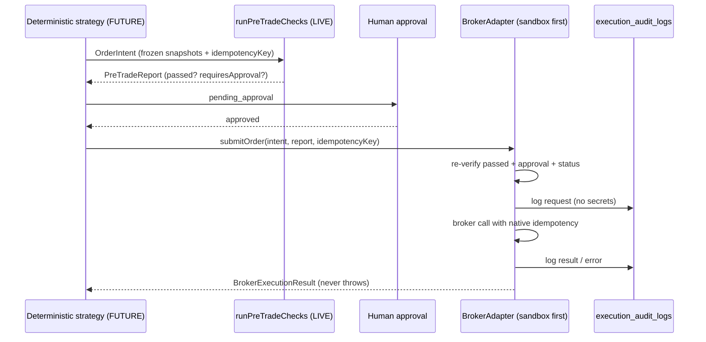

# Broker adapter spec - the contract any future adapter must satisfy

> **Purpose:** The binding contract for any future `BrokerAdapter` implementation: interface semantics, idempotency, audit logging, sandbox-first sequencing, secret rules, and explicit non-goals. Referenced from `src/lib/trading/broker-adapter.interface.ts`. | **Audience:** Any engineer or agent proposing broker connectivity. | **Status:** Active | **Owner:** Bryson Walter | **Last updated:** 2026-06-11

## Current state - read before anything else

**No live broker integration exists.** The interface file (`src/lib/trading/broker-adapter.interface.ts`) ships exactly one implementation, `NullBrokerAdapter`, and it refuses everything:

- `getStatus()` -> `{ connected: false, brokerName: 'none', environment: 'none', detail: 'Live broker execution is not implemented. Paper trading and research only.' }`
- `submitOrder()` -> `{ accepted: false, detail: 'Refused: live execution is disabled in this build.' }`
- `cancelOrder()` -> same refusal

This is defence in depth, not the only barrier: upstream, the risk engine refuses live modes outright (`no_live_execution` in `src/lib/trading/risk-engine.ts`) and the default trading mode is `disabled`. An adapter that somehow got called would still be the LAST gate, never the first.

Building any real adapter is gated behind the seven hard gates in `docs/architecture/future-trading-bot.md` - Gate 4 mandates sandbox-first with full audit logging.

## The interface

From `src/lib/trading/broker-adapter.interface.ts`:

```ts
export interface BrokerStatus {
  connected: boolean;
  brokerName: string;
  environment: 'none' | 'sandbox' | 'live';
  detail: string;
}

export interface BrokerExecutionResult {
  accepted: boolean;
  brokerOrderId?: string;
  detail: string;
}

export interface BrokerAdapter {
  getStatus(): Promise<BrokerStatus>;
  /** Must verify report.passed AND approval before anything else. */
  submitOrder(intent: OrderIntent, report: PreTradeReport, idempotencyKey: string): Promise<BrokerExecutionResult>;
  cancelOrder(brokerOrderId: string): Promise<BrokerExecutionResult>;
}
```

## Contract semantics (binding on every implementation)

### 1. Inputs are already-gated, and the adapter re-verifies anyway

An adapter only ever receives an `OrderIntent` that already PASSED the deterministic pre-trade engine and (where configured) explicit human approval. AI has no path here - intents are drafted by deterministic strategy code only (`src/lib/trading/types.ts`). Despite that, `submitOrder` MUST re-verify before any network call:

- `report.passed === true` (no blocking failures) - refuse otherwise
- `report.intentId === intent.id` - the report belongs to this intent
- approval state satisfied when `report.requiresApproval` is true
- intent `status` is an executable state (`approved`), never `blocked` / `rejected` / `expired`

Trust nothing by position in the call chain. The adapter is a verifier, not a forwarder.

### 2. Idempotency - retries must never duplicate orders

- Every call carries an idempotency key. The intent-level key is deterministic: `buildIdempotencyKey(strategyId, symbol, side, isoDay)` -> `strategy:symbol:side:day`, lowercase (`src/lib/trading/risk-engine.ts`), and the engine's `duplicate` check blocks reuse upstream.
- The `idempotencyKey` parameter on `submitOrder` is the per-submission key. The adapter MUST pass it to the broker's native idempotency mechanism where one exists, and MUST keep its own persisted submission log keyed by it where one does not.
- A retry with the same key returns the ORIGINAL result (same `brokerOrderId`), never a second order. This must hold across process restarts - the submission log is persistent, not in-memory.
- `cancelOrder` must be safe to retry: cancelling an already-cancelled or filled order returns `accepted: false` with an explanatory `detail`, not an exception.

### 3. Result discipline - return, never throw

Mirroring the notification senders' pattern, adapters resolve to a `BrokerExecutionResult` (or `BrokerStatus`) in ALL cases - broker rejection, timeout, network failure, auth failure - with the reason in `detail`. Callers branch on `accepted`; exceptions are reserved for programmer error (invalid arguments), not runtime conditions. Timeouts must be bounded and stated in `detail`.

### 4. Audit logging - every call, every error

Every call and every error is written to `execution_audit_logs` (named as the future table in the interface header; it does not exist yet and must land WITH the first adapter, not after). Minimum record: timestamp, adapter name + environment, intent id, idempotency key, action (`submit`/`cancel`/`status`), request summary (no secrets), result (`accepted`, `brokerOrderId`, `detail`), latency, and error class on failure. Append-only - the audit trail is how Gate 4 verification and any incident review happen.

### 5. Sandbox-first rule

The first real implementation MUST target a sandbox/paper environment (`environment: 'sandbox'`). A `live` adapter may not be merged until the sandbox adapter has demonstrated, with audit logs as evidence: idempotent retries under forced failure, correct refusal of unapproved/blocked intents, bounded timeouts, and clean cancel semantics. `BrokerStatus.environment` must be truthful - never report `sandbox` traffic as `live` or vice versa.

### 6. Secret rules

Verbatim from the interface header, binding:

- API keys server-side only, in managed secret storage - **never Supabase rows, never the frontend bundle, never logs.**
- Never in `NEXT_PUBLIC_*` variables (`SECURITY.md` golden rule 1).
- Error strings and audit records must be credential-free; follow the token-redaction pattern (`redactBotToken` in `src/lib/notifications/telegram.ts`) for any broker token that could appear in a URL or error.
- Rotation must be possible without code changes (env-injected, per-environment).

## Sequence for a (future) submission



## Explicit non-goals

State these plainly in any adapter PR; reviewers reject silently-expanded scope:

- **No autonomous trading.** An adapter executes individually gated intents; it never originates, batches, or re-times orders on its own.
- **No AI involvement.** No LLM output reaches an adapter in any form; AI may explain a `PreTradeReport` after the fact, nothing more.
- **No bypass paths.** No "admin" or "manual" submit that skips `runPreTradeChecks`, approval, or audit logging - not even for testing (use the sandbox environment for that).
- **No portfolio mutation beyond the order.** Position bookkeeping stays in Lyra's deterministic layer; the adapter reports results, it does not write portfolio state.
- **No margin, options, shorting, or multi-leg instruments** in the first implementation - scope is cash-equity day orders matching `OrderIntent`'s current shape (`market`/`limit`/`stop`/`stop_limit`, `day`/`gtc`/`ioc`).
- **No credential UI in the product** until the secret-storage design has its own reviewed spec.

## Acceptance checklist for the first sandbox adapter

- [ ] All seven hard gates context acknowledged; this lands under Gate 4 (`docs/architecture/future-trading-bot.md`)
- [ ] `execution_audit_logs` table + writer shipped in the same change
- [ ] Re-verification of `report.passed`, intent/report match, approval, and status implemented and unit-tested
- [ ] Idempotent retry proven by test: forced double-submit returns one `brokerOrderId`
- [ ] Refusal paths tested: unapproved intent, blocked report, expired intent, unknown cancel id
- [ ] Bounded timeouts; all failures resolve to results, never throws
- [ ] Zero secrets in code, logs, audit rows, or error strings (grep-verified)
- [ ] `getStatus()` truthfully reports `sandbox` and degrades to `connected: false` on auth failure
- [ ] Kill-switch behaviour: any active hard switch (`isHardKilled`) checked upstream blocks the call from ever reaching the adapter; adapter-level drill documented in `docs/runbooks/kill-switch.md`
