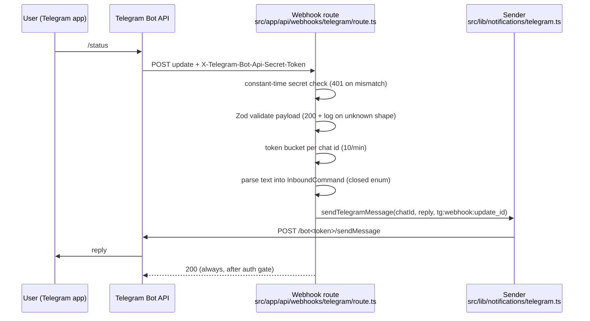
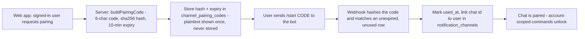

# Telegram Integration - Secure Webhook, Commands, and Pairing

> **Purpose:** Operational setup and security reference for the Lyra Telegram layer (bot creation, webhook hardening, pairing, commands, failure modes) | **Audience:** Operators and engineers wiring or debugging Telegram delivery | **Status:** Active | **Owner:** Bryson Walter | **Last updated:** 2026-06-11

## 1. What this layer is

Telegram is a delivery and command channel for Lyra, the research-first momentum console. Two directions exist:

- **Outbound alerts** - the Python worker sends deterministic signal alerts (`workers/stock_scanner/telegram.py`), and the web layer can send replies and notifications via `src/lib/notifications/telegram.ts`.
- **Inbound commands** - Telegram POSTs updates to the secured webhook at `src/app/api/webhooks/telegram/route.ts`, which parses them into the closed `InboundCommand` enum in `src/lib/notifications/types.ts`.

Hard boundaries, grounded in code:

- **No live trading exists.** The deterministic pre-trade engine (`src/lib/trading/risk-engine.ts`) refuses any mode beyond paper (`no_live_execution` check), and `DEFAULT_TRADING_SETTINGS.tradingMode` is `disabled` (`src/lib/trading/types.ts`). `/approve` and `/reject` over Telegram cannot execute anything because no pending order intents can exist.
- **Inbound text is untrusted data, never instructions.** The webhook maps text to a fixed command enum. Nothing a user types in Telegram reaches an LLM as a prompt or system instruction.
- **Secrets are server-side only.** `TELEGRAM_BOT_TOKEN` and `TELEGRAM_WEBHOOK_SECRET` are unprefixed env vars (`.env.example`), never `NEXT_PUBLIC_*`, never logged (token redaction lives in `redactBotToken` in `src/lib/notifications/telegram.ts`).

## 2. Current state vs future state

| Capability | Status |
|---|---|
| Worker outbound signal alerts to a single chat (`TELEGRAM_CHAT_ID`) | Built - `workers/stock_scanner/telegram.py`, legacy single-operator path |
| Secured inbound webhook (secret header, Zod validation, rate limit, command parsing, stub replies) | Built - `src/app/api/webhooks/telegram/route.ts` |
| Server-only sender with DeliveryRecord results and idempotency dedupe | Built - `src/lib/notifications/telegram.ts` |
| Pairing code generation helper (`buildPairingCode`) | Built - `src/lib/notifications/telegram.ts` |
| `channel_pairing_codes` table + pairing completion (`/start <code>` linking a chat to a user) | Future - not in `supabase/migrations/` yet; the webhook honestly replies that pairing is not enabled |
| Per-user routed notifications through `notification_channels` (`supabase/migrations/009_alerts_notifications.sql`) | Partial - channel save API exists (`src/app/api/notifications/route.ts`); webhook does not yet resolve chats to users |
| Live broker execution and order approvals over Telegram | Future-only by design - deterministic gates must pass first (see `docs/PATH-TO-PRODUCTION.md`) |

## 3. Architecture



## 4. Setup - BotFather

1. Open Telegram, message `@BotFather`, send `/newbot`.
2. Pick a display name and a unique bot username ending in `bot`.
3. BotFather returns the bot token (`123456789:AA...`). This is `TELEGRAM_BOT_TOKEN`. Treat it like a password.
4. Optional hardening via BotFather: `/setjoingroups` -> Disable (direct chats only), `/setprivacy` -> Enable.
5. To get a chat id for the legacy single-chat worker path: message your bot once, then call `getUpdates` (see local dev below) and read `message.chat.id`.

## 5. Environment variables

All server-side, set in `.env.local` (never committed) or the deployment platform's secret store. Reference: `.env.example`.

| Variable | Used by | Purpose |
|---|---|---|
| `TELEGRAM_BOT_TOKEN` | Worker + web sender | Bot API credential for sendMessage. Server-side only. When unset, sends become honest `demo_logged` no-ops. |
| `TELEGRAM_WEBHOOK_SECRET` | Webhook route | Secret echoed back by Telegram in the `X-Telegram-Bot-Api-Secret-Token` header. When unset, the route rejects ALL inbound requests with 401 (fail closed). |
| `TELEGRAM_CHAT_ID` | Worker (legacy) | Single-operator destination chat for worker alerts. Superseded by per-user `notification_channels` rows once pairing lands. |
| `ENABLE_TELEGRAM_ALERTS` | Worker | Toggle for worker outbound alerts. |

Rules:

- Never put any of these in a `NEXT_PUBLIC_*` variable - those ship to the browser.
- Never log the token. Error strings pass through `redactBotToken` before they are returned or logged.

## 6. Registering the webhook

Generate a strong secret first:

```bash
openssl rand -hex 32
```

Set it as `TELEGRAM_WEBHOOK_SECRET` in the deployment, then register:

```bash
curl -s "https://api.telegram.org/bot${TELEGRAM_BOT_TOKEN}/setWebhook" \
  -H "content-type: application/json" \
  -d '{
    "url": "https://<your-domain>/api/webhooks/telegram",
    "secret_token": "<TELEGRAM_WEBHOOK_SECRET value>",
    "allowed_updates": ["message"],
    "drop_pending_updates": true,
    "max_connections": 4
  }'
```

Why each field matters:

- `secret_token` - Telegram echoes it back in `X-Telegram-Bot-Api-Secret-Token` on every delivery. This is the only authenticity signal Telegram offers; without it anyone who finds the URL can POST fake updates.
- `allowed_updates: ["message"]` - restricts deliveries to plain messages. The route defends in depth anyway (non-message shapes are dropped with a log), but not receiving edited messages, callbacks, and channel posts shrinks the attack surface.
- `drop_pending_updates: true` - discards anything queued before the secure config existed.

Verify with:

```bash
curl -s "https://api.telegram.org/bot${TELEGRAM_BOT_TOKEN}/getWebhookInfo"
```

Check `url`, `pending_update_count`, and `last_error_message`.

## 7. Header verification (how the route authenticates)

In `src/app/api/webhooks/telegram/route.ts`:

- The header value and `process.env.TELEGRAM_WEBHOOK_SECRET` are each sha256-hashed, then compared with `crypto.timingSafeEqual`. Hashing first equalises buffer lengths (`timingSafeEqual` throws on unequal lengths, and an early length check would leak length).
- 401 on mismatch, missing header, or unset secret. The secret being unset fails closed - the webhook is dead until configured, never open.
- Everything after the auth gate returns 200, even for garbage payloads, because Telegram retries non-2xx responses and a retry storm of invalid updates helps nobody. Invalid payloads are logged (`invalid_json`, `invalid_shape`) without logging the untrusted body.

## 8. Pairing flow (design + current status)

Goal: link a Telegram chat id to a Lyra user without ever typing identifiers by hand or trusting inbound claims.



Shipped today:

- `buildPairingCode()` and `hashPairingCode()` in `src/lib/notifications/telegram.ts` - 6 chars from an unambiguous alphabet, `crypto.randomInt` randomness, sha256 hash, 10-minute expiry. The returned shape mirrors the `channel_pairing_codes` columns (`code_hash`, `created_at`, `expires_at`).
- The webhook recognises `/start` and `/start <code>` and replies honestly that pairing completion is not enabled in this build and nothing was stored.

Not yet shipped (do not claim otherwise):

- The `channel_pairing_codes` migration (not present in `supabase/migrations/`).
- The webhook-side lookup that matches the hash, marks the code used, and writes the chat id into `notification_channels` (`supabase/migrations/009_alerts_notifications.sql` already has the destination table).

Until those land, every chat is unpaired and account-scoped commands answer with pairing instructions.

## 9. Command table

Parsing lives in `parseMessage` in the webhook route. Commands map to the closed `InboundCommand` type in `src/lib/notifications/types.ts`. Arguments are bounded data, never instructions.

| Command | InboundCommand | Current behaviour (honest stubs) |
|---|---|---|
| `/status` | `status` | System state: webhook online, trading mode disabled, no live execution, mute state, pairing prompt |
| `/portfolio` | `portfolio` | "Pair your account in the web app first" |
| `/watchlist` | `watchlist` | Same pairing stub |
| `/today` | `today` | Same pairing stub |
| `/paper` | `paper` | No live execution exists; pairing stub |
| `/mute` | `mute` | Mutes replies for the chat - in-memory, resets on redeploy, durable prefs live in web settings |
| `/unmute` | `unmute` | Reverses `/mute` |
| `/approve` | `approve` | Refuses: approvals require a valid pending order intent and none exist because live execution is disabled |
| `/reject` | `reject` | Same refusal shape as `/approve` |
| `/killswitch` | `killswitch` | Records the user kill switch request (in-memory until persistence lands); the risk engine treats the `user` switch as hard-blocking (`isHardKilled` in `src/lib/trading/risk-engine.ts`) |
| `/help` | `help` | Command list |
| `/start [code]` | (special) | Pairing entry point - replies that completion is not enabled yet |
| anything else | `unknown` | "Unknown command" + reminder that messages are data, not instructions |

## 10. Rate limits

- Token bucket per chat id: capacity 10, refill 10 per minute. Over-limit messages are dropped with a `rate_limited` log and NO reply, to avoid reply amplification.
- The bucket is in-process memory. On serverless (Vercel) each instance has its own bucket, so the real ceiling is roughly 10/min times the number of warm instances. This is best-effort abuse damping, stated as such in the code. Production hardening: move the bucket to a shared store (Upstash Redis or a Supabase table) keyed by chat id.
- Telegram's own sendMessage limits (about 30 messages/second overall, 1/second per chat) sit far above the webhook's reply volume.

## 11. Error handling and failure modes

| Failure | Behaviour | Where |
|---|---|---|
| `TELEGRAM_WEBHOOK_SECRET` unset | All inbound rejected 401 (fail closed) | `secretMatches` in route |
| Secret header mismatch | 401, `auth_rejected` log, no body details | route |
| Malformed JSON body | 200 + `invalid_json` log, nothing processed | route |
| Valid JSON, unknown shape | 200 + `invalid_shape` log | route (Zod `safeParse`) |
| Non-text or non-message update | 200 + `ignored_non_text` log | route |
| Rate limit exceeded | 200, dropped, `rate_limited` log, no reply | route |
| `TELEGRAM_BOT_TOKEN` unset | Replies become `demo_logged` no-op DeliveryRecords | `sendTelegramMessage` |
| Telegram API error / non-ok | `failed` DeliveryRecord with token-redacted error, never thrown | `sendTelegramMessage` |
| Send timeout (8s) | `failed` DeliveryRecord, request aborted | `sendTelegramMessage` |
| Duplicate idempotency key | `suppressed` DeliveryRecord, no second send | `sendTelegramMessage` |

The sender never throws - callers branch on `DeliveryRecord.status` (`src/lib/notifications/types.ts`).

## 12. Replay and idempotency

- Replies are keyed `tg:webhook:<update_id>`. If Telegram redelivers the same update (it retries when it does not get a 2xx fast enough), the duplicate reply is suppressed by the sender's in-memory dedupe.
- The dedupe set is per-instance with a 24h TTL and a 5,000-key cap - best-effort on serverless. Exactly-once delivery needs the persistent delivery log (a `DeliveryRecord` table) checked before send; that is the production path, not yet built.
- The route answers 200 immediately after handling, which keeps Telegram's retry queue empty in the normal case.

## 13. Local development

The webhook needs a public HTTPS URL, which local dev does not have. Two options:

**Option A - polling fallback (no webhook):**

```bash
# Make sure no webhook is registered, then poll:
curl -s "https://api.telegram.org/bot${TELEGRAM_BOT_TOKEN}/deleteWebhook"
curl -s "https://api.telegram.org/bot${TELEGRAM_BOT_TOKEN}/getUpdates?timeout=30"
```

`getUpdates` and webhooks are mutually exclusive. Polling is fine for inspecting chat ids and message shapes; replay a captured update against the local route with:

```bash
curl -s -X POST http://localhost:3042/api/webhooks/telegram \
  -H "content-type: application/json" \
  -H "X-Telegram-Bot-Api-Secret-Token: ${TELEGRAM_WEBHOOK_SECRET}" \
  -d '{"update_id":1,"message":{"message_id":1,"text":"/status","chat":{"id":123},"from":{"id":123}}}'
```

**Option B - tunnel:** expose localhost with a tunnel (ngrok or cloudflared), then `setWebhook` to the tunnel URL with the same `secret_token`. Remember to `deleteWebhook` or re-point at production afterwards.

Either way, set `TELEGRAM_WEBHOOK_SECRET` in `.env.local` first - the route 401s everything when it is unset.

## 14. Production checklist

- [ ] Bot created via BotFather; token stored only in the deployment secret store
- [ ] `TELEGRAM_WEBHOOK_SECRET` generated with `openssl rand -hex 32` and set server-side
- [ ] `setWebhook` called with `secret_token`, `allowed_updates: ["message"]`, `drop_pending_updates: true`
- [ ] `getWebhookInfo` shows the correct URL and `last_error_message` is empty
- [ ] Confirmed a request WITHOUT the secret header gets 401
- [ ] Confirmed a request WITH the secret header gets 200 and a reply
- [ ] Verified no `NEXT_PUBLIC_` variable contains a Telegram value (`grep -r "NEXT_PUBLIC.*TELEGRAM" src/`)
- [ ] Verified logs contain command names and chat ids only - never raw message text or the bot token
- [ ] Rate limit noted as per-instance; shared-store upgrade ticketed if traffic warrants
- [ ] `/approve` and `/reject` verified to refuse (no pending intents can exist - live execution disabled)
- [ ] Legacy `TELEGRAM_CHAT_ID` worker path still delivering if `ENABLE_TELEGRAM_ALERTS=true`

## 15. Troubleshooting

| Symptom | Likely cause | Fix |
|---|---|---|
| Bot never replies, webhook logs show nothing | Webhook not registered or pointed at the wrong URL | `getWebhookInfo`, re-run `setWebhook` |
| Every request 401s | `TELEGRAM_WEBHOOK_SECRET` unset in the deployment, or `setWebhook` used a different `secret_token` | Set the env var and re-register with the same value |
| Replies logged as `demo_logged` | `TELEGRAM_BOT_TOKEN` unset where the route runs | Set the token server-side and redeploy |
| `last_error_message: "Wrong response from the webhook"` | Route erroring before the 200 (check function logs) | Fix the error; the route is designed to 200 on all post-auth paths |
| Duplicate replies | Dedupe set reset across instances (serverless) | Expected at low probability; persistent delivery log is the durable fix |
| `getUpdates` returns nothing in local dev | A webhook is still registered (mutually exclusive) | `deleteWebhook` first |
| Commands answer "pair your account" forever | Pairing completion is not built yet - this is the documented current state | Ship the `channel_pairing_codes` migration + webhook lookup (section 8) |

## 16. Related files

- `src/app/api/webhooks/telegram/route.ts` - secured inbound webhook
- `src/lib/notifications/telegram.ts` - server-only sender + pairing code helpers
- `src/lib/notifications/types.ts` - `InboundCommand`, `DeliveryRecord`, notification contracts
- `src/lib/trading/risk-engine.ts` + `src/lib/trading/types.ts` - deterministic pre-trade engine and kill switches
- `src/app/api/notifications/route.ts` - channel save API (`notification_channels`)
- `supabase/migrations/009_alerts_notifications.sql` - notification tables
- `workers/stock_scanner/telegram.py` - legacy worker outbound alerts
- `.env.example` - canonical env var list
- `docs/ai-notification-layer.md` - notification layer design
