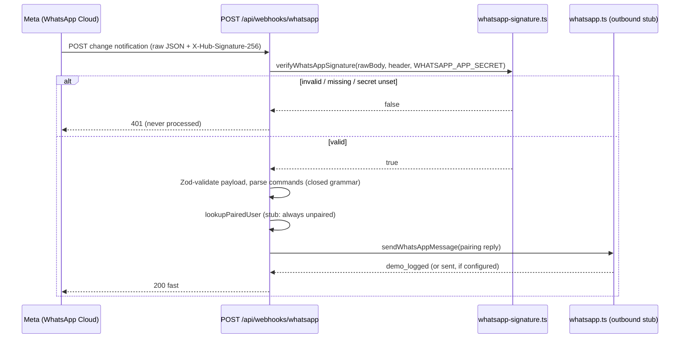

# WhatsApp Cloud API Integration (Part 9 - Architecture)

> **Purpose:** Operate and extend Lyra's WhatsApp Cloud API channel - webhook verification, signed inbound command intake, and the outbound send stub. | **Audience:** Engineers wiring or debugging the WhatsApp channel. | **Status:** Active | **Owner:** Bryson Walter | **Last updated:** 2026-06-11

## What is built vs what is future

This part ships the secure ARCHITECTURE. No real WhatsApp sends are required for it to work, and the codebase contains no live broker execution of any kind.

| Capability | State | Where |
|---|---|---|
| Webhook GET verification (hub.challenge) | Built | `src/app/api/webhooks/whatsapp/route.ts` |
| Webhook POST signature verification (X-Hub-Signature-256) | Built, unit-tested | `src/lib/notifications/whatsapp-signature.ts` + `src/lib/notifications/__tests__/whatsapp-signature.test.ts` |
| Zod validation of the change payload | Built | `src/app/api/webhooks/whatsapp/route.ts` |
| Closed-grammar command parsing (untrusted input) | Built (parse + log only) | `src/app/api/webhooks/whatsapp/route.ts` |
| Outbound send adapter with appsecret_proof | Built as stub - demo_logged unless env is set | `src/lib/notifications/whatsapp.ts` |
| Typed message templates | Built | `src/lib/notifications/whatsapp-templates.ts` |
| Pairing lookup against notification_channels | Future - stub always returns unpaired (fails safe) | `lookupPairedUser` in the route |
| Command execution (STATUS/PORTFOLIO/APPROVE/...) | Future - parsed and logged only | route comment block |
| Real production sends | Future - requires Meta setup + env below | this doc |
| Live order execution from any channel | Does not exist and is refused by design | `src/lib/trading/risk-engine.ts` (`no_live_execution` check) |

## Architecture

Design rules carried through the whole path:

- Inbound text is untrusted. It is normalised, matched against a closed command grammar, and logged with masked phone numbers. There is no free-form fallback and no LLM anywhere in the webhook path.
- Deterministic code decides, AI only explains. Notification events originate from the deterministic router contracts in `src/lib/notifications/types.ts`; an eventual APPROVE can only act on a server-minted pending approval that already passed `runPreTradeChecks` in `src/lib/trading/risk-engine.ts`.
- This is a research platform. Live execution is disabled in code (`no_live_execution` is a blocking check) and the approval template says so explicitly.

## Environment variables

All server-side only. Never `NEXT_PUBLIC_*`, never logged, never imported by client components. Declared in `.env.example` under "WhatsApp Cloud API (Part 9)".

| Variable | Required for | Notes |
|---|---|---|
| `WHATSAPP_VERIFY_TOKEN` | Webhook GET verification | Any random string you choose; pasted into the Meta webhook config. Unset = GET always returns 403 (fail closed). |
| `WHATSAPP_APP_SECRET` | Webhook POST verification + appsecret_proof | From Meta App Dashboard > App settings > Basic. Unset = every POST returns 401 (fail closed). |
| `WHATSAPP_ACCESS_TOKEN` | Real outbound sends | System-user token. Unset = all sends resolve to `demo_logged` with the note "WhatsApp not configured - this would be sent". |
| `WHATSAPP_PHONE_NUMBER_ID` | Real outbound sends | Numeric id of the sending number (not the phone number itself). |
| `WHATSAPP_BUSINESS_ACCOUNT_ID` | Template management | WABA id; used when registering templates, not by runtime code yet. |
| `WHATSAPP_API_VERSION` | Outbound URL | Defaults to `v21.0` in `src/lib/notifications/whatsapp.ts` if unset. |

## Meta app setup (one-time)

1. Create a Meta Business Portfolio (business.facebook.com) and verify the business.
2. Create a Meta app of type "Business" at developers.facebook.com and add the WhatsApp product.
3. Note the App Secret (App settings > Basic) -> `WHATSAPP_APP_SECRET`.
4. Add or use the test phone number under WhatsApp > API Setup; note the Phone number ID -> `WHATSAPP_PHONE_NUMBER_ID` and the WABA ID -> `WHATSAPP_BUSINESS_ACCOUNT_ID`.
5. Create a System User (Business settings > Users), grant it the app + WABA with `whatsapp_business_messaging` and `whatsapp_business_management`, and generate a long-lived token -> `WHATSAPP_ACCESS_TOKEN`.
6. Enable "Require app secret" for Graph API calls (App settings > Advanced > Security) so `appsecret_proof` is enforced server-side too.
7. Configure the webhook (WhatsApp > Configuration): callback URL `https://<your-deployment>/api/webhooks/whatsapp`, verify token = your `WHATSAPP_VERIFY_TOKEN`, then subscribe to the `messages` field.
8. While the app is in development mode, add tester phone numbers to the allowed recipient list - sends to anyone else fail with error 131030.

## Webhook verification

Two independent mechanisms, both fail closed:

### 1. GET challenge (subscription handshake)

Meta calls `GET /api/webhooks/whatsapp?hub.mode=subscribe&hub.verify_token=...&hub.challenge=...`. The route echoes `hub.challenge` as plain text only when `hub.mode === 'subscribe'` and `hub.verify_token` exactly equals `WHATSAPP_VERIFY_TOKEN`; everything else (including an unset env var) returns 403. This runs once per webhook configuration.

### 2. POST signature (every delivery)

Every POST carries `X-Hub-Signature-256: sha256=<hex>` - the HMAC-SHA256 of the raw request body keyed with the app secret. `verifyWhatsAppSignature` in `src/lib/notifications/whatsapp-signature.ts`:

- reads the raw body BEFORE JSON parsing (the signature is over exact bytes - never re-serialise),
- rejects a missing header, missing prefix, or non-64-hex digest early,
- compares with `crypto.timingSafeEqual` (constant time),
- fails closed when `WHATSAPP_APP_SECRET` is unset or empty.

Mismatches return 401 and the payload is never parsed. Authentic-but-unrecognised payloads (non-JSON, or shapes that fail the Zod schema) are logged and acknowledged with 200 so Meta does not retry-storm; they are otherwise ignored.

## appsecret_proof (outbound hardening)

Graph API calls from `sendWhatsAppMessage` append `appsecret_proof` - the HMAC-SHA256 of the access token keyed with the app secret (`buildAppSecretProof` in `src/lib/notifications/whatsapp.ts`). With "Require app secret" enabled in the Meta app, a leaked access token alone cannot call the API; the attacker would also need the app secret, which never leaves the server. The proof is recomputed per call and never logged.

## Pairing flow (web app first, never inbound)

Accounts are NEVER created or linked from an inbound WhatsApp message.

1. The user signs in to the Lyra web app and adds their phone number under Settings > Notifications.
2. `POST /api/notifications` (`src/app/api/notifications/route.ts`) validates the number (E.164-ish) and upserts it into the `notification_channels` table, scoped to the signed-in user via RLS.
3. The webhook's `lookupPairedUser` resolves an inbound sender against those rows. Today it is a stub that always returns unpaired - which fails safe: no inbound message can act on any account.
4. Unpaired senders receive a fixed "pair in the web app" reply through the outbound stub (`demo_logged` until WhatsApp env is configured).

## Templates and opt-in rules

WhatsApp platform rules that shape this design:

- Users must opt in before receiving business-initiated messages. Pairing in the web app is the opt-in record; sends are also gated by `whatsappEnabled` in `NotificationPreferences` (`src/lib/notifications/types.ts`, default false).
- Business-initiated messages outside the 24-hour customer-service window MUST use pre-approved templates. Free text is only allowed within 24 hours of the user's last message (e.g. command replies).
- Template parameters may not contain newlines, tabs, or runs of 4+ spaces - builders sanitise every parameter.

Typed builders live in `src/lib/notifications/whatsapp-templates.ts`; the canonical bodies are in `WHATSAPP_TEMPLATE_BODIES` and must stay byte-identical to what is registered in Meta Business Manager:

| Template | Builder | Notes |
|---|---|---|
| `lyra_signal_alert` | `buildSignalAlertTemplate` | Symbol, score, delta, action state, deterministic trigger reason, evidence link. |
| `lyra_daily_digest` | `buildDailyDigestTemplate` | Date, top movers, watchlist trigger count, portfolio summary, digest link. |
| `lyra_portfolio_risk` | `buildPortfolioRiskTemplate` | Symbol, deterministic risk state, one-line detail, evidence link. |
| `lyra_order_approval_required` | `buildOrderApprovalRequiredTemplate` | Includes the hard-coded line "This is a research platform - live execution disabled." plus the server-minted approval code. |

Every body ends with "Research, not advice." - all parameter values come verbatim from deterministic engine fields; AI never composes template content.

## Command handling

Inbound text is matched against a closed grammar in `parseInboundCommand` (route file). Case-insensitive, whitespace-normalised, max 64 chars; anything else is `unknown`.

| Command | Parsed as (`InboundCommand`) | Intended behaviour (future wiring) |
|---|---|---|
| `STATUS` | `status` | Reply with scanner/system status. |
| `PORTFOLIO` | `portfolio` | Reply with the deterministic portfolio overlay summary. |
| `TODAY` | `today` | Reply with today's digest. |
| `MUTE` / `UNMUTE` | `mute` / `unmute` | Toggle instant alerts in `NotificationPreferences`. |
| `APPROVE <code>` | `approve` + code | Must exactly match a server-minted pending approval (`^[A-Z0-9][A-Z0-9-]{3,31}$`). Records a paper decision only - the pre-trade engine (`src/lib/trading/risk-engine.ts`) blocks all live modes. |
| `REJECT <code>` | `reject` + code | Same exact-match rule; marks the intent rejected. |
| `KILLSWITCH` | `killswitch` | One-way: may only ACTIVATE the user kill switch (`isHardKilled` in `risk-engine.ts` treats it as a hard stop). Clearing requires the authenticated web app. |
| `HELP` | `help` | Reply with the command list. |

Current state: commands are parsed, validated, and logged (with masked phone numbers) - execution is intentionally not wired in this architecture pass.

## Production checklist

Before pointing a real Meta app at a deployed webhook:

- [ ] Business verified and app out of development mode (or all recipients on the tester allow list)
- [ ] `WHATSAPP_VERIFY_TOKEN`, `WHATSAPP_APP_SECRET`, `WHATSAPP_ACCESS_TOKEN`, `WHATSAPP_PHONE_NUMBER_ID` set in the deployment's server env (never `NEXT_PUBLIC_*`, never committed)
- [ ] "Require app secret" enabled in the Meta app so `appsecret_proof` is enforced
- [ ] Webhook subscribed to the `messages` field and GET verification succeeded against the deployed URL
- [ ] All four templates registered in Meta Business Manager with bodies byte-identical to `WHATSAPP_TEMPLATE_BODIES`
- [ ] `npm run test` green - includes `whatsapp-signature.test.ts` (valid passes, tampered/missing/unset all fail)
- [ ] `lookupPairedUser` wired to `notification_channels` before enabling any command execution
- [ ] Access token is a long-lived system-user token with only `whatsapp_business_messaging` + `whatsapp_business_management`
- [ ] Confirmed no live execution path exists: `tradingMode` defaults to `disabled` (`src/lib/trading/types.ts`) and `no_live_execution` blocks live modes (`src/lib/trading/risk-engine.ts`)

## Troubleshooting

| Symptom | Likely cause | Fix |
|---|---|---|
| Meta webhook setup fails with "callback verification failed" | `WHATSAPP_VERIFY_TOKEN` unset or does not match what was typed in the Meta UI; URL not publicly reachable | Set the env var, redeploy, re-verify. The route 403s on any mismatch by design. |
| Every POST returns 401 | `WHATSAPP_APP_SECRET` unset (fails closed) or wrong; a proxy/middleware re-serialised the body | Set the correct app secret; ensure nothing rewrites the raw body before the route reads it. |
| POST returns 200 with `ignored: true` | Payload was authentic but non-JSON or failed the Zod schema (e.g. status-only delivery) | Expected for non-message events. Check route logs if real messages are being ignored. |
| Sends return `demo_logged` | `WHATSAPP_ACCESS_TOKEN` or `WHATSAPP_PHONE_NUMBER_ID` unset | Expected default. Set both to attempt real sends. |
| Send fails with Graph error 131030 | Recipient not in the development-mode allowed list | Add the tester number in Meta, or move the app to live mode. |
| Send fails with Graph error 190 | Access token expired or invalidated | Regenerate the system-user token; rotate the env var. |
| Send fails with error 100 / template not found | Template name or language mismatch with Meta registration | Names must match `WhatsAppTemplateName` exactly; language code defaults to `en`. |
| Send fails mentioning appsecret_proof | `WHATSAPP_APP_SECRET` does not match the app that issued the token | Use the secret and token from the same Meta app. |
| Commands never act on an account | `lookupPairedUser` is a stub returning unpaired | By design in Part 9 - wire it to `notification_channels` (see Pairing flow). |

Related docs: `docs/ai-notification-layer.md` (deterministic-decides / AI-composes doctrine), `SECURITY.md` (secret-handling rules), `.env.example` (canonical env list).
