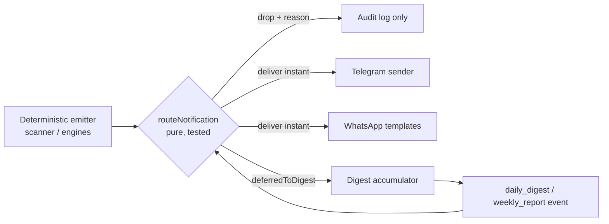

# Notification experience

> **Purpose:** The product design of Lyra's notification layer: every notification type, the deterministic routing rules (relevance floor, mutes, quiet hours, safety-critical bypass), channel UX for Telegram and WhatsApp, and the digest design. | **Audience:** Anyone designing, building, or debugging what pings the user. | **Status:** Active | **Owner:** Bryson Walter | **Last updated:** 2026-06-11

## Design stance

A notification is a deterministic event with evidence, not a marketing ping. Every event carries a deterministic `triggerReason`, `evidenceRefs`, a 0-100 `relevanceScore`, a `dedupeKey`, and an `idempotencyKey` (`NotificationEvent` in `src/lib/notifications/types.ts`). AI never originates a notification - at most it may rephrase a payload the router has already approved. Channels are opt-in: with defaults, NOTHING sends.

## Notification types

All 16 types from `NotificationType` in `src/lib/notifications/types.ts`, grouped by how the router treats them:

| Type | What it tells the user | Routing class |
|---|---|---|
| `signal_alert` | A momentum signal crossed a threshold | Standard |
| `theme_breakout` | A whole theme is breaking out | Standard |
| `small_cap_discovery` | A small-cap matched discovery criteria | Standard |
| `capital_event` | Raise/IPO/buyback-style capital event | Standard |
| `investor_move` | A tracked investor moved | Standard |
| `portfolio_news` | News on a holding | Standard |
| `portfolio_risk` | Deterministic risk state change on a holding | Standard |
| `paper_trade_opened` | Simulated entry filled | Paper (gated by `paperTradeAlerts`) |
| `paper_trade_closed` | Simulated exit filled | Paper (gated by `paperTradeAlerts`) |
| `paper_trade_stop_hit` | Simulated stop triggered | Paper (gated by `paperTradeAlerts`) |
| `order_intent_created` | A deterministic intent was drafted | Order chatter (gated by `orderApprovalAlerts`) |
| `order_rejected` | An intent was rejected/blocked | Order chatter (gated by `orderApprovalAlerts`) |
| `order_approval_required` | An intent is parked awaiting a human decision | SAFETY-CRITICAL (bypass) |
| `kill_switch_enabled` | A deterministic guard halted (future) trading activity | SAFETY-CRITICAL (bypass) |
| `daily_digest` | The day's roll-up | Digest (gated by `dailyDigest`) |
| `weekly_report` | The week's roll-up | Digest (gated by `weeklyDigest`) |

Note on honesty: the order/kill-switch types are fully contracted and routed today, but their deterministic EMITTERS belong to the future trading layer - no live order intents can exist in this build (`docs/architecture/future-trading-bot.md`).

## Routing rules (deterministic, first match wins)

`routeNotification` in `src/lib/notifications/router.ts` is a pure function of (event, preferences, clock, recent dedupe keys) - the entire policy is unit-tested in `src/lib/notifications/__tests__/router.test.ts` (28 tests). Rule order:

1. **Relevance floor** - events below `minRelevanceScore` (default 40) are dropped outright.
2. **Mutes** - muted symbol, then muted theme. Matches entity tags (`relatedEntityType`/`relatedEntityId`) or dedupe-key tokens, case-insensitive.
3. **Dedupe** - same `dedupeKey` (`type:entity:isoDay`) inside the recent window collapses to one delivery.
4. **Safety-critical bypass** - `kill_switch_enabled` and `order_approval_required` ALWAYS deliver instantly: immune to quiet hours, the instant-alerts toggle, digest deferral, and even the order-chatter toggle. The only thing that stops them is having no enabled channel. Rationale is written into the code: a tripped kill switch must never be learned from tomorrow's digest, and deferring an approval request silently stalls the approval workflow. Deterministic emitters stamp these events with relevance 100 and unique day-scoped dedupe keys, so rules 1-3 act as exact-duplicate protection, not a silencing path.
5. **Paper toggle** - paper-trade events drop when `paperTradeAlerts` is off.
6. **Order chatter toggle** - `order_intent_created` / `order_rejected` drop when `orderApprovalAlerts` is off (`order_approval_required` never reaches this rule).
7. **Digest gates** - `daily_digest` / `weekly_report` route only when their preference is on; they are never themselves deferred (they ARE the digest).
8. **No channels** - both Telegram and WhatsApp disabled means drop with reason `no channels`.
9. **Quiet hours** - non-critical events inside the window defer to the next digest (`deferredToDigest: true`). Overnight windows wrap midnight (default 22:00-07:00). Malformed or zero-length windows fail OPEN - a bad preference string must not silently defer everything forever.
10. **Instant alerts off** - same deferral semantics as quiet hours.

Otherwise: deliver instantly on every enabled channel (Telegram first, stable order). Drop reasons are stable machine-readable constants (`DROP_REASONS`) so audits never string-match prose.

### Preference defaults

`DEFAULT_NOTIFICATION_PREFERENCES` (`src/lib/notifications/types.ts`): instant alerts ON, daily + weekly digests ON, **both channels OFF**, quiet hours ON 22:00-07:00, no mutes, relevance floor 40, paper-trade and order-approval alerts ON. Net effect: a new user receives nothing until they deliberately enable a channel. Preferences persist browser-locally today (`lyra.notificationPrefs.v1`, `src/lib/notifications/preferences.ts`); a Supabase-backed store can replace the load/save pair without touching routing logic.

## Message format (the wire UX)

Deterministic templates in `src/lib/notifications/templates.ts` render one dense, plain-ASCII message per type: compact uppercase type label first (`SIGNAL`, `PAPER OPEN`, ...), newline-separated, always under 400 characters so it fits a single chat bubble, trigger reason always included, and every signal-like type ends with `Research, not advice.` AI may rephrase elsewhere; this module is the no-LLM fallback and the canonical wire format. Every delivery attempt (sent, failed, suppressed, demo_logged) is recorded append-only (`src/lib/notifications/audit.ts`).

## Channel UX

### Telegram (the interactive channel)

- Outbound: worker signal alerts today (`workers/stock_scanner/telegram.py`); web-layer sends with idempotent dedupe (`src/lib/notifications/telegram.ts`).
- Inbound: a secured webhook parses messages into a CLOSED command enum - text is data, never instructions. Commands: `/status`, `/portfolio`, `/watchlist`, `/today`, `/paper`, `/mute`, `/unmute`, `/approve`, `/reject`, `/killswitch`, `/help`, `/start [code]`. Account-scoped commands answer with pairing instructions until pairing ships; `/approve` and `/reject` refuse because no pending intents can exist. Full table, security model, and failure modes: `docs/integrations/telegram.md`.

### WhatsApp (the template channel)

- Architecture is built (signed webhook, closed command grammar, outbound stub); real sends are future and require Meta setup. Business-initiated messages must use the four pre-approved templates in `src/lib/notifications/whatsapp-templates.ts`: `lyra_signal_alert`, `lyra_daily_digest`, `lyra_portfolio_risk`, `lyra_order_approval_required` (which hard-codes "This is a research platform - live execution disabled."). Every body ends with "Research, not advice." Details: `docs/integrations/whatsapp.md`.

## Digest design

- The digest is itself a notification type, routed through the same gate - so digest preferences, channel availability, and audit logging all behave identically to instant alerts.
- Quiet-hours and instant-off deferrals return `deferredToDigest: true`; those events belong in the NEXT digest rather than being lost. The honest current state: the route decision is fully built and tested; the digest SCHEDULER (accumulating deferred events and choosing a send time outside quiet hours) is the responsibility named in the router comments and is not built yet.
- Digest content design: one message, under 400 chars on the wire (template layer), leading with top movers, watchlist trigger count, and portfolio summary (mirrors `buildDailyDigestTemplate` parameters), linking back to the web digest for depth.

## Product rules of thumb

- If a notification cannot name its deterministic trigger reason in one line, it does not ship.
- Never add a type that bypasses the router; never add a bypass type that is not genuinely safety-critical (the bar: "would learning this tomorrow be strictly worse than a late-night ping?").
- Respect the floor: tune `relevanceScore` at the emitter rather than lowering a user's `minRelevanceScore`.
- Every new type needs: a template in `templates.ts`, a routing-class decision here, and router tests covering its gates.
