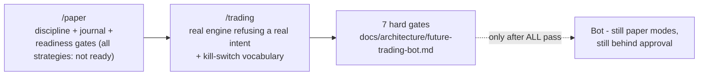

# Trading bot readiness - bot last, foundations first

> **Purpose:** The user-facing promise about automated trading: what the Paper Trading and Bot Readiness pages show today, the gates that must pass before live execution is even discussable, and why the product refuses on purpose. | **Audience:** Product, engineering, and anyone writing user-facing copy about the bot. | **Status:** Active | **Owner:** Bryson Walter | **Last updated:** 2026-06-11

## The promise

**The bot ships last.** Lyra builds and proves every foundation - data quality, deterministic signals, risk engine, kill switches, paper discipline, audited approvals - in the open, in the product, BEFORE any order can touch a broker. Users can watch the foundations pass their gates one by one. Until every gate passes, the product's job is to refuse, visibly and honestly.

This is enforced, not promised: live modes are refused in code (`no_live_execution` blocking check, `src/lib/trading/risk-engine.ts`), the default trading mode is `disabled` (`DEFAULT_TRADING_SETTINGS`, `src/lib/trading/types.ts`), and the only broker adapter refuses every call (`NullBrokerAdapter`, `src/lib/trading/broker-adapter.interface.ts`).

## What users see today

### `/paper` - Paper Trading (`src/app/paper/page.tsx`)

A fully simulated account for pressure-testing strategy DISCIPLINE before automation is even discussable:

- Demo account starting at $100,000 with 3 open and 6 closed trades across three named strategies (momentum breakout, oversold recovery, trend pullback) - `DEMO_PAPER_TRADES` in `src/lib/paper-trading.ts`.
- Honest friction: every fill carries 0.05% commission and 0.1% slippage baked into the price, with cumulative `feesPaid` and `slippagePaid` displayed - the P/L never flatters the strategy.
- A frozen `thesisSnapshot` per trade (score, RSI, MACD state, volume ratio, note) so every decision is auditable forever.
- A trade journal with mistake tags (`chased_entry`, `oversized`, `ignored_regime`, `no_mistake`, ...) and lessons - process review is part of the product, not an afterthought.
- The strategy readiness panel (below).

### The readiness panel - per-strategy gates

`computeStrategyReadiness` (`src/lib/paper-trading.ts`) renders five gates per strategy and a verdict that is hard-coded honest: **`not_ready_for_automation`**, for every strategy in this build.

| Gate | Today | Why |
|---|---|---|
| Sample size n >= 30 closed trades | FAIL | A handful of paper trades proves nothing (`MIN_SAMPLE = 30`) |
| Out-of-sample evaluation period | FAIL | All results are in-sample paper fills - no held-out period exists yet |
| Drawdown tested through a full regime cycle | FAIL | The strategies have not traded through a downtrend regime |
| Positive expectancy with statistical confidence | FAIL | Point estimates exist; no confidence interval worth acting on at this n |
| Fees + slippage modelled in results | PASS | Every paper fill includes commission and slippage |

The user-visible message: even the gates we CAN pass today do not add up to automation. The full validation standard behind these gates is `docs/testing/backtesting-validation.md`.

### `/trading` - Bot Readiness (`src/app/trading/page.tsx`)

The page that shows the safety machinery working by REFUSING:

- Server-side, it drafts a demo NVDA paper `OrderIntent` (deterministic strategy fields, frozen snapshots, idempotency key) and runs it through the REAL pre-trade engine - `runPreTradeChecks` with `DEFAULT_TRADING_SETTINGS` - then renders the genuinely failing `PreTradeReport`.
- With defaults, the refusal is multi-layered: `trading_mode` fails (disabled is the default), `max_order_notional` fails (limit is 0), `max_daily_loss` fails (an unconfigured loss limit fails by design), `strategy_allowed` fails (empty allowlist), `broker_connected` fails (no broker). One blocked check would be enough; users see five.
- The full kill-switch vocabulary (`ALL_KILL_SWITCHES`, 11 switches from `global` to `ai_system`) is listed so users can see the controls that will govern any future bot.
- Footer, verbatim intent: "No live trading exists in this product; the pre-trade engine output above is a deterministic demonstration, not an order."

## The gates before live execution (user-facing summary)

The engineering version lives in `docs/architecture/future-trading-bot.md` ("Hard gates before live execution"). The user-facing ladder:

1. **Backtest evidence** - documented, bias-checked, out-of-sample results (`docs/testing/backtesting-validation.md`).
2. **Paper validation period** - the full intent lifecycle running end-to-end on real market data, results reconciled against backtest expectations.
3. **Risk configuration proven** - real limits set AND demonstrated to block when hit.
4. **Sandbox broker first** - a sandbox adapter with full audit logging and idempotent, duplicate-safe submission (`docs/integrations/broker-adapter-spec.md`).
5. **Kill-switch drills** - all 11 switches tripped in test and shown to halt their scope.
6. **Manual approval mandatory** - `requireManualApproval` stays on for any initial live phase; no unattended operation.
7. **Legal and regulatory review** - before any real order, full stop.

These are sequential. A later gate cannot compensate for an earlier one, and no marketing milestone moves them.

## Copy rules for this surface

- Never imply a bot exists, is in beta, or is "coming soon" with a date. The honest phrase is: live execution is intentionally not implemented; foundations are being proven in the open.
- The refusing pre-trade report is a FEATURE. Do not soften it, hide failed checks, or fake a passing state for demos - the genuinely failing report IS the demo.
- Readiness verdicts use the fixed vocabulary (`not_ready_for_automation` today; the AI `trade_readiness` agent is likewise limited to `research_only` / `paper_trade_eligible` / `blocked_missing_evidence` - `src/lib/ai/agents/registry.ts`). No surface invents optimistic synonyms.
- Every page in this area carries the research-not-advice footer. It is load-bearing, not boilerplate.
