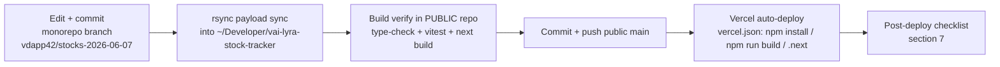

# Deploy runbook - monorepo to public repo to Vercel

> **Purpose:** The real, end-to-end deploy flow for Lyra: monorepo branch -> manual rsync sync into the public `vai-lyra-stock-tracker` repo -> local build verify -> push -> Vercel auto-deploy, plus the content:build pipeline, env vars per mode, and the post-deploy checklist. | **Audience:** Anyone shipping Lyra changes to the public deployment. | **Status:** Active | **Owner:** Bryson Walter | **Last updated:** 2026-06-11

## 1. The two-repo reality

Lyra lives in two places. Get this wrong and you ship from the wrong tree.

| Repo | Path | Remote | Role |
|---|---|---|---|
| Monorepo app (SOURCE OF TRUTH) | `~/Developer/Vivacity.ai-stocks/vd-apps/vdapp42-stock-momentum-radar/` | `git@github.com:BrysonW24/Vivacity.ai.git`, branch `vdapp42/stocks-2026-06-07` | All development happens here |
| Public repo (DEPLOY TARGET) | `~/Developer/vai-lyra-stock-tracker/` | `https://github.com/BrysonW24/vai-lyra-stock-tracker.git`, branch `main` | Sanitized public mirror; Vercel builds from this repo |

There is **no sync script on disk today** - the sync is a manual rsync (section 3). If you find yourself doing it a third time in a week, script it and check the script into `scripts/`.



## 2. What syncs and what never syncs

The two repos intentionally diverge. The public repo OWNS its own top-level identity files; the monorepo carries internal agent/process files that must never leak.

**Sync payload (source of truth = monorepo):**
`src/`, `workers/`, `tests/`, `content/`, `contracts/`, `scripts/`, `sql/`, `supabase/`, `public/`, `docs/`, `package.json`, `package-lock.json`, `next.config.js`, `postcss.config.js`, `tailwind.config.ts`, `tsconfig.json`, `vitest.config.ts`, `vercel.json`, `requirements.txt`, `.env.example`, `QUICKSTART.md`, `SECURITY.md`

**Never copy to the public repo (monorepo-internal):**
`.claude/`, `.mcp.json`, `AGENTS.md`, `app-aesthetic-prompt.md`, `app-aesthetic-system.md`, `landing-aesthetic-prompt.md`, `tsconfig.tsbuildinfo`, `node_modules/`, `.next/`, any `.env*` except `.env.example`

**Never overwrite in the public repo (public-repo-owned, they have diverged on purpose):**
`README.md` (screenshot showcase version), `CHANGELOG.md`, `CLAUDE.md`, `LICENSE`, `PRIVACY.md`, `DISCLAIMER.md`, `CONTRIBUTING.md`, `assets/`, `image*.png`, `.github/` (the live scanner workflow), `.gitignore`, `.vercelignore`

## 3. The sync step (manual rsync)

From the monorepo app directory:

```bash
SRC=~/Developer/Vivacity.ai-stocks/vd-apps/vdapp42-stock-momentum-radar
DST=~/Developer/vai-lyra-stock-tracker

# Directories - --delete keeps the mirror honest INSIDE the payload dirs only
for d in src workers tests content contracts scripts sql supabase public docs; do
  rsync -av --delete \
    --exclude '__pycache__' --exclude '*.pyc' --exclude 'generated' \
    "$SRC/$d/" "$DST/$d/"
done

# Individual files
for f in package.json package-lock.json next.config.js postcss.config.js \
         tailwind.config.ts tsconfig.json vitest.config.ts vercel.json \
         requirements.txt .env.example QUICKSTART.md SECURITY.md; do
  rsync -av "$SRC/$f" "$DST/$f"
done
```

Notes:

- `--delete` is scoped to the payload directories. NEVER run a repo-root rsync with `--delete` - it would destroy the public-only files (LICENSE, README, assets, `.github/`).
- `src/lib/generated/` is build output of the content pipeline (section 4); excluding it is safe because `prebuild`/`predev` regenerate it in the destination.
- Verify the sync before committing:

```bash
diff -rq "$SRC/src" "$DST/src" | grep -v node_modules
```

A real drift example: `src/lib/notifications/preferences.ts` existed in the monorepo but not in the public repo until the next sync picked it up. `diff -rq` catches exactly this class of miss.

## 4. The content:build pipeline (runs on every build)

`scripts/build-content.mjs` compiles every `content/*.jsonl` file into importable JSON at `src/lib/generated/<domain>.json` plus `manifest.json`. It is wired into npm lifecycle hooks in `package.json`:

- `predev` -> runs before `npm run dev`
- `prebuild` -> runs before `npm run build` (including on Vercel)
- `pretype-check` -> runs before `npm run type-check`

Failure mode that WILL break a deploy: a single invalid JSON line in any `content/*.jsonl` makes the script `process.exit(1)`, which fails `npm run build`, which fails the Vercel deploy. The error names the file and line (`content: ipos.jsonl:12 invalid JSON -> ...`). Fix the one line, re-run `npm run content:build`, re-verify. Blank lines and lines starting with `//` are allowed. See `content/README.md` for editing rules.

## 5. Build verify (mandatory, in the PUBLIC repo)

Run the verify in the public repo after the sync - that is the exact tree Vercel will build:

```bash
cd ~/Developer/vai-lyra-stock-tracker
npm install            # only when package.json/package-lock.json changed
npm run type-check     # pretype-check compiles content first
npm run test           # vitest run - 8 suites, must be green
npm run build          # prebuild compiles content, then next build
```

Optional but recommended when worker code changed: `npm run worker:test` (pytest, requires `pip install -r requirements.txt` in a venv).

Only when all green:

```bash
git add -A
git commit -m "feat: <what changed>"   # conventional commits
git push origin main
```

Vercel auto-deploys on push. `vercel.json` pins: framework `nextjs`, `installCommand: npm install`, `buildCommand: npm run build`, `outputDirectory: .next`, region `iad1`. `.vercelignore` excludes the Python worker caches and test artefacts from the upload.

## 6. Env vars per mode

Reference: `.env.example`. Three modes, additive.

### Demo mode (default - zero keys)

| Var | Where | Value |
|---|---|---|
| (no demo-mode flag) | n/a | Demo fallback is automatic - the dashboard stays on built-in demo data whenever the Supabase env vars are unset. Nothing to set. |

With nothing else set, the app deploys and runs entirely on demo data. This is by design - see `SECURITY.md` ("Demo mode is the safe default").

### Live mode (Supabase + scanner + alerts)

| Var | Where | Notes |
|---|---|---|
| `NEXT_PUBLIC_SUPABASE_URL` / `NEXT_PUBLIC_SUPABASE_ANON_KEY` | Vercel | Read-only anon access, RLS enforced. The ONLY Supabase values allowed in the browser. |
| `SUPABASE_URL` / `SUPABASE_SERVICE_ROLE_KEY` | GitHub Actions secrets (public repo) | Worker-only. NEVER in Vercel client env, never `NEXT_PUBLIC_*`. |
| `DEFAULT_USER_ID` | GitHub Actions secrets | Single-operator mode: stamps worker overlays with your auth user id. |
| `TELEGRAM_BOT_TOKEN` / `TELEGRAM_CHAT_ID` / `ENABLE_TELEGRAM_ALERTS` | GitHub Actions secrets | Worker outbound alerts. |
| `TELEGRAM_BOT_TOKEN` + `TELEGRAM_WEBHOOK_SECRET` | Vercel (server-side) | Inbound webhook + web-layer replies. Unset secret = webhook 401s everything (fail closed). |
| `WHATSAPP_VERIFY_TOKEN` / `WHATSAPP_APP_SECRET` / `WHATSAPP_ACCESS_TOKEN` / `WHATSAPP_PHONE_NUMBER_ID` / `WHATSAPP_BUSINESS_ACCOUNT_ID` / `WHATSAPP_API_VERSION` | Vercel (server-side) | All optional; unset = fail closed (webhook) / `demo_logged` (sends). See `docs/integrations/whatsapp.md`. |
| `FINNHUB_API_KEY` | GitHub Actions secrets | Optional Horizon-2 live data. |
| Scanner thresholds (`ALERT_SCORE_THRESHOLD` etc.) | GitHub Actions secrets/vars | See `.env.example` for the full list. |

The hourly scanner runs from the PUBLIC repo's workflow: `.github/workflows/hourly-stock-scanner.yml` (cron `5 * * * *`, UTC; the worker's market-hours guard in `workers/stock_scanner/scheduler_guard.py` decides whether to actually scan). With no Actions secrets set, the worker no-ops safely.

### AI mode

| Var | Where | Notes |
|---|---|---|
| `OPENAI_API_KEY` | Vercel server-side | Hosted beta default for keyless users. Never prefix with `NEXT_PUBLIC_`. |
| `LYRA_HOSTED_OPENAI_MODEL` | Vercel server-side | Optional override; defaults to `gpt-5.5`. |
| `LYRA_OPENAI_REASONING_EFFORT` | Vercel server-side | Optional `none`, `low`, `medium`, `high`, or `xhigh`; defaults to `low`. |
| `GOOGLE_AI_KEY` | Vercel server-side | Optional older shared Gemini fallback. |
| User BYOK | Browser localStorage | Optional. A user's key in Settings -> AI overrides the hosted key for that user's request. |
| `ANTHROPIC_API_KEY` / `ENABLE_AI_EXPLANATIONS` | Vercel/GitHub server-side | Optional legacy worker-side explanations/smart-money paths. |

## 7. Post-deploy verification checklist

Run against the production URL within minutes of the deploy:

- [ ] `/` (Command) loads; with no Supabase env the demo data renders and nothing errors
- [ ] `/radar`, `/paper`, `/trading` load; `/trading` shows the pre-trade engine genuinely REFUSING the demo intent (that refusal is correct behaviour, not a bug)
- [ ] Mobile bottom nav scrolls horizontally and the active item is visible (test at 390px width)
- [ ] `POST /api/webhooks/telegram` WITHOUT the secret header returns 401
- [ ] `GET /api/webhooks/whatsapp` without valid `hub.verify_token` returns 403
- [ ] No secret leaked to the client: `grep -r "NEXT_PUBLIC" .env.example` shows only the app URL, demo flag, and Supabase anon pair
- [ ] Vercel function logs clean (no repeated errors on `/api/*`)
- [ ] If live mode: GitHub Actions `Hourly Stock Scanner` latest run green (or skipped by the market-hours guard outside 13:00-23:59 UTC weekdays)
- [ ] If content changed: spot-check one updated fact on its page (e.g. an IPO reference price on `/ipos`)
- [ ] `npm run doctor` locally if anything looks off (`scripts/doctor.mjs`)

## 8. Rollback

Two options, fastest first:

1. **Vercel instant rollback** - Vercel dashboard -> Deployments -> promote the previous good deployment. No git change needed.
2. **Git revert** - in the public repo: `git revert <bad-sha> && git push origin main`. Vercel redeploys automatically. Then fix forward in the MONOREPO and re-sync - never patch the public repo directly and forget the monorepo, or the next sync re-introduces the bug.

## 9. Failure modes

| Failure | Symptom | Fix |
|---|---|---|
| Invalid JSONL line in `content/` | Vercel build fails in `prebuild` with `content: <file>:<line> invalid JSON` | Fix the named line, `npm run content:build` locally, re-sync, re-push |
| Synced only part of the payload | Type errors on Vercel that do not reproduce in the monorepo | `diff -rq` both `src/` trees; re-run the full sync (section 3) |
| Pushed monorepo-internal files | `AGENTS.md` / `.claude/` visible on GitHub | Remove them in a follow-up commit; they contain internal process, not secrets - but they do not belong in public |
| Root rsync with `--delete` | LICENSE / README / assets / `.github/` gone in the public repo | `git checkout -- <paths>` in the public repo before committing; re-read section 3 |
| Forgot Vercel env after rotation | Webhooks 401 everything / sends become `demo_logged` | Both are fail-safe defaults; set the env vars and redeploy |
| Worker scans nothing | Actions run green but no new rows | Expected outside market hours (guard) or with no secrets; check `FORCE_SCAN` and `ENABLE_MARKET_HOURS_GUARD` |
