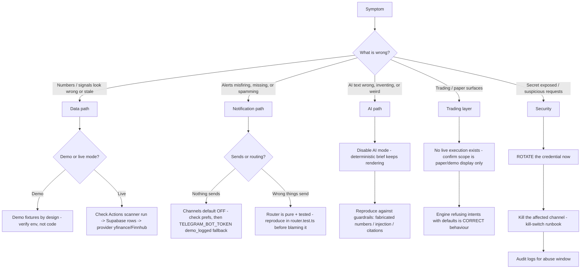

# Incident response - operational quick card

> **Purpose:** The first-15-minutes playbook when Lyra misbehaves in production: a symptom-driven decision tree, containment moves per layer, and links to the detailed security playbooks. | **Audience:** The operator on the spot (today: Bryson). | **Status:** Active | **Owner:** Bryson Walter | **Last updated:** 2026-06-11

## 0. Calibrate severity first

Lyra is research software. **No live broker execution exists** (`NullBrokerAdapter` in `src/lib/trading/broker-adapter.interface.ts` refuses everything; the `no_live_execution` check in `src/lib/trading/risk-engine.ts` blocks live modes). No incident in this build can move real money. That removes the worst class of severity - but wrong data, wrong alerts, or a leaked secret still erode the only asset the product has: trust.

| Severity | Definition | Examples |
|---|---|---|
| SEV-1 | Secret leak or unauthorized access path | Bot token / service-role key committed or exposed; webhook accepting unsigned requests |
| SEV-2 | Wrong information delivered to users | Misfiring alerts, wrong scores, AI inventing numbers |
| SEV-3 | Degraded or stale | Scanner not running, stale dashboard, sends failing |
| SEV-4 | Cosmetic / single-surface | One page broken, layout issues |

## 1. First 15 minutes

1. **Write down the time and the symptom** (one line; you will need it for the postmortem).
2. **Establish data mode.** Is the deployment in demo mode or live mode? Demo mode (no Supabase env) means user-visible "wrong data" is almost certainly demo fixtures behaving as designed - check `NEXT_PUBLIC_ENABLE_DEMO_FALLBACK` and whether Supabase env is set before debugging anything else.
3. **Capture evidence before changing anything.** Vercel function logs, the failing URL, GitHub Actions run logs (`Hourly Stock Scanner` in the public repo), a screenshot. Logs rotate; screenshots do not.
4. **Contain using the kill-switch runbook** (`docs/runbooks/kill-switch.md`). Every layer has a today-workable off switch: notifications, AI, webhooks, scanner. Containment is reversible; investigate after.
5. **If a secret is involved, rotate first, investigate second** - rule 4 in `SECURITY.md`. Rotation steps per channel are in the kill-switch runbook and the integration docs.
6. **Roll back if a deploy caused it** - Vercel instant rollback or `git revert` on the public repo (`docs/runbooks/deploy.md` section 8).

## 2. Decision tree by symptom

## 3. Per-path quick cards

### Data wrong or stale (scanner -> Supabase -> dashboard)

- Order of checks: GitHub Actions `hourly-stock-scanner.yml` last run -> worker logs in that run -> Supabase table rows fresh? -> dashboard fetch (`src/lib/` Supabase helpers) -> demo fallback masking a fetch failure.
- The market-hours guard (`workers/stock_scanner/scheduler_guard.py`) skips weekends and runs only 13:00-23:59 UTC weekdays unless `FORCE_SCAN=true`. "No scan since Friday" on a Sunday is not an incident.
- Frontend never computes trading logic - if a score is wrong, the worker wrote it wrong (`workers/stock_scanner/`); fix there, never patch the display.

### Alerts wrong (router -> channel adapters)

- All channels are OFF by default (`DEFAULT_NOTIFICATION_PREFERENCES` in `src/lib/notifications/types.ts`: `telegramEnabled: false`, `whatsappEnabled: false`). "No alerts" is usually preferences, not an outage.
- The routing policy is a pure function (`routeNotification` in `src/lib/notifications/router.ts`) with 28 unit tests. Reproduce the misroute as a failing test case in `src/lib/notifications/__tests__/router.test.ts`; if you cannot, the bug is in the emitter or the adapter, not the router.
- Spam: check the dedupe window (per-instance memory on Vercel - duplicates across instances are a known, documented limitation, see `docs/integrations/telegram.md` section 12).
- Containment: kill-switch runbook section on notifications (preferences + env).

### AI wrong (gateway -> guardrails)

- Containment is one toggle: AI mode `off` in Settings (the default). The deterministic brief always renders; AI is narration only (`src/app/api/ai/brief/route.ts` falls back on ANY error).
- Then classify the failure against the guardrails in `src/lib/ai/guardrails/`: fabricated number (`assertNoFabricatedNumbers`), injection (`detectInjectionAttempt` / `isolateExternalContent`), missing citations (`enforceCitations`). Add the failing case to `src/lib/ai/__tests__/guardrails.test.ts` and to the eval corpus (`docs/testing/ai-evals.md`).
- AI cannot have placed an order, sent a notification, or changed settings - `FORBIDDEN_TOOLS` in `src/lib/ai/policy.ts` has no implementation behind it to abuse. If something acted, the cause is deterministic code, not the LLM.

### Trading layer

- Scope check first: `/paper` is a simulated demo ledger (`src/lib/paper-trading.ts`); `/trading` deliberately shows the risk engine REFUSING a demo intent (`src/app/trading/page.tsx`). A failing pre-trade report with default settings is the product working.
- There is nothing to halt: `DEFAULT_TRADING_SETTINGS.tradingMode` is `'disabled'` and no settings persistence exists. If any surface ever implies a real order happened, treat it as a SEV-2 honesty bug in display copy.

### Security

- Playbooks, in order of use: `SECURITY.md` (golden rules + rotation), `docs/integrations/telegram.md` (sections 7, 14, 15 - webhook auth, checklist, troubleshooting), `docs/integrations/whatsapp.md` (signature verification, checklist, troubleshooting), `docs/runbooks/kill-switch.md` (per-layer shutoff).
- Webhook probing without the secret header is normal internet noise - the routes 401/403 it by design. Escalate only if authenticated requests look forged.
- Leak response: rotate at the provider -> update the deployment env -> redeploy -> review the abuse window in logs -> postmortem.

## 4. After containment

- [ ] Symptom, timeline, and root cause written down (even three lines)
- [ ] Failing case captured as a unit test where the bug was logic (`router.test.ts`, `guardrails.test.ts`, `risk-engine.test.ts`, worker `tests/`)
- [ ] Fix landed in the MONOREPO first, then synced and deployed (`docs/runbooks/deploy.md`)
- [ ] Any rotated secret confirmed working end-to-end
- [ ] Kill switches you flipped are deliberately restored (or deliberately left off, with a note)
- [ ] If the incident class is new, add it to the decision tree above
