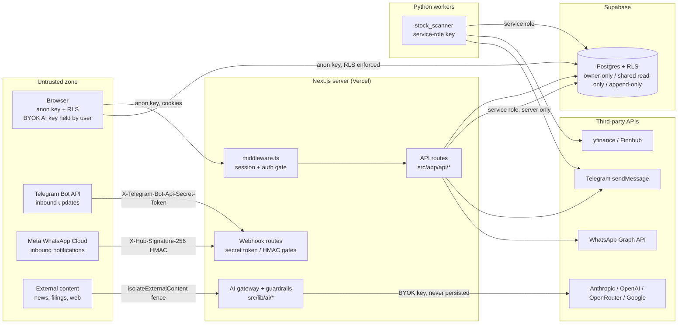

# Security architecture

> **Purpose:** The Lyra security model in one place: trust boundaries, secret classes, RLS as the tenancy backbone, and the defence-in-depth stack mapped to real code paths. | **Audience:** Engineers and agents building or reviewing any Lyra surface. | **Status:** Active | **Owner:** Bryson Walter | **Last updated:** 2026-06-11

## Two invariants that shape everything

1. **No live broker execution exists.** The deterministic pre-trade engine refuses every live mode (`no_live_execution` check in `src/lib/trading/risk-engine.ts`), and the database cannot even record a live execution (`trading_settings.trading_mode` and `order_intents.status` check constraints in `supabase/migrations/020_trading_foundations.sql` exclude live values). Security work assumes an attacker who somehow reaches the trading layer still cannot move money.
2. **LLMs never generate orders or originate decisions.** Deterministic code decides; AI only explains (`src/lib/ai/policy.ts`, `AI_NEVER`). The AI layer has no write path into the risk engine, the router, or any broker surface.

## Trust boundaries

### Boundary 1 - Browser to Next.js server

- `src/middleware.ts` refreshes the Supabase session on every request and gates the app behind sign-in when Supabase is configured. Unauthenticated visitors are redirected to `/welcome`; API routes enforce their own auth (401).
- When Supabase env vars are absent, the app runs in open demo mode on built-in data (`src/lib/demo-data.ts`) and makes no privileged calls. Demo mode is the safe default (`SECURITY.md`).
- The browser holds exactly two Supabase values, both public by design: `NEXT_PUBLIC_SUPABASE_URL` and `NEXT_PUBLIC_SUPABASE_ANON_KEY` (`src/lib/env.ts`, `src/lib/supabase/client.ts`). Nothing else crosses into the bundle.
- BYOK AI keys are user-held: stored client-side by the user's choice, forwarded per-request to `src/app/api/ai/brief/route.ts`, passed to the provider via `src/lib/ai/gateway.ts`, never logged or persisted server-side.

### Boundary 2 - Next.js server to Supabase

Three clients, three privilege levels, all in `src/lib/supabase/`:

| Client | File | Key | RLS |
|---|---|---|---|
| Browser | `client.ts` | anon | Enforced |
| Server (request-scoped) | `server.ts` | anon + auth cookies | Enforced - queries return only the signed-in user's rows |
| Admin | `admin.ts` | `SUPABASE_SERVICE_ROLE_KEY` | **Bypassed** - server only, never importable from client components |

### Boundary 3 - Messaging providers to webhook routes

Both inbound webhooks authenticate before any parsing:

- Telegram: constant-time secret-token check against `TELEGRAM_WEBHOOK_SECRET`, 401 on mismatch or unset secret (`src/app/api/webhooks/telegram/route.ts`).
- WhatsApp: HMAC-SHA256 of the raw body against `WHATSAPP_APP_SECRET` via `X-Hub-Signature-256`, fail closed (`src/app/api/webhooks/whatsapp/route.ts`, `src/lib/notifications/whatsapp-signature.ts`).

All inbound text is untrusted data, parsed into closed command enums, never forwarded to an LLM as instructions. Full detail in [`webhooks.md`](./webhooks.md).

### Boundary 4 - External content to the AI layer

Anything retrieved from outside (news, filings, documents, inbound chat) is data, never instructions. `isolateExternalContent` in `src/lib/ai/guardrails/injection.ts` strips known injection patterns and wraps the text in explicit untrusted-data fence markers before it may reach a prompt. Full detail in [`ai-security.md`](./ai-security.md).

### Boundary 5 - Python workers to Supabase and providers

`workers/stock_scanner/` runs with the service-role key (bypasses RLS) and the Telegram bot token. It runs only in trusted environments (local, GitHub Actions scheduler) and its secrets never touch the frontend.

## Secret classes and where each lives

| Class | Examples | Lives in | Crosses to browser? |
|---|---|---|---|
| Public-by-design config | `NEXT_PUBLIC_SUPABASE_URL`, `NEXT_PUBLIC_SUPABASE_ANON_KEY`, `NEXT_PUBLIC_APP_URL` | Browser bundle + server env | Yes - safe only because RLS is the real gate |
| Server runtime secrets | `TELEGRAM_WEBHOOK_SECRET`, `TELEGRAM_BOT_TOKEN`, `WHATSAPP_APP_SECRET`, `WHATSAPP_ACCESS_TOKEN`, `WHATSAPP_VERIFY_TOKEN` | Deployment env (Vercel) | Never |
| Worker secrets | `SUPABASE_SERVICE_ROLE_KEY`, `FINNHUB_API_KEY`, `ANTHROPIC_API_KEY` | Worker env / Actions secrets | Never |
| User-held BYOK keys | per-user AI provider keys | The user's browser; forwarded per-request, never persisted server-side | Held by the user, by design |
| Derived / hashed material | pairing code hashes (`channel_pairing_codes.code_hash`, only the sha256 hash is stored - `buildPairingCode` in `src/lib/notifications/telegram.ts`) | Supabase | Hash only |

The full per-variable inventory, rotation guidance, and the `NEXT_PUBLIC_` rule live in [`secrets-management.md`](./secrets-management.md).

## RLS as the tenancy backbone

Row Level Security is the load-bearing tenancy control. The client is never trusted to filter; hiding data in the UI is not a control (`SECURITY.md`). Three policy families, all idempotently applied in `supabase/migrations/019_ai_native_evidence.sql` and `020_trading_foundations.sql`:

1. **Owner-only CRUD** (`auth.uid() = user_id` on select/insert/update/delete): `user_research_notes`, `research_tasks`, `notification_channels`, `channel_pairing_codes`, `outbound_messages`, `trading_settings`, `order_intents`, `order_approvals`, `execution_audit_logs`, `paper_accounts`, `paper_orders`, `paper_positions`, `paper_trades`, `paper_trade_journal`.
2. **Shared intelligence, authenticated read-only**: `source_documents`, `source_chunks`, `entity_registry`, `entity_links`, `ai_citations`, `research_dossiers`, `strategy_definitions`, `backtest_runs`, `backtest_trades`, `company_fundamentals`, `fundamental_events`. Writes happen only through backend workers with the service-role key.
3. **Append-only audit**: `ai_runs` - owners read their own runs, system runs (`user_id is null`) are readable by any authenticated user, clients may insert runs they own, and **no update or delete policy exists** so the audit trail cannot be rewritten from any client. `inbound_messages` is owner-read-only; unpaired rows (`user_id` null) are invisible to every client.

## Defence-in-depth summary

| Layer | Control | Code path |
|---|---|---|
| Edge / routing | Auth gate + mandatory onboarding redirect | `src/middleware.ts` |
| Webhook authenticity | Constant-time secret token (Telegram), raw-body HMAC (WhatsApp), fail closed when unset | `src/app/api/webhooks/telegram/route.ts`, `src/lib/notifications/whatsapp-signature.ts` |
| Input validation | Zod schemas on every webhook payload; closed command enums; bounded args | both webhook routes, `src/lib/notifications/types.ts` |
| Abuse damping | Per-chat token bucket 10/min (in-memory, best-effort on serverless) | Telegram route |
| Tenancy | RLS owner-only policies; service role confined to server/worker | `supabase/migrations/019` + `020`, `src/lib/supabase/admin.ts` |
| AI input | Injection pattern stripping + untrusted-data fencing | `src/lib/ai/guardrails/injection.ts` |
| AI permission | Fail-closed tool gate, forbidden-tool refusal, least-privilege agent matrix | `canAgentUseTool` in `src/lib/ai/policy.ts` |
| AI output | Strict Zod schemas, citation enforcement, fabricated-number detection | `src/lib/ai/guardrails/schema.ts`, `src/lib/ai/agents/registry.ts` |
| AI audit | Append-only `ai_runs` + `ai_citations` | `supabase/migrations/019_ai_native_evidence.sql` |
| Trading | 20 deterministic pre-trade checks, fail closed; 11 kill switches; schema-level live-mode block | `src/lib/trading/risk-engine.ts`, `supabase/migrations/020` |
| Notifications | Deterministic router (no AI in delivery decisions), dedupe + idempotency keys | `src/lib/notifications/router.ts`, `outbound_messages.idempotency_key` |
| Logging | Token redaction, masked phone numbers, command names only - never raw inbound text | `redactBotToken` in `src/lib/notifications/telegram.ts`, `maskDestination` in `src/lib/notifications/whatsapp.ts` |
| Secrets hygiene | `.gitignore` covers `.env*` variants; only `.env.example` committed; `NEXT_PUBLIC_` rule | `.gitignore`, `SECURITY.md`, `.env.example` |

## What fails closed (verified in code)

- Telegram webhook with `TELEGRAM_WEBHOOK_SECRET` unset: every request 401s.
- WhatsApp webhook with `WHATSAPP_APP_SECRET` unset: every POST 401s; `WHATSAPP_VERIFY_TOKEN` unset: GET handshake always 403s.
- Risk engine: unknown or missing context fails the relevant check; `maxDailyLoss <= 0` fails the loss check outright ("configure one before any execution"); default trading mode is `disabled` with `maxOrderNotional` 0.
- AI tool gate: forbidden tools refused for every agent, unknown tool names refused, ungranted tools refused.
- Supabase clients return `null` when unconfigured - the app degrades to demo mode rather than erroring open.

## Companion docs

- [`threat-model.md`](./threat-model.md) - actor/vector/impact/mitigation/status table
- [`ai-security.md`](./ai-security.md) - OWASP LLM Top 10 mapping
- [`secrets-management.md`](./secrets-management.md) - full secret inventory + rotation
- [`webhooks.md`](./webhooks.md) - webhook hardening detail
- [`trading-risk-controls.md`](./trading-risk-controls.md) - pre-trade engine + kill switches
- [`incident-response.md`](./incident-response.md) - playbooks
- [`../architecture/system-overview.md`](../architecture/system-overview.md) - the full system map
