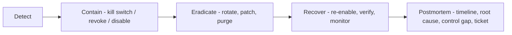

# Incident response playbooks

> **Purpose:** Step-by-step playbooks for Lyra's realistic incident classes - leaked secrets, webhook abuse, AI misbehaviour, RLS failure, alerting outage, runaway notifications - each with detect / contain / eradicate / recover / postmortem and the kill switches that apply. | **Audience:** The operator (currently a single person) responding under pressure; agents drafting fixes afterwards. | **Status:** Active | **Owner:** Bryson Walter | **Last updated:** 2026-06-11

## Ground truth for every incident

- **Blast radius is bounded by design.** No live broker execution exists (`src/lib/trading/risk-engine.ts` `no_live_execution`; schema constraints in `supabase/migrations/020_trading_foundations.sql`). No incident in this codebase can move money. Do not let that breed complacency about data and trust.
- **Most kill levers are env vars or provider-side switches.** With no keys configured the app degrades to demo mode and makes no privileged calls (`SECURITY.md`) - full shutdown is always achievable by removing config.
- **Severity guide:** SEV1 = tenancy breach or secret-critical leak (service-role key, bot token, WhatsApp app secret). SEV2 = abuse in progress, AI misbehaviour reaching users, alerting fully down. SEV3 = degraded/noisy behaviour with a workaround.
- **Reporting:** vulnerabilities arrive via private contact, never public issues (`SECURITY.md`). The same discretion applies outbound: do not paste secrets or user data into issue trackers during response.

## Generic flow

Containment beats diagnosis. Pull the relevant kill lever first, understand second.

---

## Playbook 1 - Leaked secret

Applies to: `SUPABASE_SERVICE_ROLE_KEY`, `TELEGRAM_BOT_TOKEN`, `TELEGRAM_WEBHOOK_SECRET`, `WHATSAPP_ACCESS_TOKEN`, `WHATSAPP_APP_SECRET`, `FINNHUB_API_KEY`, `OPENAI_API_KEY`, `GOOGLE_AI_KEY`, `ANTHROPIC_API_KEY`. Full inventory + rotation column: [`secrets-management.md`](./secrets-management.md).

**Detect**
- A secret appears in a commit, log line, screenshot, chat paste, or `NEXT_PUBLIC_*` variable.
- Indirect signals: unexplained Supabase writes, bot messages you did not send, provider usage spikes.

**Contain**
- Treat the secret as burned the moment exposure is suspected. Rotate at the provider FIRST (rotation procedures per variable in the secrets inventory). For the bot token: BotFather `/revoke` kills the old token immediately. For the service-role key: Supabase dashboard rotation invalidates the old key everywhere at once.
- If the leak is the webhook secret: rotating it 401s ALL inbound (fail closed) until you re-run `setWebhook` - acceptable downtime, take it.

**Eradicate**
- Update every copy: `.env.local`, deployment env, GitHub Actions secrets (the worker schedule holds a second copy of worker secrets).
- If committed: rewrite history only if the repo is private and small-team; otherwise rely on rotation - history purges do not un-leak anything already cloned.
- Grep for siblings: one leaked var usually means a pasted block. `grep -rn "SUPABASE_SERVICE_ROLE\|TELEGRAM_BOT_TOKEN\|WHATSAPP_" --include='*.md' --include='*.ts' .` outside `.env.example`.

**Recover**
- Verify the worker scan runs (`npm run worker:scan`), webhook auth passes with the new secret, sends are `sent` not `failed`.
- Watch provider dashboards for residual use of the old credential (should be impossible post-rotation; confirm anyway).

**Postmortem**
- How did it leave the env store? Add the missing guard (redaction helper, pre-commit secret scan - a known gap per [`threat-model.md`](./threat-model.md) row 3c).

---

## Playbook 2 - Webhook abuse / spam

**Detect**
- Telegram route logs: bursts of `auth_rejected` (spoofing attempts), `rate_limited` (flood from a chat), `invalid_shape`/`invalid_json` (probing).
- WhatsApp route logs: 401 spikes (unsigned probes), or signed inbound floods (`[whatsapp-webhook] inbound ...` lines).
- Unexpected outbound replies in `outbound_messages` or bot chat history.

**Contain**
- `auth_rejected`/401 noise with no successful auth: no compromise - the gates are doing their job. Monitor only.
- Successful-auth flood (Telegram): the per-chat token bucket damps to ~10/min per warm instance, with no reply to dropped messages (no amplification). If the flood continues, rotate `TELEGRAM_WEBHOOK_SECRET` and re-register `setWebhook` with `drop_pending_updates: true` - this invalidates the attacker's ability to be processed and flushes the queue. Nuclear option: `deleteWebhook` kills the inbound channel entirely; outbound worker alerts are unaffected.
- WhatsApp: there is no rate limit on this route today ([`webhooks.md`](./webhooks.md)) - a signed flood means the Meta app or a sender is compromised. Disable the webhook subscription in the Meta App Dashboard, and reset `WHATSAPP_APP_SECRET` (every POST then 401s, fail closed).

**Eradicate**
- Identify the chat id / wa_id from logs (logs carry ids, never message bodies). If pairing existed, revoke the channel row (`notification_channels.revoked_at`).
- Patch whatever let abuse through; if the in-memory rate limit was the gap, this is the trigger to ship the shared-store limiter (known planned hardening).

**Recover**
- Re-register webhooks with fresh secrets; run the production checklists in [`../integrations/telegram.md`](../integrations/telegram.md) section 14 and [`webhooks.md`](./webhooks.md).

**Postmortem**
- Record peak rates and whether instance-local limiting was sufficient; decide whether the shared-store limiter graduates from planned to scheduled.

---

## Playbook 3 - AI misbehaviour (injection success or fabrication)

**Detect**
- An AI output contains instructions-following behaviour from external content, a number absent from its evidence, a missing citation, advice-shaped language, or another user's data.
- `flagged` pattern ids from `isolateExternalContent` appearing in audit records at unusual rates; rejected-output spikes in `ai_runs` (`status` / error_message).

**Contain**
- Trip the **`ai_system` kill switch** (taxonomy in [`trading-risk-controls.md`](./trading-risk-controls.md)) - it disables the AI layer, which "can never trade anyway".
- Unset `OPENAI_API_KEY` and `GOOGLE_AI_KEY` (server env) to disable hosted/shared AI, and set `ENABLE_AI_EXPLANATIONS=false` for legacy worker explanations.
- The product keeps working: every AI surface has a deterministic fallback (the brief route returns `ok:false` and the client renders the deterministic brief - `src/app/api/ai/brief/route.ts`).
- If a BYOK key may have been exfiltrated to a hostile endpoint (it should be structurally impossible - the gateway only calls four fixed provider endpoints in `src/lib/ai/gateway.ts`), tell the user to rotate their provider key.

**Eradicate**
- Injection success: add the missed pattern to `INJECTION_PATTERNS` in `src/lib/ai/guardrails/injection.ts` WITH a test in `src/lib/ai/__tests__/guardrails.test.ts` reproducing the exact payload. The pattern list is intentionally conservative - a false positive costs a few words; a miss costs the trust boundary.
- Fabrication: confirm `assertNoFabricatedNumbers` and `enforceCitations` (`src/lib/ai/guardrails/schema.ts`) were actually applied on the offending path; wire them in if the surface bypassed the guardrail layer - that is the root cause, not the model.
- Review the `ai_runs` / `ai_citations` audit trail (append-only by RLS design, migration 019) to scope which outputs were affected.

**Recover**
- Re-enable only after the reproducing test passes and the eval requirements in [`ai-security.md`](./ai-security.md) are met for any prompt change.

**Postmortem**
- Map the failure to its OWASP row in [`ai-security.md`](./ai-security.md); if the gap was "guardrail existed but was not wired", add the wiring check to review checklists.

---

## Playbook 4 - RLS failure (cross-tenant exposure)

This is SEV1. Treat any credible report as true until proven otherwise.

**Detect**
- A user reports seeing data that is not theirs; a query with the anon key returns rows where `user_id != auth.uid()`; a new migration shipped a table without policies.
- Verification probe (read-only, as a normal authenticated user): select from each user-owned table and confirm only own rows return.

**Contain**
- Smallest credible scope first: `alter table <t> enable row level security;` plus the owner-only policy block (the migrations are idempotent drop-then-create - re-running the policy DO-blocks from `supabase/migrations/019` / `020` is safe).
- If scope is unknown or wide: pause the app (take the deployment down or remove `NEXT_PUBLIC_SUPABASE_*` from the deployment, which drops the frontend to demo mode and stops all privileged reads). Brutal but honest - demo mode makes no privileged calls.

**Eradicate**
- Re-apply the full RLS blocks from migrations 019 and 020. Diff actual policies against intent: `select * from pg_policies where schemaname = 'public';`
- Confirm the three policy families hold: owner-only CRUD, shared read-only, append-only audit ([`architecture.md`](./architecture.md)).
- Find the root cause: usually a new table added without the policy loop, or a service-role write path leaking into a client surface.

**Recover**
- Re-run the verification probe per table. Restore the deployment. Check `inbound_messages` unpaired rows are invisible and `ai_runs` cannot be updated/deleted by clients.

**Postmortem**
- Notify affected users honestly about what was visible and for how long. Ship the automated RLS regression test (known gap, [`threat-model.md`](./threat-model.md) row 2) so this class cannot recur silently.

---

## Playbook 5 - Alerting outage (signals not reaching the user)

Missed alerts are a trust incident in a momentum product, even though nothing is breached.

**Detect**
- Expected hourly alerts absent; dashboard data stale; `getWebhookInfo` shows `last_error_message`; sender logs show `failed` or `demo_logged` DeliveryRecords; scanner scheduler runs missing in GitHub Actions.

**Contain**
- Nothing to kill - this is an availability incident. If staleness could mislead (future) paper trading, the **`data_staleness` kill switch** is the relevant guard: stale quotes already fail the `quote_fresh` blocking check.

**Eradicate - walk the chain in order**
1. Scheduler: did the Actions workflow run? (`.github/workflows/vdapp42-hourly-stock-scanner.yml` at the repo root.)
2. Worker: `npm run worker:scan` locally; check `ENABLE_MARKET_HOURS_GUARD` is not suppressing legitimately (or `FORCE_SCAN=true` once to bypass).
3. Market data: yfinance/Finnhub reachable? `FINNHUB_API_KEY` valid?
4. Persistence: rows landing in Supabase? Service-role key valid?
5. Delivery: `TELEGRAM_BOT_TOKEN` set where the sender runs? `demo_logged` means not configured; `failed` records carry a token-redacted provider error. Telegram troubleshooting table: [`../integrations/telegram.md`](../integrations/telegram.md) section 15.
6. Routing: was the event dropped deterministically? `routeNotification` returns machine-readable drop reasons (`DROP_REASONS` in `src/lib/notifications/router.ts`) - check relevance floor, mutes, dedupe, quiet hours, and the no-channels case before blaming delivery.

**Recover**
- Confirm the next scheduled scan produces alerts end to end; backfill data if the scanner missed windows.

**Postmortem**
- If detection was "the user noticed", ship a staleness banner / freshness check before more alert volume.

---

## Playbook 6 - Runaway notifications (spam loop to the user)

**Detect**
- The same alert repeating; digest storms; users muting in self-defence. Check `outbound_messages` volume per user/time.

**Contain - in order of bluntness**
1. `ENABLE_TELEGRAM_ALERTS=false` on the worker - stops worker outbound at the source.
2. User-side `/mute` (Telegram) silences webhook replies for that chat (in-memory, best-effort).
3. Unset `TELEGRAM_BOT_TOKEN` / `WHATSAPP_ACCESS_TOKEN` in the sending environment - every send becomes an honest `demo_logged` no-op; nothing leaves the box.
4. `deleteWebhook` (Telegram) / disable subscription (Meta) if the loop is reply-driven.

**Eradicate**
- Find which dedupe layer failed: router-level same-content collapse (`buildDedupeKey`, `recentDedupeKeys` in `src/lib/notifications/router.ts`), sender idempotency (`buildIdempotencyKey` event:channel; in-memory `sentKeys`), or the DB unique constraint (`outbound_messages.idempotency_key`). The in-memory layers reset per serverless instance - a multi-instance dedupe failure points at the known durable-delivery-log gap ([`webhooks.md`](./webhooks.md)).
- Safety-critical types (`kill_switch_enabled`, `order_approval_required`) bypass quiet hours and toggles BY DESIGN - they are protected from silencing, so a loop in one of these is a dedupe-key bug (keys are day-scoped and unique per event), not a router-rule bug.

**Recover**
- Re-enable channels one at a time; replay a known event and verify exactly one delivery per channel.

**Postmortem**
- Add a router/sender test reproducing the duplicate path (`src/lib/notifications/__tests__/router.test.ts` is the home); decide whether the durable delivery log graduates to scheduled work.

---

## Postmortem template (all playbooks)

- [ ] Timeline: detection, containment, eradication, recovery timestamps
- [ ] Root cause: one sentence, no euphemisms
- [ ] Blast radius: which users, which data, which duration - verified against logs and append-only audit tables (`execution_audit_logs`, `ai_runs`, `outbound_messages`)
- [ ] Control gap: which control was missing, partial, or unwired (cross-reference the status column in [`threat-model.md`](./threat-model.md))
- [ ] Fix shipped: code + test, not just config
- [ ] Doc drift: update this doc, the threat model, and the secrets inventory if the incident changed any of them
