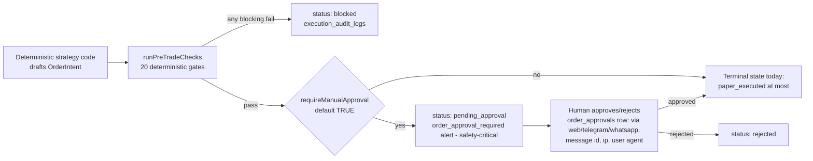

# Trading risk controls

> **Purpose:** Document the deterministic pre-trade risk engine check by check, the kill-switch taxonomy, the approval workflow, the paper-before-live posture, and how the design aligns with SEC 15c3-5 / FINRA algo-supervision principles. | **Audience:** Engineers touching the trading layer; reviewers gating any future execution work. | **Status:** Active | **Owner:** Bryson Walter | **Last updated:** 2026-06-11

## Posture in one paragraph

Live broker execution does not exist in this codebase and may not be implied to exist. The only broker adapter is `NullBrokerAdapter` (`src/lib/trading/broker-adapter.interface.ts`), which refuses everything. The deterministic pre-trade engine (`src/lib/trading/risk-engine.ts`) is pure functions with no I/O, fully unit-tested (`src/lib/trading/__tests__/risk-engine.test.ts`), and intentionally conservative: **unknown or missing context fails closed**. AI has no write path into the engine - it can read a `PreTradeReport` to explain it, nothing more. Today's only consumers are the paper-trading simulator and the Bot Readiness surface.

## Fail-closed philosophy (verified in code)

- Default `TradingSettings` (`DEFAULT_TRADING_SETTINGS` in `src/lib/trading/types.ts`): `tradingMode: 'disabled'`, `maxOrderNotional: 0`, `maxDailyLoss: 0`, `requireManualApproval: true`, `allowedStrategies: []`. Zero means no orders - a fresh account can do nothing until limits are deliberately configured.
- `maxDailyLoss <= 0` FAILS the `max_daily_loss` check with "No daily loss limit configured - configure one before any execution." An unset limit is a block, not an allow.
- A zero `portfolioValue` makes any buy compute as 100% position size, failing `max_position_pct`.
- The database enforces the same posture independently of the TypeScript: `trading_settings.trading_mode` is check-constrained to `('disabled', 'paper_only', 'approval_required')` - `live_limited` / `live_full` are "INTENTIONALLY absent ... the constraint is a deliberate schema-level kill switch" - and `order_intents.status` cannot record `live_executed` (`supabase/migrations/020_trading_foundations.sql`). Even a compromised server with the service-role key cannot persist a live trade state.

## The pre-trade checks - real ids from `runPreTradeChecks`

Every future order MUST pass this engine before approval or (eventual) execution. 20 checks; any failed `blocking` check fails the report (`passed: blocking.length === 0`).

| # | Check id | Gate | Severity |
|---|---|---|---|
| 1 | `trading_mode` | Trading is not `disabled` (the default) | blocking |
| 2 | `no_live_execution` | Mode is `disabled`, `paper_only`, or `approval_required` - live modes are refused here even if a row somehow carried one | blocking |
| 3 | `kill_switches` | No kill switch in `ctx.killSwitches` is active | blocking |
| 4 | `strategy_allowed` | `intent.strategyId` is on the user's allow-list | blocking |
| 5 | `symbol_not_blocked` | Symbol not on the user's blocked list | blocking |
| 6 | `theme_not_blocked` | Symbol's theme not on the blocked-themes list | blocking |
| 7 | `market_open` | Market session is open | blocking |
| 8 | `symbol_tradable` | Symbol not halted / untradable | blocking |
| 9 | `broker_connected` | (Paper) broker connection healthy | blocking |
| 10 | `quote_fresh` | Quote age between 0 and `maxQuoteAgeSeconds` - stale data fails closed | blocking |
| 11 | `max_order_notional` | `0 < notional <= maxOrderNotional` | blocking |
| 12 | `max_position_pct` | Post-fill position share of book within `maxPositionPct` | blocking |
| 13 | `max_daily_loss` | Limit configured (> 0) AND realised daily PnL above `-maxDailyLoss` | blocking |
| 14 | `max_drawdown` | Portfolio drawdown below `maxTotalDrawdownPct` | blocking |
| 15 | `liquidity` | Average daily dollar volume at or above the floor | blocking |
| 16 | `spread` | Spread percent within tolerance | blocking |
| 17 | `earnings_blackout` | Outside the earnings blackout window | warning (would be blocking for live) |
| 18 | `news_blackout` | No high-impact news-risk flag | warning (would be blocking for live) |
| 19 | `duplicate` | `intent.idempotencyKey` not already among open intents | blocking |
| 20 | `intent_sane` | Quantity and notional are positive finite numbers | blocking |

Duplicate prevention is deterministic: `buildIdempotencyKey(strategyId, symbol, side, isoDay)` collapses same strategy+symbol+side+day into one key, and the DB backs it with `unique(user_id, idempotency_key)` on `order_intents` (migration 020). Two layers, same invariant.

## Kill-switch taxonomy - `ALL_KILL_SWITCHES`

From `src/lib/trading/risk-engine.ts` (ids typed as `KillSwitchId` in `src/lib/trading/types.ts`; an active switch must carry a `reason`):

| Id | Label | Scope |
|---|---|---|
| `global` | Global | Disables all trading activity platform-wide |
| `user` | User | Disables all trading for this account |
| `strategy` | Strategy | Disables a single strategy across all users |
| `broker` | Broker | Disables a broker connection (outage, errors) |
| `symbol` | Symbol | Blocks new orders in a specific symbol |
| `theme` | Theme | Blocks new orders in a whole theme |
| `daily_loss` | Daily loss | Trips when the daily loss limit is hit |
| `error_rate` | Error rate | Trips on elevated system error rates |
| `slippage` | Slippage | Trips when realised slippage exceeds tolerance |
| `data_staleness` | Data staleness | Trips when market data is stale |
| `ai_system` | AI system | Disables the AI layer (it can never trade anyway) |

Semantics:

- ANY active switch fails the `kill_switches` blocking check - every switch stops new intents.
- `isHardKilled` flags the platform-level trio (`global`, `user`, `broker`) that "would stop everything regardless of context" - the distinction matters for UI severity and for future cancel-open-orders behaviour.
- The `user` switch is reachable from chat: `/killswitch` (Telegram) and `KILLSWITCH` (WhatsApp) record an activation request, and the channel grammar is deliberately one-way - chat can only ACTIVATE, never clear (`src/app/api/webhooks/whatsapp/route.ts`). Clearing requires the authenticated web surface. Current honesty: the chat-side record is in-memory until pairing and persistence land.
- A `kill_switch_enabled` notification is safety-critical in the router: it always delivers instantly, immune to quiet hours, mutes-by-toggle, and digest deferral (`SAFETY_CRITICAL_TYPES` in `src/lib/notifications/router.ts`).

## Approval workflow

Deterministic code drafts; humans decide; everything is audited:

- `requireManualApproval` defaults to true in both the TypeScript defaults and the `trading_settings` table.
- `order_approvals` (migration 020) records the explicit human decision with `approved_via` constrained to `('web', 'telegram', 'whatsapp')`, plus `approval_message_id`, `ip_address`, and `user_agent` for the audit trail. A messaging-channel approval "must match an exact pending-approval prompt, never a free-form message" - and the WhatsApp grammar pre-validates codes against `APPROVAL_CODE_PATTERN` (server-minted codes only).
- `execution_audit_logs` is the append-only event stream across the whole intent lifecycle.
- `OrderIntent` freezes `signal_snapshot`, `risk_snapshot`, and `evidence_snapshot` at draft time so every decision is auditable forever. `ai_explanation` is a post-hoc explanation column - "AI may EXPLAIN an intent after the fact - it never creates or mutates one."
- An `order_approval_required` notification is the second safety-critical type: never digest-deferred, because silently stalling an approval is worse than a late-night ping (`src/lib/notifications/router.ts`).

## Paper before live

The progression is structural, not aspirational:

1. **Today:** `disabled` (default) -> `paper_only` / `approval_required`. Terminal intent state is at most `paper_executed` against a `paper_account` (full paper schema: `paper_accounts`, `paper_orders`, `paper_positions`, `paper_trades`, `paper_trade_journal` in migration 020). Backtests (`backtest_runs`, `backtest_trades`) freeze assumptions for reproducibility.
2. **Before any live mode:** the hard gates in `docs/architecture/future-trading-bot.md` must pass - including widening the `trading_settings` check constraint (a deliberate, reviewable schema migration), a real broker adapter satisfying the interface contract, broker credentials in a managed secret store (see [`secrets-management.md`](./secrets-management.md)), and promoting the two warning checks (`earnings_blackout`, `news_blackout`) to blocking.
3. **Never:** an LLM-originated order. The AI layer's tool surface contains no order tool to grant (`FORBIDDEN_TOOLS` in `src/lib/ai/policy.ts`), and the registry has no schema that can represent an order.

## Regulatory principle alignment

Lyra is research software, not a broker-dealer, and is not itself subject to SEC Rule 15c3-5 or FINRA rules. The design deliberately aligns with their principles anyway, so that any future regulated integration inherits the right shape rather than retrofitting it:

| Principle | Source | Lyra implementation |
|---|---|---|
| Pre-trade financial controls: prevent orders exceeding capital/credit thresholds | SEC 15c3-5(c)(1)(i) | `max_order_notional`, `max_position_pct`, `max_daily_loss`, `max_drawdown` - hard-coded blocking checks, fail closed on missing limits |
| Prevent erroneous orders | SEC 15c3-5(c)(1)(ii) | `intent_sane`, `duplicate` + idempotency keys, `quote_fresh`, `liquidity`, `spread` |
| Systemic controls applied automatically, not post-hoc | SEC 15c3-5 | The engine is the single mandatory gate; pure deterministic functions, side-effect free, unit-tested |
| Kill switch capability | FINRA Regulatory Notice 15-09 (effective algo supervision) | The 11-switch taxonomy with platform-level hard kills (`isHardKilled`), one-way activation from chat, safety-critical alerting |
| Testing before deployment | FINRA 15-09 | Paper-first lifecycle, frozen-assumption backtests, full unit coverage of the engine |
| Audit trail and supervision | FINRA 15-09 / SEC 15c3-5(b) review obligations | `execution_audit_logs` append-only stream, frozen intent snapshots, `order_approvals` with channel + ip + user agent |
| Documented annual review | SEC 15c3-5(e) | Principle only today - no formal review cadence exists yet; institute one before any live-execution work starts |

## Drill checklist

A full kill-switch drill runbook is planned at `docs/runbooks/kill-switch-drill.md` (named in `docs/README.md`, not yet written). Until then, the minimum periodic verification:

- [ ] `npm run test` - the risk-engine suite (`src/lib/trading/__tests__/risk-engine.test.ts`) is green
- [ ] Each of the 11 switches, when active in context, fails the `kill_switches` check
- [ ] `isHardKilled` returns true for `global`, `user`, `broker` and false for the rest
- [ ] Default settings produce a fully-blocked report (`trading_mode`, `max_order_notional`, `max_daily_loss` all fail)
- [ ] A `live_limited` mode in context still fails `no_live_execution`
- [ ] Attempting to set `trading_settings.trading_mode = 'live_full'` in Supabase is rejected by the check constraint
- [ ] `kill_switch_enabled` event routes as instant delivery even inside quiet hours (`src/lib/notifications/__tests__/router.test.ts`)
