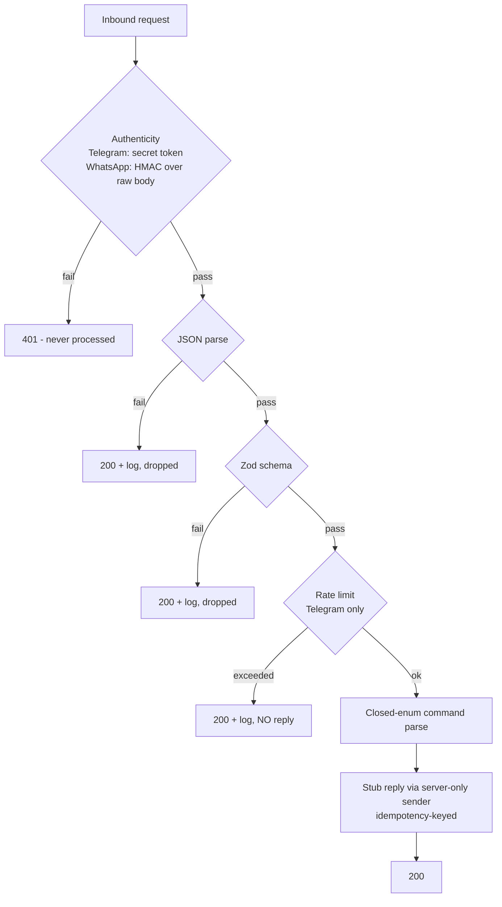

# Webhook security

> **Purpose:** The security gates on Lyra's two inbound webhooks (Telegram, WhatsApp): authenticity verification, payload validation, replay/idempotency handling, rate limiting and its serverless caveat, and log redaction. | **Audience:** Engineers wiring, reviewing, or debugging the webhook routes. | **Status:** Active | **Owner:** Bryson Walter | **Last updated:** 2026-06-11

Operational setup (BotFather, `setWebhook`, Meta dashboard config, local dev, troubleshooting) lives in [`../integrations/telegram.md`](../integrations/telegram.md) and [`../integrations/whatsapp.md`](../integrations/whatsapp.md). This doc is the security-gate reference.

## Shared doctrine for both routes

- **Authenticate before parsing.** Nothing downstream runs until the provider's authenticity signal is verified. Unauthenticated traffic gets 401 (or 403 on the WhatsApp GET handshake) and is never processed.
- **Fail closed on unset secrets.** An unconfigured `TELEGRAM_WEBHOOK_SECRET` or `WHATSAPP_APP_SECRET` means the webhook is dead, not open.
- **Inbound text is untrusted data, never instructions.** Both routes parse text into closed command enums (`InboundCommand` in `src/lib/notifications/types.ts`). There is no free-form fallback and no LLM anywhere in either path.
- **Return 200 fast after authenticity.** Both providers retry non-2xx responses; a retry storm of garbage helps nobody. Authentic-but-malformed payloads are logged and acknowledged.
- **No path to execution.** `/approve` / `APPROVE <code>` would have to exact-match a server-minted pending order intent, and none can exist: live execution is refused by the deterministic risk engine (`no_live_execution` in `src/lib/trading/risk-engine.ts`).

## Gate order

## Telegram - `src/app/api/webhooks/telegram/route.ts`

### 1. Secret-token verification (constant-time)

Telegram echoes the `secret_token` you registered with `setWebhook` back in the `X-Telegram-Bot-Api-Secret-Token` header on every delivery. This is the only authenticity signal Telegram offers.

The route's `secretMatches` compares the header against `TELEGRAM_WEBHOOK_SECRET` in constant time: **both values are sha256-hashed first, then compared with `crypto.timingSafeEqual`**. Hashing first equalises buffer lengths - `timingSafeEqual` throws on unequal lengths, and an early length check would itself leak length information. Missing header or unset secret returns 401 (`auth_rejected` log, no body details).

### 2. Payload validation

`telegramUpdateSchema` (Zod) requires `update_id` and validates the optional message shape, with `text` capped at 4096 chars. Malformed JSON logs `invalid_json`; valid JSON with an unknown shape logs `invalid_shape`. Both get 200 so Telegram does not retry-storm, and nothing downstream runs. Non-text updates are dropped with `ignored_non_text` (defence in depth on top of `allowed_updates: ["message"]` at registration).

### 3. Rate limiting + the serverless caveat

Per-chat token bucket: capacity 10, refilling 10 per minute (`RATE_CAPACITY`, `RATE_REFILL_PER_MS`), with a `MAX_BUCKETS` (10,000) memory guard. Over-limit messages are dropped with a `rate_limited` log and **no reply** - replying to spam would let an attacker use our bot as an amplifier.

**Caveat, stated in the code itself:** the bucket lives in instance memory. On serverless every cold instance starts a fresh bucket, so the effective ceiling is roughly 10/min times the number of warm instances. Treat it as best-effort abuse damping, not a hard guarantee. Production hardening is a shared store (Upstash Redis or a Supabase table) keyed by chat id - **planned, not built**.

### 4. Command parsing (closed enum)

`parseMessage` maps `/commands` through `COMMAND_MAP` into the closed `InboundCommand` enum; anything else collapses to `unknown`. Arguments are bounded to 64 chars and are "data only - bounded, never instructions". `/approve` and `/reject` refuse honestly: no pending order intents can exist. `/start <code>` replies that pairing completion is not enabled in this build and stores nothing.

### 5. Replay / idempotency

Replies are keyed `tg:webhook:<update_id>`. When Telegram redelivers an update (it retries until it gets a 2xx fast enough), the duplicate reply is suppressed by the sender's idempotency dedupe (`sentKeys` in `src/lib/notifications/telegram.ts` - 24h TTL, 5,000-key cap, `suppressed` DeliveryRecord). This dedupe is also in-process memory, so a redelivery landing on a different instance can slip through at low probability. The durable fix - checking a persistent delivery log before send (the `outbound_messages` table in `supabase/migrations/020_trading_foundations.sql` already has a UNIQUE `idempotency_key` column to build on) - is **planned, not built**.

### 6. Log redaction

Logs are structured JSON carrying the event name, command name, chat id, from id, and update id - **never the raw message text** (untrusted user input) and never the bot token. Any error string that could contain provider responses passes through `redactBotToken` (`src/lib/notifications/telegram.ts`), which strips both the literal configured token and the generic `bot<digits>:<secret>` URL shape.

## WhatsApp - `src/app/api/webhooks/whatsapp/route.ts`

### 1. GET - subscription handshake

Meta's one-time verification: the route echoes `hub.challenge` only when `hub.mode=subscribe` AND `hub.verify_token` exactly matches `WHATSAPP_VERIFY_TOKEN` AND a challenge is present. An unset env token can never verify - everything else gets 403.

### 2. POST - HMAC signature over the RAW body

Meta signs every POST with `X-Hub-Signature-256: sha256=<hex>`, the HMAC-SHA256 of the raw request bytes keyed with the app secret. Verification (`verifyWhatsAppSignature` in `src/lib/notifications/whatsapp-signature.ts`, unit-tested in `src/lib/notifications/__tests__/whatsapp-signature.test.ts`):

- Runs against `await request.text()` BEFORE any JSON parsing - the signature covers exact bytes, not a re-serialisation.
- Fails closed on: unset `WHATSAPP_APP_SECRET`, missing header, missing `sha256=` prefix, anything that is not exactly 64 hex chars, and any mismatch.
- Compares with `crypto.timingSafeEqual` after decoding to buffers (constant-time).
- Never throws and never leaks secret material in any path.

Unsigned or mis-signed traffic gets 401 and is never processed. Signed-but-unparseable or schema-failing payloads are acknowledged with 200 (`ignored: true`) and a warning log, so Meta does not retry forever.

### 3. Payload validation

`webhookPayloadSchema` (Zod) requires `object: "whatsapp_business_account"` and validates the entry/changes/value structure, extracting only `type: "text"` messages with a body.

### 4. Command parsing (closed grammar)

`parseInboundCommand` normalises to uppercase, caps at 64 chars, and matches a closed verb grammar: `STATUS`, `PORTFOLIO`, `TODAY`, `MUTE`, `UNMUTE`, `KILLSWITCH` (one-way: chat may only ACTIVATE the user kill switch, never clear it), `HELP`, and `APPROVE <code>` / `REJECT <code>` where the code must match `APPROVAL_CODE_PATTERN` (`^[A-Z0-9][A-Z0-9-]{3,31}$` - server-minted codes only). Anything else collapses to `unknown`.

Current state, honestly: commands are **parsed, validated, and logged only**. `lookupPairedUser` is a stub that always returns null, which fails safe - no inbound message can act on an account through this webhook. Unpaired numbers get a pairing-instructions reply through the outbound stub (`demo_logged` until WhatsApp env is configured). Accounts are never created from inbound messages.

### 5. Rate limiting

There is **no per-sender rate limit on the WhatsApp route today** - the HMAC gate means only Meta-signed traffic is processed at all, which removes the anonymous-spam vector that motivated the Telegram bucket. A signed flood (compromised Meta app or a hostile paired sender) would still be processed; a shared-store rate limit mirroring the Telegram design is the planned hardening when command execution lands.

### 6. Replay / idempotency

Outbound pairing replies are keyed `pair-prompt:<message.id>` so a Meta redelivery of the same message produces a deduped reply (same in-memory caveat as Telegram). Inbound persistence with provider-message-id dedupe (`inbound_messages.provider_message_id` + its index in migration 020) is schema-ready but the webhook does not yet write it - **planned**.

### 7. Log redaction

Inbound logs carry the masked sender (`maskDestination` keeps a 4-char prefix and last 2 digits), the provider message id, and the parsed command - never full phone numbers, never message bodies, never tokens. `redactSecrets` strips the access token and app secret from any error text. The outbound adapter also appends `appsecret_proof` (HMAC of the access token keyed with the app secret, `buildAppSecretProof`) so a leaked access token alone cannot call the Graph API.

## Security checklist (both webhooks)

- [ ] `TELEGRAM_WEBHOOK_SECRET` set server-side and matching the `setWebhook` `secret_token`; request without the header verified to 401
- [ ] `WHATSAPP_APP_SECRET` + `WHATSAPP_VERIFY_TOKEN` set; unsigned POST verified to 401; bad GET token verified to 403
- [ ] `allowed_updates: ["message"]` + `drop_pending_updates: true` used at Telegram registration
- [ ] Logs inspected: command names and ids only - no raw text, no tokens, no full phone numbers
- [ ] `/approve`, `/reject`, `APPROVE`, `REJECT` verified to refuse (no pending intents can exist - live execution disabled)
- [ ] Rate-limit serverless caveat acknowledged; shared-store upgrade ticketed before any real command execution ships
- [ ] In-memory idempotency caveat acknowledged; durable delivery-log check ticketed alongside pairing
- [ ] Webhook abuse playbook reviewed ([`incident-response.md`](./incident-response.md))
