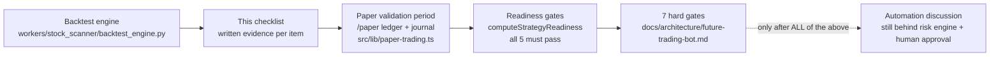

# Backtesting validation - the anti-bias checklist

> **Purpose:** The mandatory validation standard for any strategy result in Lyra: the anti-bias checklist (survivorship, look-ahead, fills, costs, regimes, sample size, out-of-sample), the required metrics set, and the hard rule that no strategy automates without passing all of it. | **Audience:** Anyone producing or reviewing backtest or paper-trading results. | **Status:** Active | **Owner:** Bryson Walter | **Last updated:** 2026-06-11

## The rule

**No strategy automates without passing this document.** This is not aspiration - it is already enforced in code two ways:

1. `computeStrategyReadiness` in `src/lib/paper-trading.ts` hard-codes `verdict: 'not_ready_for_automation'` for every strategy in this build and gates readiness on five checks (sample size n >= 30 closed trades, an out-of-sample period, drawdown tested through a full regime cycle, positive expectancy with statistical confidence, fees + slippage modelled). Three of those gates are currently `passed: false` by construction because the evidence does not exist yet - the panel on `/paper` renders that honestly.
2. Even a "ready" strategy cannot trade: live modes are refused by the `no_live_execution` check in `src/lib/trading/risk-engine.ts`, and Gate 1 of `docs/architecture/future-trading-bot.md` makes documented backtest evidence the FIRST of seven hard gates before live execution may even be proposed.

The backtest engine itself lives in the worker (`workers/stock_scanner/backtest_engine.py`, tested in `tests/test_backtest_engine.py`). Results from it are inputs to this checklist, never substitutes for it.

## The anti-bias checklist

Every item must be explicitly addressed in writing for a result to count. "We did not check" fails the item.

### 1. Survivorship bias

- [ ] The test universe is the universe AS OF each historical date, not today's list of winners. Lyra's current universe is a configured ticker list (`TICKER_SYMBOLS`, `workers/stock_scanner/`), which is survivorship-loaded by construction - any backtest on it must state this limitation in the results.
- [ ] Delisted, acquired, and collapsed names are included for the periods they traded, or the result is labelled "survivor universe - optimistic".

### 2. Look-ahead bias

- [ ] No feature uses data unavailable at decision time (e.g. using the day's close to enter during that day; indicators computed on the full series then sliced).
- [ ] Corporate-action adjustments do not leak future information into past bars.
- [ ] Signal computation order in the test mirrors the live worker pipeline order (`workers/stock_scanner/main.py`).

### 3. Fill assumptions

- [ ] Entries/exits fill at the NEXT available price after the signal, never at the signal bar's ideal price.
- [ ] Limit fills require the price to have traded THROUGH the limit, not merely touched it.
- [ ] Partial fills and gap-throughs on stops are modelled (a stop at 86.6 gapping to 84 fills at 84, not 86.6).

### 4. Fees, slippage, and spread

- [ ] Commission and slippage are charged on EVERY fill. The paper simulator's floor is the reference: 0.05% commission per fill (`PAPER_FEE_RATE`) and 0.1% slippage per fill (`PAPER_SLIPPAGE_RATE`) baked into fill prices in `src/lib/paper-trading.ts` - a backtest claiming lower friction must justify it.
- [ ] Spread cost is included for less liquid names (the live engine refuses wide spreads via the `spread` check; the backtest must model what the engine would have allowed).
- [ ] Results are reported gross AND net of costs; the strategy is judged on net.

### 5. Regime coverage

- [ ] The test window spans at least one full bull/bear/chop cycle for the traded universe - not just the favourable regime. The readiness gate `drawdown_tested` ("the strategy has not traded through a downtrend regime") stays failed until this is true.
- [ ] Results are broken out per regime, not only aggregated; a strategy that only works in one regime is labelled as such.

### 6. Sample size

- [ ] Minimum 30 closed trades for any metric to be quoted at all (mirrors `MIN_SAMPLE = 30` in `computeStrategyReadiness`); meaningful confidence needs far more.
- [ ] Expectancy is quoted with a confidence interval, not a point estimate - the readiness gate text is explicit: "n=<small> gives no confidence interval worth acting on".

### 7. Out-of-sample and walk-forward

- [ ] Parameters are chosen on an in-sample window and validated on a held-out, never-touched out-of-sample window.
- [ ] Walk-forward: re-fit on rolling windows and trade the next window forward; report the stitched out-of-sample equity curve, not the in-sample one.
- [ ] The number of parameter combinations tried is reported (multiple-testing honesty - 200 tried variants make one good curve meaningless).

## Required metrics set

Report ALL of these, net of costs, for the out-of-sample period:

| Metric | Notes |
|---|---|
| Closed-trade count (n) | The gatekeeper metric; nothing else is quotable below n=30 |
| Win rate | As computed in `computeAccountSummary` / `computeStrategyReadiness` (wins = realised PnL > 0) |
| Expectancy per trade | Mean net PnL per closed trade, with confidence interval |
| Profit factor | Gross wins / gross losses (same construction as `computeStrategyReadiness`) |
| Max drawdown (depth and duration) | On the equity curve, including open-trade marks |
| Return vs exposure | CAGR or period return alongside time-in-market, so idle capital is not flattered |
| Cost drag | Total fees + slippage as a share of gross PnL (the paper account tracks `feesPaid` and `slippagePaid` for exactly this) |
| Per-regime breakdown | Each metric above split by regime label |

## How this connects to the live product

The paper-trading journal (`MistakeTag`s like `chased_entry`, `ignored_regime` in `src/lib/paper-trading.ts`) feeds the same loop: a strategy whose paper results diverge from its backtest must have the divergence explained before the validation period counts (Gate 2 in `future-trading-bot.md`).

## Reviewer checklist (attach to any result)

- [ ] All 7 bias sections answered in writing, with the failing/unaddressed ones stated plainly
- [ ] Full metrics table present, net of costs, out-of-sample
- [ ] Survivor-universe limitation stated if the current ticker-list universe was used
- [ ] Parameter-search honesty: variants tried, selection rule
- [ ] Verdict uses the readiness vocabulary: a strategy is `not_ready_for_automation` until every gate passes - and even then, automation means paper modes behind `runPreTradeChecks` and manual approval, nothing more in this build
