# Paper-bot spine

A deterministic, auditable, **paper-only** spine that proves a future trading bot can exist safely -
**without building one**. The model may explain why a trade candidate exists; only deterministic
code may create an `OrderIntent`, and only paper-execution code may simulate a fill.

> The most important invariant: **AI can explain an OrderIntent, but it cannot create, approve,
> submit, or execute one.** This is enforced in code (fail-closed tool gate + deterministic builder +
> approval gate + a risk engine that refuses any live mode), not by a disclaimer.

## Lifecycle (Mermaid)

```mermaid
flowchart LR
    SIG([Signal / candidate]) --> TR[trade_readiness agent<br/>AI explains, verdict only]
    TR -->|research_only / blocked| STOP([No order])
    TR -->|paper_trade_eligible| OIB[Deterministic OrderIntent builder<br/>AI is NOT in this path]
    OIB --> RISK{Risk gate<br/>runPreTradeChecks}
    RISK -->|blocked| BLOCKED([blocked - clear reasons])
    RISK -->|passed| APPROVE{Approval gate}
    APPROVE -->|pending_approval| WAIT([Awaiting user approval])
    WAIT -->|user approves| APPROVED[approved]
    APPROVE -->|no approval needed| APPROVED
    APPROVED --> EXEC[Execute: risk RE-CHECK at execution]
    EXEC -->|blocked now| BLOCKED
    EXEC -->|ok| FILL[Simulated paper fill<br/>fee 0.05% + slippage 0.1%]
    FILL --> POS[Paper position / trade]
    POS --> AUDIT[(Audit + paper performance)]
    AUDIT --> READY([Future: strategy readiness score])

    classDef stop fill:#2b1214,stroke:#7f1d1d,color:#ff9b9b;
    class STOP,BLOCKED stop;
```



## What is implemented (and verified)

- **`trade_readiness` agent** (`lib/ai/run-agent.ts`) - gathers evidence through the fail-closed tool
  runtime, emits one verdict (`research_only` / `paper_trade_eligible` / `blocked_missing_evidence`),
  **never an order, side, quantity, or price**. Schema-validated + cited + audited (the #6 runtime).
- **Deterministic OrderIntent builder** (`lib/trading/order-intent-builder.ts`) - side, quantity,
  price, type, reason code and idempotency from deterministic inputs only; the model's explanation is
  attached for the record and decides nothing. Reuses the existing `OrderIntent` type.
- **Risk gate** - reuses the existing `runPreTradeChecks` (`lib/trading/risk-engine.ts`, ~23 checks
  incl. `no_live_execution`, kill switches, notional, position size, liquidity, spread, duplicates).
- **Approval gate** - a `pending_approval` intent must be explicitly approved before execution;
  executing a non-approved intent is rejected.
- **Paper executor** - `simulatePaperFill` (`lib/trading/paper-bot.ts`) applies the existing fee
  (0.05%) + slippage (0.1%) model. No broker. Risk is **re-checked at execution time**.
- **Endpoint** - `POST /api/trading/paper-bot` with `propose` / `approve` / `execute`.
- **Tests** - `tests/paper-bot-spine.test.ts` (9/9): AI-boundary, fail-closed runtime, deterministic
  intent, fill math, risk gate blocks live + over-notional, passes a valid paper intent.

## What is NOT implemented (deliberately, or next)

- **No live trading. No broker adapter.** `no_live_execution` hard-blocks any live mode and no broker
  implementation exists - only an interface concept. This is permanent until a separate, reviewed,
  regulated build.
- **Per-user Supabase persistence** - the tables exist (`migration 020`: `order_intents`,
  `paper_orders`, `paper_trades`, ...), but the spine currently runs in-memory/demo. Binding the
  endpoint to those tables (user-scoped via RLS) + a `service_role` writer is the next hardening pass.
- **Granular CRUD routes** (order-intents list, positions, trades, kill-switch) and the `/paper-bot`
  UI page - next.

## Lifecycle stages

| Stage | Owner | Output |
|---|---|---|
| Trade readiness | AI (`trade_readiness`) | verdict + reasons + missingEvidence + citations |
| OrderIntent | deterministic code | immutable `OrderIntent` (status `drafted`) |
| Risk gate | `runPreTradeChecks` | `PreTradeReport` (passed / blocking / warnings) |
| Approval gate | user | `approved` / `rejected` |
| Paper execution | `simulatePaperFill` | `PaperFill` (fee + slippage, re-validated) |
| Audit / performance | code | audit events, paper P/L, future readiness score |

## AI boundaries

The AI may: retrieve evidence, phrase, explain, cite, and assign a readiness verdict.
The AI may not: choose side/quantity/price, create/modify/cancel an order, approve, or execute.
Forbidden tools (`create_order`, `modify_position`, `change_settings`, ...) have **no runtime
implementation** and are rejected by `canAgentUseTool()` - structurally unrunnable (tested).

## Security boundaries

- Paper-only is structural (risk engine refuses non-paper modes; no broker).
- Execution requires an explicit approved intent (approval gate).
- Risk is re-checked at execution, not only at proposal.
- Audit is hash-only for AI runs; no secrets/keys/raw prompts logged.
- Per-user RLS is required before any real user's data lands in the DB (next pass).

## Future broker integration requirements

Adding live execution later must reuse the **same** `OrderIntent → risk gate → approval → audit`
spine - only a reviewed broker adapter behind the existing interface, behind a separately-gated
`live_*` mode, with SEC Rule 15c3-5-style pre-trade controls and FINRA-aligned testing/validation.
No part of the current spine should be rebuilt; the bot is added behind it.

## Test checklist

- [x] OrderIntent schema/shape valid + deterministic
- [x] AI cannot create an executable order (boundary)
- [x] Forbidden tools structurally unrunnable
- [x] Risk engine pass/fail cases (live blocked, over-notional blocked, valid paper passes)
- [x] Paper fill calculation (fee + slippage)
- [x] Approval gate (execute rejects unapproved) - verified via the live endpoint
- [ ] Per-user RLS isolation (pending persistence)
- [ ] Granular route auth (pending routes)
```
